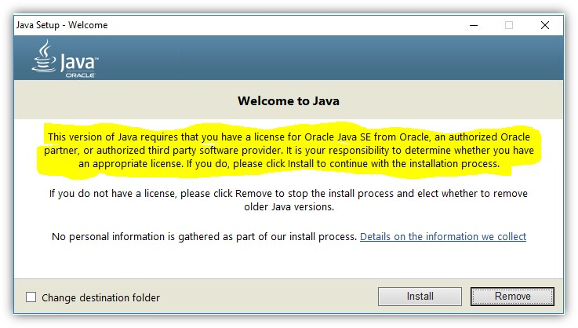

# Campaign Classic: Java ライセンス

ホスト型/ハイブリッド/オンプレミスインスタンスの Java ライセンスを担当するユーザーについて説明します。

## 説明 {#description}

### 環境

Campaign Classic

### 問題/症状

ホスト/ハイブリッド/オンプレミスインスタンスの Java ライセンスは誰が担当しますか？

## 解決策 {#resolution}

Adobeドキュメントには、Java は前提条件とされているので、Java ライセンスを提供する必要があります。

OpenJDK は、に従ってサポートされます [互換性マトリックス](https://experienceleague.adobe.com/docs/campaign-classic/using/release-notes/compatibility-matrix.html).
