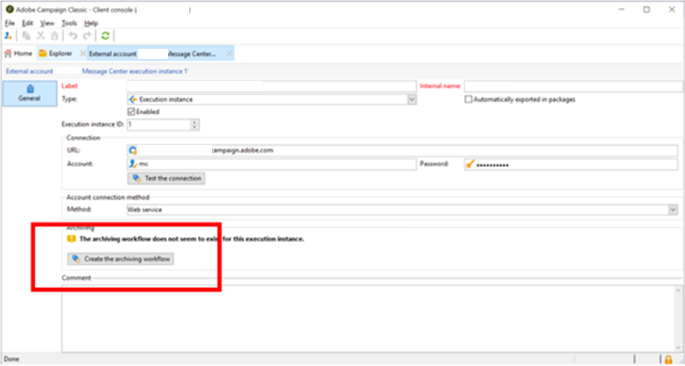

# Neolane プロセスダウン Message Center、MCSync ワークフローの再作成方法

からのデータの同期に使用されたワークフロー *Message Center 実行インスタンス* に *コントロールインスタンス*&#x200B;古いビルドのでは非推奨（廃止予定）となりました。 この記事では、新しいビルドでデータを同期する新しいワークフローを作成する方法について説明します。

## 説明 {#description}

### <b>環境</b>

Adobe Campaign Classic

### <b>問題</b>

次に示すように、一部の Neolane プロセスが停止しています。

- 強制隔離の読み込み（`quarantineSynch`）
- イベントのインポート （`eventSynch`）
- コスト計算（`budgetMgt`）

## 解決策 {#resolution}

からデータを同期するために使用した 6 つのワークフロー *Message Center 実行インスタンス* 対象： *コントロールインスタンス* 古いビルドのでは、新しいビルドで非推奨（廃止予定）となりました。

これらのワークフローは次のとおりです。

1. 同期開始（`synchLaunch`）
2. イベントのインポート （`eventSynch`）
3. 配信メッセージ選定のインポート （`broadLogMsgSynch`）
4. イベント配信ログのインポート （`broadLogSynch`）
5. トラッキングされる URL のインポート （`trackingUrlSynch`）
6. イベントトラッキングログのインポート （`trackingLogSynch`）
7. 強制隔離の読み込み（`quarantineSynch`）

新しいビルドでは、データを同期するために新しいアーカイブワークフローを作成する必要があります。

次の手順に従います。

1. に移動 *実行インスタンスの外部アカウント* をクリックし、 <b>アーカイブワークフローの作成</b> ボタン。

   

   これにより、「」フォームの新しいワークフローが作成されます`MCSync_<external account internal name>`」と入力します。
2. 古い非推奨ワークフローを停止し、新しいワークフローの使用を開始します。
