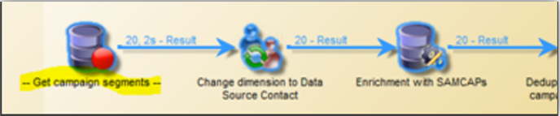

# ワークフローのベストプラクティス -Campaign Classicでの設定と監視

この記事では、Adobe Campaign Classicでのワークフローの設定と監視に関するベストプラクティスをいくつか説明します。

## 説明 {#description}

### <b>環境</b>

- Adobe Campaign
- Adobe Campaign Classic

### <b>問題</b>

ほとんどの場合、ワークフローは、プラットフォームのコア機能（組み込みまたはカスタム）の一部を構成します。 そのため、設定には十分注意が必要です。

## 解決策 {#resolution}

### 一般設定

#### 組織

tableXXX への読み込みなど、ワークフローをカスタムフォルダーに作成します。

プラットフォーム全体に影響する一般的なワークフローの場合にのみ（例えばクレンジング）、組み込みで追加することを検討できます <b>テクニカルワークフロー</b> フォルダー。

#### ワークフロー名

前述のように、ワークフローに適切な名前とラベルを付けることが非常に重要です。 オペレーターが必ずしもドキュメントを参照するとは限らないので、ワークフローのを入力します <b>説明</b> 実行するプロセスを要約するためのフィールド。

ワークフローが複数のワークフローを含むプロセスの一部である場合は、ラベルを入力する際に明示的に指定してください。数値を使用すると、ワークフローを（ラベルで）並べ替えるのに最適な方法です。 例：

- 001 - インポート – 受信者のインポート
- 002 - インポート – 販売のインポート
- 003 - インポート – 販売詳細のインポート
- 010 - エクスポート – 配信ログのエクスポート
- 011 - エクスポート – トラッキングログのエクスポート

#### 重大度

次の場所にあるワークフローのプロパティで、ワークフローの重要度を設定します <b>実行</b> タブ：

- 標準
- 実稼動
- 重大

ワークフローの作成時にこの情報を提供すると、設定されたプロセスの重大度を理解するのに役立ちます。

#### ログ

JavaScript メソッド `logInfo()` は、ワークフローのデバッグに最適なソリューションです。 便利ですが、頻繁に実行するアクティビティでは特に注意が必要です。過度な負荷がログにかかり、ログテーブルのサイズを大幅に増大させてしまう可能性があります。

ただし、それ以上が必要になる場合もあります `logInfo()`. 2 つの追加のソリューションを利用できます。

<b>2 つの実行間の中間母集団の結果を保持</b>

このオプションは、ワークフローのプロパティで使用できます。 <b>一般</b> タブ、それは危険なことができるとして有用なことができます。 これにより、Adobe Campaignは、2 回の実行の間に作成された一時テーブルを削除しなくなります。 開発環境には便利ですが、実稼動環境では使用できないので、監視する必要があります。 一時テーブルを保持すると、データベースのサイズが大幅に増加し、最終的にサイズ制限に達する可能性があります。 さらに、バックアップが遅くなります。

<b>ワークフローがありません</b> 実稼動環境では、このオプションは常にオンになっている必要があります。

<b><u>SQL クエリをジャーナルに記録</u>:</b>

で使用可能 <b>実行</b> ワークフローのプロパティのタブに移動します。これにより、異なるアクティビティからツールで生成されたすべての SQL クエリがログに記録されます。 プラットフォームが実際に何を実行しているかを確認するのに最適な方法です。 ただし、このオプションは開発時に一時的に利用するべきもので、実稼働では有効にしないでください。

#### 監視

実稼動環境で実行されているスケジュール済みワークフローはすべて、エラーが発生した場合に警告を受け取るために監視する必要があります。

ワークフローのプロパティで、 <b>スーパーバイザーグループ</b>：デフォルトの「ワークフロースーパーバイザー」かカスタムグループのどちらか。 メールが設定された、少なくとも 1 人のオペレーターがこのグループに属していることを確認してください。

<b><u>ワークフローを一時停止したままにしない</u>:</b>

一時的なワークフローを作成する場合は、そのワークフローが正しく終了でき、「一時停止」状態にならないことを確認してください。 一時停止した場合は、一時テーブルを保持する必要があるので、データベースのサイズを大きくする必要があります。

### ワークフロー内

#### アクティビティ名

ワークフローを開発する際は、すべてのAdobe Campaign オブジェクトと同様に、すべてのアクティビティに名前が付けられます。 名前はツールによって生成されますが、設定時には明示的な名前で名前を変更することをお勧めします。 後で実行する場合のリスクは、別の以前のアクティビティの名前を使用しているアクティビティで、ワークフローが中断される可能性があることです。 そのため、後で名前を更新するのは難しい作業です。

アクティビティ名は、 <b>詳細</b> タブ。 query、query1、query11 という名前のままにするのではなく、次のような明示的な名前を付けてください。 `querySubscribedRecipients`. この名前はジャーナルに表示され、該当する場合は SQL ログにも表示されます。これは、ワークフローを設定する際のデバッグに役立ちます。

#### アクティビティ内の JavaScript

ワークフローアクティビティの初期化時に、JavaScript を追加できます。 これは、アクティビティの <b>詳細</b> タブ。 ワークフローのスポッティングを簡単にするために、アクティビティラベルの先頭と末尾には次のように二重のダッシュを使用することをお勧めします。 *– 自分のラベル —*

#### シグナル

ほとんどの場合、信号がどこから呼び出されているかを知ることはできません。 この問題を回避するには、 <b>コメント</b> 内のフィールド <b>詳細</b> このアクティビティのシグナルの想定されるオリジンをドキュメント化する、シグナルアクティビティのタブ。

#### ワークフローの更新

実稼動ワークフローは、直接更新しないでください。 テンプレートワークフローでキャンペーンの作成が含まれていない限り、可能であれば、まず開発環境でプロセスをテストする必要があります。 この検証の後にのみ、ワークフローをデプロイして実稼動環境で開始できます。

アーカイブされたワークフローは、開発またはテストのプラットフォームの <b>アーカイブ済み</b> フォルダーですが、実稼動環境は可能な限りクリーンな状態に保つ必要があります。 古いワークフローは、非アクティブの場合、実稼動環境から削除する必要があります。
