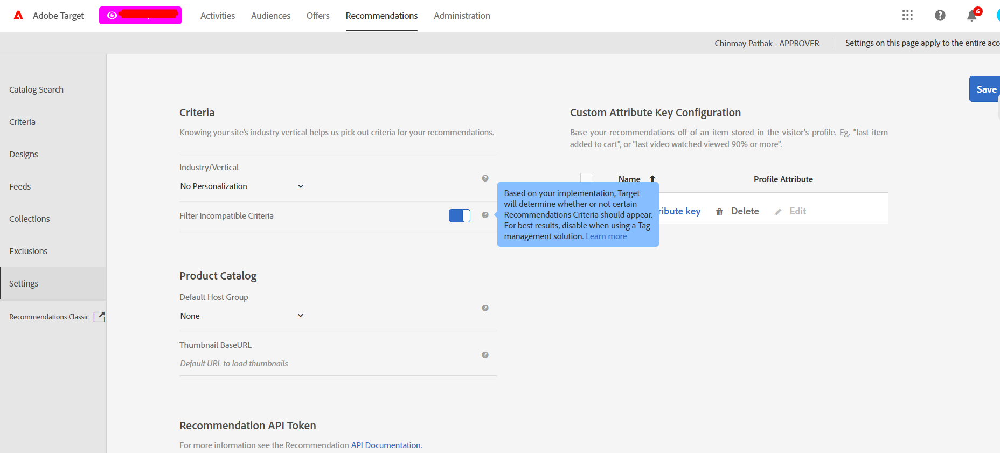

# アクティビティの作成時にはフィルター条件をお勧めします

## 説明 {#description}


<b>0.5511122</b>
Adobe Target

<b>問題</b>
すべてが正しく設定されている場合でも、アクティビティに特定の条件を適用すると警告メッセージが表示されます。アクティビティのページが、条件に必要なパラメーターを渡しています（`entity.id` および `entity.categoryId`）に設定する必要があります。

ただし、アクティビティに必要な条件を適用すると、次のエラーメッセージが引き続き表示されます。


```
An entity.ategoryID is required for this criteria to work properly. Use it anyway?
```


<b>原因：</b>
ページがタグ付けされたアクティビティビルダーが正しく「ピックアップ」されない場合があります `entity.id` および `entity.categoryId` 警告メッセージが表示されます。


## 解決策 {#resolution}


<b>解決策</b>
レコメンデーション設定を使用して、アカウントレベルでのフィルタリングを次のようにオフにできます。




アクティビティコンテンツの配信は、この設定ではまったく制限されません。

このフィルターは、アクティビティの作成にのみ使用されますが、アルゴリズムには影響しません。
