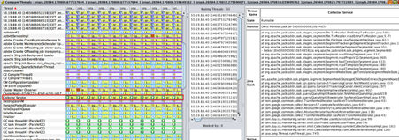

# AEM スレッドダンプ分析

この記事で詳しく説明する手順とベストプラクティスに従って、 [IBM Thread Analyzer](https://www.ibm.com/support/pages/ibm-thread-and-monitor-dump-analyzer-java-tmda) ツールを使用します。

## 説明 {#description}

<b>環境</b>

Adobe Experience Manager

<b>問題</b>

を使用してAEM Java スレッドダンプを分析する方法 [IBM Thread Analyzer](https://www.ibm.com/support/pages/ibm-thread-and-monitor-dump-analyzer-java-tmda) ツール？

## 解決策 {#resolution}

1. ダウンロードとインストール [IBM Thread Analyzer](https://www.ibm.com/support/pages/ibm-thread-and-monitor-dump-analyzer-java-tmda) ( つまり、IBM TDA と呼ぶ )。
2. パフォーマンスの問題が発生している AEM インスタンスから[スレッドダンプ](https://helpx.adobe.com/experience-manager/kb/thread-dumps-collection-analysis.html)をキャプチャします。
3. IBM TDA でスレッドダンプを開きます。
4. スレッドダンプの詳細を表示するには、リスト内のファイルを選択し、 <b>スレッドの詳細</b> 」ボタンをクリックします。

   
5. 並べ替え基準 <b>スタックの深さ</b> 一番長いスタックが上にある

   
6. スタックの深さが 10 行以上のスレッドを確認します。 これらは通常、最も興味深いスレッドです。

   関心のあるスレッドに関するメモを取ります。
7. スレッドで並べ替え <b>都道府県</b>.
8. 下にスクロールして、 <b>実行可能</b> スレッド。 Runnable スレッドは、スレッドダンプが取得された際に、実際に CPU 時間を取っていたスレッドです。

   *注意： <b>実行可能</b> スレッドを使用すると、 <b>無視できるThreads</b> 」セクションをクリックします。*

9. アプリケーションの一部である実行可能なスレッドを見つけます。たとえば、バックグラウンドジョブスレッドやリクエストスレッド ( リクエストスレッドは次のような名前を持ちます。 *127.0.0.1 `[` 1347028187737`]`  GET/content/sites/global/en/sitemap.static-delivery.httpd.html HTTP/1.1*) をクリックします。

   見つけたら、1 つずつクリックします。
10. 各リクエストスレッドについて、スレッド名のタイムスタンプを調べることで、ユーザーのブラウザーがサーバーに対してリクエストを実行した日時を確認できます。

   例えば、上記のスレッド名では、タイムスタンプ（ミリ秒 UNIX エポック形式）はです。 *1347028187737*.

   を使用して、そのエポック番号を日付/時刻に変換できます。 [www.epochconverter.com](https://www.epochconverter.com/).

   各スレッドダンプは、実行された日時を示します。

   リクエスト時間とスレッドダンプ時間の間の時間差を取り、リクエストがアクティブになっている時間を確認できます。
11. リクエストスレッドを確認したら、他のスレッドをスクロールします。 <b>実行可能</b> スレッド。

   目的の実行可能なスレッドを見つけたら、中央のパネルを見てみましょう。 <b>待機中スレッド</b>.

   Threadsが一覧表示され、選択したスレッドがモニタを解放するのを待っています。

   待機中のスレッドが見つからない場合、選択したスレッドは、 [ロック](https://docs.oracle.com/javase/1.5.0/docs/api/java/util/concurrent/locks/Lock.html) （クラスの実装を参照） [ロック](https://docs.oracle.com/javase/1.5.0/docs/api/java/util/concurrent/locks/Lock.html) を参照 )。

   例えば、 [ReentrantReadWriteLock](https://docs.oracle.com/javase/1.5.0/docs/api/java/util/concurrent/locks/ReentrantReadWriteLock.html) ロックが複数のモニタを内部的に実装するので、どのスレッドがロックホルダかは判別できません。

   だから、ソースコードを見て、ロックホルダーのスレッドと照合しなければならないかもしれません。
12. 他の多くのスレッドが待機していたロックまたはモニタがスレッドにあった場合は、残りのスレッドダンプを調べて、同じ問題を持つ他のスレッドが見つかるかどうかを確認します。

   他のダンプに同じスレッドがまだ存在するかどうかを確認します (IBM TDA では、複数のスレッドダンプを選択し、 <b>比較Threads</b> ボタンを使用して、複数のスレッドダンプにわたるスレッドの状態を表示します。

   
13. 詳しくは、 <b>コレクターサービス</b> 以下のスクリーンショットでは、

   
14. このビューでは、複数のスレッドダンプにわたってスレッドを確認し、長い実行スレッドであるかどうかを確認できます。

   基本的に、スレッドが <b>実行可能</b> 複数のダンプをまたいで、長いスタックを持つ状態。通常は、長い実行スレッドです。
15. もし、 <b>実行可能</b> スレッドを選択し、スレッドリストに戻り、スレッドダンプを選択して、 <b>モニタの詳細</b> ボタンを使用して、製品内で利用できます。

   IBM TDA は、モニタの所有スレッドとその待機スレッドのツリービューを示すウィンドウを開きます。

   *注意：サーブレットエンジンのスレッドプールモニターなど、一部のスレッドプールスレッドが表示される場合があります。アイドルスレッドは無視できます。*

   通常、スレッドはアイドルスレッドプールのスレッドであることを示すことができます。これは、ほとんどの場合、10 個以下のスタックラインしかないためです。

   

<u><b>スレッドレベルの CPU 使用率（Linux プラットフォームのみ）</b></u><b>:</b>

1. をキャプチャした場合 `top -H -b -n1 -p <javapid>` スレッドダンプに加えて、スレッドレベルの CPU 使用率を相互参照できます。

   上部の出力を開き、CPU を使用しているスレッドのプロセス ID を取得します。

   プロセス ID を 16 進数に変換し、対応するスレッドダンプファイルでその 16 進数値を検索します。

   ID は <b>nid</b> ある糸の
2. 最も多くの CPU を使用する一致するスレッドが <b>VM スレッド</b> または任意の <b>GC</b> スレッドを読み込むと、メモリに問題が発生する可能性があります。

   同じ演習を繰り返して、より多くのスレッドダンプとトップ出力を行います。CPU 時間をかけるこれらのスレッドのパターンがある場合は、メモリの問題が発生します。
3. メモリの問題を確認した場合は、次に問題が発生したときにヒープダンプをキャプチャします。

   詳しくは、 [メモリの問題の分析の記事](https://experienceleague.adobe.com/docs/experience-cloud-kcs/kbarticles/KA-17482.html?lang=ja) ヒープダンプのキャプチャと分析の詳細については、を参照してください。

<b><u>無視できるThreads</u>:</b>

- VM Thread：これは VM システムのスレッドです。
- GC タスクスレッドで始まるスレッド：これらは、ガベージコレクションスレッドです。
- 名前がに類似しているThreads `- [ 1347028691218]  in code at java.net.PlainSocketImpl.socketAccept(Native Method)`：これは、新しい接続で待機しているサーブレットエンジンのスレッドプールからのスレッドです。

