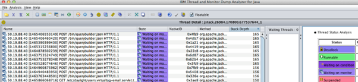

# AEM スレッドダンプ分析

この記事で詳しく説明している手順とベストプラクティスに従って、を使用してAEM Java スレッドダンプを正常に分析します [IBM スレッドアナライザー](https://www.ibm.com/support/pages/ibm-thread-and-monitor-dump-analyzer-java-tmda) ツール。

## 説明 {#description}

<b>環境</b>

Adobe Experience Manager

<b>問題</b>

を使用してAEM Java スレッドダンプを分析する方法 [IBM スレッドアナライザー](https://www.ibm.com/support/pages/ibm-thread-and-monitor-dump-analyzer-java-tmda) 道具？

## 解決策 {#resolution}

1. ダウンロードとインストール [IBM スレッドアナライザー](https://www.ibm.com/support/pages/ibm-thread-and-monitor-dump-analyzer-java-tmda) （略してIBMTDA とします）。
2. パフォーマンスの問題が発生している AEM インスタンスから[スレッドダンプ](https://helpx.adobe.com/experience-manager/kb/thread-dumps-collection-analysis.html)をキャプチャします。
3. IBM TDA でスレッドダンプを開きます。
4. スレッドダンプの詳細を表示するには、リストでファイルを選択して、 <b>スレッドの詳細</b> ボタン。

   
5. 並べ替え <b>スタックの深度</b> 最も長いスタックが上に表示されます。

   
6. スタックの深さが 10 行以上のスレッドを確認します。 これらは通常、最も関心のあるスレッドです。

   関心のあるスレッドをメモします。
7. スレッドで並べ替え <b>都道府県</b>.
8. にスクロール ダウンします。 <b>実行可能</b> スレッド。 Runnable スレッドは、スレッドダンプが取得された際に、実際に CPU 時間を取っていたスレッドです。

   *メモ： <b>実行可能</b> スレッドの場合、にリストされているスレッドを無視できます <b>無視できるThreads</b> このページの下部にあるセクション。*

9. 例えば、バックグラウンドジョブスレッドやリクエストスレッド（リクエストスレッドは次のような名前です）など、アプリケーションの一部である Runnable スレッドを探します。 *127.0.0.1 `[` 1347028187737`]`  GET /content/sites/global/en/sitemap.static-delivery.httpd.html HTTP/1.1*）に設定します。

   見つけたら、1 つずつクリックします。
10. 各リクエストスレッドについて、スレッド名のタイムスタンプを調べることで、ユーザーのブラウザーがサーバーに対してリクエストを行った時間を調べることができます。

   例えば、上記のスレッド名では、タイムスタンプ（ミリ秒単位の Unix Epoch 形式）は次のようになります *1347028187737*.

   を使用して、この Epoch 数を日付/時間に変換できます。 [www.epochconverter.com](https://www.epochconverter.com/).

   各スレッドダンプは、取得された日時を示します。

   リクエスト時間とスレッドダンプ時間の時間の差から、リクエストがアクティブであった時間の長さを確認できます。
11. リクエストスレッドを確認したら、もう一方をスクロールします <b>実行可能</b> スレッド。

   関心のある Runnable スレッドを見つけたら、中央のパネルを確認します。 <b>待機スレッド</b>.

   リストにThreadsは、選択したスレッドがモニターを解放するのを待っています。

   待機しているスレッドが表示されない場合、選択したスレッドがの所有者である可能性があります。 [ロック](https://docs.oracle.com/javase/1.5.0/docs/api/java/util/concurrent/locks/Lock.html) （クラスの実装を参照 [ロック](https://docs.oracle.com/javase/1.5.0/docs/api/java/util/concurrent/locks/Lock.html) （詳細はこちら）。

   例えば、 [ReentrantReadWriteLock](https://docs.oracle.com/javase/1.5.0/docs/api/java/util/concurrent/locks/ReentrantReadWriteLock.html) ロックは複数のモニターを内部で実装しているので、どのスレッドがロック所有者であるかはわかりません。

   そのため、ロック所有者である可能性のあるスレッドと組み合わせるために、ソースコードを調べる必要がある場合があります。
12. そのスレッドが他の多くのスレッドが待機しているロックまたはモニターを持っている場合、残りのスレッドダンプを確認すると、同じ問題がある他のスレッドが見つかるかどうかがわかります。

   他のダンプに同じスレッドがまだ存在するかどうかを確認します（IBM TDA で、複数のスレッドダンプを選択して、 <b>Threadsの比較</b> 複数のスレッドダンプにわたるスレッドの状態を表示するボタン。

   
13. を参照してください。 <b>コレクタ サービス</b> 以下のスクリーンショットを参照してください。

   
14. この表示では、複数のスレッドダンプにわたるスレッドを確認すると、長時間実行されているスレッドかどうかがわかります。

   基本的に、スレッドがにある場合 <b>実行可能</b> 複数のダンプをまたいだ状態で、長いスタックを持つ場合、通常は、長時間実行されているスレッドであることを意味します。
15. よく見ていなかったら <b>実行可能</b> スレッドを選択し、スレッドリストに戻ってスレッドダンプを選択してから、をクリックします。 <b>モニターの詳細</b> 上部パネルの「」ボタン。

   IBM TDA によって、ウィンドウが開かれ、スレッドを所有するモニターとその待機スレッドのツリービューが表示されます。

   *メモ：サーブレットエンジンスレッドプールモニターなどの、一部のスレッドプールスレッドが表示されることがあります。アイドルスレッドは無視されます。*

   通常、ほとんどの時間、10 行以下のスタックのみなので、スレッドがアイドルスレッドプールスレッドであることがわかります。

   

<u><b>スレッドレベルの CPU 使用率（Linux プラットフォームのみ）</b></u><b>:</b>

1. キャプチャした場合 `top -H -b -n1 -p <javapid>` 出力スレッドダンプに加えて、スレッドレベルの CPU 使用率を相互参照できます。

   top 出力を開いて、CPU を使用しているスレッドのプロセス ID を取得します。

   プロセス ID を 16 進数に変換し、対応するスレッドダンプファイルでその 16 進数の値を検索します。

   ID は、 <b>nid</b> いずれかのスレッドの。
2. ほとんどの CPU を使用している、一致するスレッドが <b>VM スレッド</b> または <b>GC</b> スレッドが存在する場合、メモリの問題が発生している可能性があります。

   より多くのスレッドダンプおよび top 出力に対して、同じ演習を繰り返します。これらのスレッドが CPU 時間を占めるパターンがある場合は、メモリの問題が発生しています。
3. メモリの問題を確認した場合、次回問題が発生したらヒープダンプをキャプチャします。

   これを表示 [メモリの問題の分析記事](https://experienceleague.adobe.com/docs/experience-cloud-kcs/kbarticles/KA-17482.html?lang=en) ヒープダンプのキャプチャおよび分析についての詳細を参照してください。

<b><u>無視できるThreads</u>:</b>

- VM Thread：これは VM システムのスレッドです。
- GC タスクスレッドで始まるスレッド：これらは、ガベージコレクションスレッドです。
- 次のような名前のThreads `- [ 1347028691218]  in code at java.net.PlainSocketImpl.socketAccept(Native Method)`：これらは、新しい接続を待機しているサーブレットエンジンのスレッドプールからのスレッドです。

