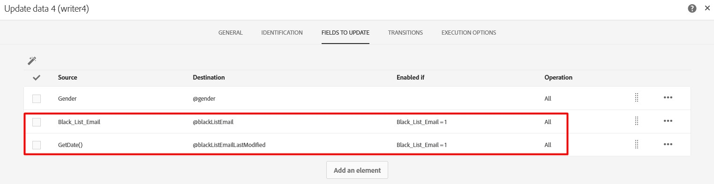

# blacklistEmail が変更されていない場合でも、blackListEmailLastModified は変更されます

## 説明


| 使用例 — ファイルからプロファイルをインポートする場合、ファイルから読み取る主要なプロパティの 1 つは、 `blacklistEmail`. 次に示すように、ソースフィールドに条件付き更新を使用して、宛先フィールドに対する不要な更新を避ける場合です。<br><br><br><br>しかし、 `blackListEmailLastModified` フィールドは、インポートされるすべての既存のプロファイルに対して変更されます。 期待される動作は、 `blackListEmailLastModified` 次の場合にのみ変更  `blacklistEmail` が変更されました。<br><br>生成された SQL 更新を次に示します。<br><br>NMS 受信者を更新 <br>     SET iGender=COALESCE( OutTbl.iFld1084817585, 0),<br>         iBlackListEmail=COALESCE( CASE OutTbl.iEnaFld1086062770 WHEN 1 THEN OutTbl.iFld1086062770 ELSE NULL END, CASE WHEN OutTbl.iEnaFld1086062770=1 THEN 0 ELSE iBlackListEmailEND),<br>         iModifiedById=16107610,tsLastModified=$(curdate),<br>         tsBlackListEmailLastModified=$(curdate),<br>         tsBlackListAllLastModified=$(curdate) <br>    FROM wkf11373941_23_1 OutTbl <br>   WHERE NmsRecipient.iRecipientId=OutTbl.iPKey_1 <br>     AND OutTbl.iRecProcState$(l) <br>     AND OutTbl.iRecProcState=$(l) <br>     AND OutTbl.iPKey_10<br><br>上記の更新で示されているように、 `blackListEmailLastModified` (`tsBlackListEmailLastModified`) フィールドは `blacklistEmail` (`iBlackListEmail`) が更新されたか、更新されなかったかを示します。 |
| --- |


## 解像度


解決策は、 `blackListEmailLastModified`  フィールドの値を条件付き更新に設定します。

以下を参照してください。



生成された SQL 更新は、 `blackListEmailLastModified` は次の場合にのみ変更されます： `blacklistEmail` が変更されました。

```
UPDATE NmsRecipient 
    SET iGender=COALESCE( OutTbl.iFld1084817585, 0),
        iBlackListEmail=COALESCE( CASE OutTbl.iEnaFld1086062770 WHEN 1 THEN OutTbl.iFld1086062770 ELSE NULL END, CASE WHEN OutTbl.iEnaFld1086062770=1 THEN 0 ELSE iBlackListEmail END),
        tsBlackListEmailLastModified=COALESCE( CASE OutTbl.iEnaFld1169490137 WHEN 1 THEN OutTbl.tsFld1169490137 ELSE NULL END, CASE WHEN OutTbl.iEnaFld1169490137=1 THEN NULL ELSE tsBlackListEmailLastModified END),
        iModifiedById=16107610,
        tsLastModified=$(curdate),
        tsBlackListAllLastModified=$(curdate) 
   FROM wkf11373941_25_1 OutTbl 
  WHERE NmsRecipient.iRecipientId=OutTbl.iPKey_1 
    AND OutTbl.iRecProcState$(l) 
    AND OutTbl.iRecProcState=$(l) 
    AND OutTbl.iPKey_10
```
