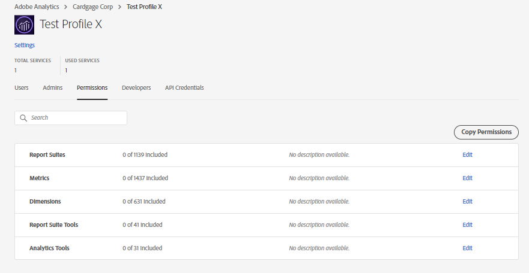

# ワークスペースプロジェクトの共有中に製品プロファイルを使用可能にするための前提条件

## 説明

ワークスペースプロジェクトを「X」のユーザーと共有している間、製品プロファイルは、ドロップダウンで「X」を使用できない可能性があります。

## 解像度

ワークスペースプロジェクトを共有する際に製品プロファイルをドロップダウンで使用できるようにするには、Admin Console内で、製品プロファイルに関連付けられた Analytics 権限が/にある必要があります。 製品プロファイル「X」にランダムな権限が追加されたら、Workspace プロジェクトを共有する際に、ドロップダウンで表示され始める必要があります。

上記の例では、製品プロファイル「Test Profile X」は、権限を持たずに新しく作成された場合、ドロップダウンオプションで使用できませんでした。 ただし、権限を追加すると、使用可能になります。

<b>注意：</b> 製品プロファイル「X」に割り当てられているすべての権限がAdmin Consoleで取り消された場合、製品プロファイル「X」は <b>まだ </b>引き続き、プロジェクトを共有するためのドロップダウンで使用できます。

     
