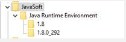

# ACC v7 エラー：「JVM-510037 Cannot find the Java dynamic library.」


解決策は 2 つあります。JavaSoft キーを Windows レジストリの下に手動で追加するか、 `Computer\HKEY_LOCAL_MACHINE\SOFTWARE`または、2 つの Windows 環境変数を使用して、 `jvm.dll` ファイルは、Web モジュールで見つかります。

## 説明 {#description}


### <b>環境</b>

Adobe Campaign Classic v7 (ACC v7)


### <b>問題/症状</b>

<b>使用例</b>  — この問題は、Windows で実行されている Campaign インスタンスで、OracleJDK を Open JDK に置き換える際に発生していました。

この例では、OracleJDK v1.8.0.191 がすべての Windows Campaign インスタンスにインストールされていました。 いずれかの Campaign インスタンスでOracleJDK を Open JDK に置き換えた後、WEB が起動に失敗し、次のエラーが表示されました。

<b>`JVM-510037 Cannot find the Java dynamic library. Check that a JDK or a JRE is installed on the machine. (iRc=-53)`</b>

ただし、Java は、適切な Path および JAVA_HOME 環境変数と共に正しくインストールされます。


## 解決策 {#resolution}


Web モジュールを実行するには、JVM ダイナミックライブラリが Campaign に対して表示されている必要があります。 oracleJDK を削除すると、Windows レジストリから JavaSoft キーが削除され、その JVM ライブラリへの参照もすべて失われます。

この問題を解決する方法は 2 つあります。

### <u>ソリューシ#1ョン</u>

JavaSoft キーは、Windows レジストリの下に手動で追加できます。 `Computer\HKEY_LOCAL_MACHINE\SOFTWARE`.



次に例を示します ( `OpenJDK 1.8_292`) に含まれる必要がある情報を示します。

`Windows Registry Editor Version 5.00`

`[ HKEY_LOCAL_MACHINE\SOFTWARE\JavaSoft]`


```
[ HKEY_LOCAL_MACHINE\SOFTWARE\JavaSoft\Java Runtime Environment] "CurrentVersion"="1.8""BrowserJavaVersion"="11.301.2"
```


```
[ HKEY_LOCAL_MACHINE\SOFTWARE\JavaSoft\Java Runtime Environment\1.8] "MicroVersion"="0""RuntimeLib"="C:\\Users\\perth\\Java\\openjdk-8u292-b10\\jre\\bin\\server\\jvm.dll""JavaHome"="C:\\Users\\perth\\Java\\openjdk-8u292-b10\\jre"
```


```
[ HKEY_LOCAL_MACHINE\SOFTWARE\JavaSoft\Java Runtime Environment\1.8.0_292] "MicroVersion"="0""RuntimeLib"="C:\\Users\\perth\\Java\\openjdk-8u292-b10\\jre\\bin\\server\\jvm.dll""JavaHome"="C:\\Users\\perth\\Java\\openjdk-8u292-b10\\jre"
```


 
次のパスフォルダーが <b>`Path` </b>環境変数。

`C:\Users\perth\Java\openjdk-8u292-b10\bin`

Web モジュールは、期待どおりに起動できるはずです。


### <u>ソリューシ#2ョン</u>

2 つの Windows 環境変数の使用方法を定義して、 `jvm.dll` ファイルは、Web モジュールで見つかります。

変数は次のとおりです。

- `USEENV=1`
- `JVMLIBDIR=<the path of the jvm.dll file>`


次に例を示します。


なお、 `JVMLIBDIR` Web モジュールで詳細ログが有効になっている場合、がログから表示されます。
