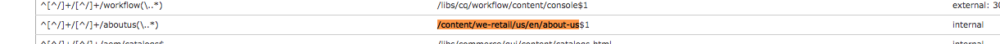

# Dispatcher バニティ URL | AEM


このドキュメントでは、Adobe Experience Managerでのバニティ URL の処理方法と、書き換えルールを使用してコンテンツを配信のエッジに近づけるなどの追加手法を説明します。

## 説明 {#description}


### <b>環境</b>

Adobe Experience Manager


### <b>問題/症状</b>

AEMではバニティ URL をどのように扱いますか？ 配信のエッジに近いコンテンツをマッピングする追加の手法はありますか？

#### バニティ URL とは

意味のあるフォルダー構造に存在するコンテンツがある場合、参照しやすい URL に存在しないことがあります。 バニティ URL はショートカットのようなものです。 実際のコンテンツが存在する場所を参照する短い、または一意の URL。

例： <b>*/aboutus</b> ～を指す <b>/content/we-retail/us/en/about-us.html</b>*

AEM オーサーには、AEM内のコンテンツの 1 つにバニティ URL プロパティを設定して公開するオプションが用意されています。

この機能を使用するには、バニティを許可するように Dispatcher フィルターを調整する必要があります。 作成者がこれらのバニティページエントリの設定に必要となる割合で Dispatcher 設定ファイルを調整する際には、これによって無理が生じます。

このため、Dispatcher モジュールには、コンテンツツリーにバニティとしてリストされるすべての項目を自動許可する機能があります。


## 解決策 {#resolution}


### 仕組み

#### バニティ URL の作成

作成者がAEMのページにアクセスしてページのプロパティを閲覧し、「バニティ URL」セクションにエントリを追加します。

変更を保存してページをアクティベートすると、バニティがこのページに割り当てられます。

<b><u>タッチ UI</u>:</b>


<b><u>クラシックコンテンツファインダー</u>:</b>


<b>注意：</b> 名前空間の問題に対して非常に脆弱であることを理解してください。 バニティエントリはすべてのページに対してグローバルです。これは、回避策を計画する必要がある欠点の 1 つにすぎません。 その一部については、後ほど説明します。

<b><u>リソースの解決とマッピング</u>:</b>

各バニティエントリは、内部リダイレクトの Sling マップエントリです。 これらのマップは、AEM インスタンスの Felix コンソール（`/system/console/jcrresolver`）

バニティエントリによって作成されたマップエントリのスクリーンショットを次に示します。



上記の例では、AEM インスタンスにへのアクセスを指示すると、 `/aboutus` 解決します `/content/we-retail/us/en/about-us.html`

<b><u>Dispatcher の自動許可フィルター</u>:</b>

安全な状態の Dispatcher は、JCR ツリーのルートであることが理由で、Dispatcher 経由でパス /にある要求を除外します。

パブリッシャーが、以下からのコンテンツを許可していることを確認するのが重要です `/content` などのパスではなく、その他の安全なパスなど。 `/system` 等。

以下は、のベースフォルダーに格納されているバニティ URL です。安全を確保しながらパブリッシャーにどう到達できるでしょうか。

シンプルな Dispatcher には自動フィルターの許可メカニズムが備わっており、AEM パッケージをインストールしてから、そのパッケージページを指すように Dispatcher を設定する必要があります。 訪問 [こちら](https://experience.adobe.com/#/downloads/content/software-distribution/en/aem.html?package=/content/software-distribution/en/details.html/content/dam/aem/public/adobe/packages/granite/vanityurls-components) （AEM パッケージ用）。

Dispatcher のファームファイルには、設定セクションがあります。


```
/vanity_urls {      /url    "/libs/granite/dispatcher/content/vanityUrls.html"
  /file   "/tmp/vanity_urls"      /delay  300 }
```


この設定では、300 秒ごとにAEM インスタンスからこの URL を取得し、許可する項目のリストを取得するように Dispatcher に指示されます。

応答のキャッシュを/file 引数（この例では/tmp/vanity_urls）に保存します。

そのため、URI でAEM インスタンスにアクセスすると、取得した内容が表示されます。


これは非常にシンプルなリストです。

#### バニティルールとしてのルールの書き換え

上述のように、AEMに組み込まれているデフォルトのメカニズムの代わりに、書き換えルールを使用することが挙げられるのはなぜでしょうか。

名前空間の問題、パフォーマンス、より適切に処理できる高レベルのロジックについて簡単に説明されています。

バニティエントリの例を見てみましょう `/aboutus` 内容に合わせて `/content/we-retail/us/en/about-us.html` apache のを使用 `mod_rewrite` これを実現するためのモジュール。

`RewriteRule /aboutus /content/we-retail/us/en/about-us.html PT,L,NC`

このルールはバニティを探します `/aboutus` PT （Pass Through）フラグを使用して、レンダラーからフルパスを取得します。

また、他のすべてのルール L （Last）フラグの処理が停止します。つまり、JCR Resolving などの大量のルールリストをトラバースする必要がなくなります。

リクエストをプロキシする必要なく、AEM パブリッシャーがこのメソッドのこれらの 2 つの要素に応答するのを待つことで、パフォーマンスが大幅に向上します。

さらに良いのは、NC フラグ（大文字と小文字を区別しない）です。これは、顧客が URI を `/Aboutus` の代わりに `/aboutus` 引き続き機能し、適切なページを取得できます。

これを実行するために書き換えルールを作成するには、Dispatcher に設定ファイルを作成します（例： `/etc/httpd/conf.d/rewrites/examplevanity_rewrite.rules`）に設定し、に含めます `.vhost` これらのバニティ url を適用する必要があるドメインを処理するファイル。

以下に、内部の Include のコードスニペットの例を示します。


```
/etc/httpd/conf.d/enabled_vhosts/we-retail.vhost
 VirtualHost *:80    ServerName    weretail.com    ServerAlias 

www.weretail.com        ........ SNIP ........     IfModule mod_rewrite.c   

   ReWriteEngine    on       LogLevel warn rewrite:info

Include /etc/httpd/conf.d/rewrites/examplevanity_rewrite.rules      / IfModule         
   ........ SNIP ......../VirtualHost
```


### 使用する方法と場所

A. バニティエントリの制御にAEMを使用すると、次のメリットがあります。

- 作成者はその場で作成できます
- コンテンツと共に存在し、コンテンツと共にパッケージ化できる


B.使用 `mod_rewrite` バニティエントリを制御するには、次の利点があります。

- コンテンツの解決を迅速化
- エンドユーザーコンテンツリクエストのエッジに近い
- 他の条件でのコンテンツのマッピング方法を制御するための拡張性とオプションの増加
- 大文字と小文字を区別しない場合がある


C.両方の方法を使用しますが、どちらをいつ使用するかについてのアドバイスと条件は次のとおりです。

- バニティが一時的なもので、予定されているトラフィックレベルが低い場合は、AEMの組み込み機能を使用します
- バニティが頻繁に変更されず、頻繁に使用されるステープルエンドポイントの場合は、 `mod_rewrite` ルール。
- バニティ名前空間（例： `/aboutus`）は、同じAEM インスタンス上の多数のブランドで再利用し、書き換えルールを使用する必要があります。


<b>注意：</b> AEM バニティ機能を使用してネームスペースを避ける場合は、命名規則を作成できます。 のようにネストされたバニティ URL の使用 `/brand1/aboutus, brand2/aboutus, brand3/aboutus`
