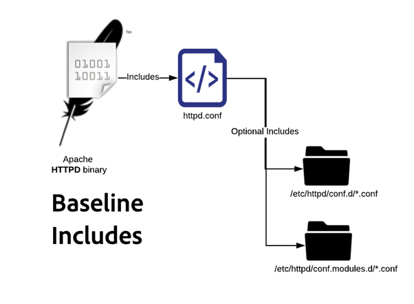
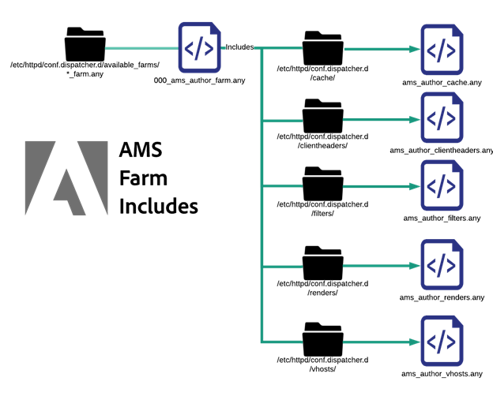

# 設定ファイルの説明 | AEM


Managed Servicesの Dispatcher Adobeサーバーの設定ファイルの詳細な分類を説明します。 その重要性、命名規則および実用的なアプリケーションを明らかにします。

## 説明 {#description}


### 環境

Adobe Experience Manager

### 問題/症状

このドキュメントでは、Adobe Managed Servicesでプロビジョニングされた標準ビルドの Dispatcher サーバーにデプロイされた設定ファイルをそれぞれ分類して説明します。 使用方法、命名規則など

<b>命名規則</b>

Apache web サーバーは、include または includeoptional ステートメントを使用してターゲティングを行っている場合、ファイルの拡張子が何であるかは気にしません。 競合や混乱を排除するように適切に命名すると、非常に助けになります。 使用される名前は、ファイルが適用される範囲を示すので、作業が容易になります。 すべてにという名前を付けると、非常に混乱します。 アドビでは、不適切な名前のファイルと拡張子は避けたいと考えています。

一般的な AMS 設定済みの Dispatcher で使用される様々なカスタムファイル拡張子と命名規則のリストを以下に示します。

<u>conf.d/に含まれるファイル</u>


| ファイル | ファイルの保存先 | 説明 |
| --- | --- | --- |
| `<` ファイル名`>` .conf | /etc/httpd/conf.d/ | デフォルトの Enterprise Linux インストールでは、このファイル拡張子とインクルードフォルダーを httpd.conf の設定を上書きする場所として使用し、Apache のグローバルレベルで追加機能を追加できるようにします。 |
| `<` ファイル名`>` .vhost | ステージング：/etc/httpd/conf.d/available_vhosts/<br><br>アクティブ：<br><br>/etc/httpd/conf.d/enabled_vhosts/<br><br><u style="box-sizing: border-box; border: 0 none">*メモ：.vhost ファイルは enabled_vhosts フォルダーにコピーされませんが、available_vhosts/ .vhost ファイルへの相対パスへの symlinks を使用します。</u> | \*.vhost （仮想ホスト）ファイルは、 `<` VirtualHosts `>`  エントリをホスト名に一致させ、Apache が各ドメイントラフィックを異なるルールで処理できるようにします。 .vhost ファイルから、書き換えや許可リストへの登録などの他のファイルが含まれます。 |
| `<` ファイル名`>` _rewrite.rules | /etc/httpd/conf.d/rewrites/ | `*_rewrite.rules` ファイルストア `mod_rewrite` vhost ファイルによって明示的に含まれて使用されるルール |
| `<` ファイル名`>` _whitelist.rules | /etc/httpd/conf.d/whitelists/ | \*_ipwhitelist.rules ファイルは、\*.vhost ファイル内からインクルードされます。 IP の正規表現または IP の許可リストへの登録を許可する拒否ルールが含まれます。 IP アドレスに基づいて仮想ホストの表示を制限しようとする場合は、これらのファイルの 1 つを生成し、\*.vhost ファイルからインクルードします。 |


<u>conf.modules.d/に含まれるファイル</u>


| ファイル | ファイルの保存先 | 説明 |
| --- | --- | --- |
| `<` ファイル名`>` .any | /etc/httpd/conf.dispatcher.d/ | AEM Dispatcher Apache モジュールは、その設定を\*.any ファイルから取得します。 デフォルトの親インクルードファイルは conf.dispatcher.d/dispatcher.anyです。 |
| `<` ファイル名`>` _farm.any | <u>ステージング</u>:<br><br>/etc/httpd/conf.dispatcher.d/available_farms/<br><br><u>アクティブ</u>:<br><br>/etc/httpd/conf.dispatcher.d/enabled_farms/<br><br><u style="box-sizing: border-box; border: 0 none">*メモ：これらの farm ファイルは enabled_farms フォルダーにコピーされませんが、available_farms/ _farm.any ファイルへの相対パスへの symlinks を使用します。</u> | \*_farm.any ファイルは conf.dispatcher.d/dispatcher.any ファイル内に含まれています。 これらの親 farm ファイルは、レンダリングまたは web サイトタイプごとにモジュールの動作を制御するために存在します。 ファイルは available_farms ディレクトリに作成され、enabled_farms ディレクトリへのシンボリックリンクによって有効にされます。<br><br>dispatcher.any ファイルから名前でそれらを自動的に含めます。<br><br>ベースラインファームファイルは 000 で始まります_ 最初に読み込まれていることを確認します。<br><br>カスタム farm ファイルは、適切なインクルード動作を保証するために 100_で番号スキームを開始してから必要があります。 |
| `<` ファイル名`>` _filters.any | /etc/httpd/conf.dispatcher.d/filters/ | \*_filters.any ファイルは、conf.dispatcher.d/enabled_farms/\*_farm.any ファイル内からインクルードされます。 各 farm には、どのトラフィックをフィルターで除外し、レンダラーに送信しないかを変更する一連のルールがあります。 |
| `<` ファイル名`>` _vhosts.any | /etc/httpd/conf.dispatcher.d/vhosts/ | \*_vhosts.any ファイルは、conf.dispatcher.d/enabled_farms/\*_farm.any ファイル内からインクルードされます。 これらのファイルは、BLOB マッチングによって照合されて、そのリクエストを処理するためのレンダラーを決定するホスト名または URI パスのリストです。 |
| `<` ファイル名`>` _cache.any | /etc/httpd/conf.dispatcher.d/cache/ | \*_cache.any ファイルは、conf.dispatcher.d/enabled_farms/\*_farm.any ファイル内からインクルードされます。 これらのファイルは、キャッシュされる項目とキャッシュされない項目を指定します。 |
| `<` ファイル名`>` _invalidate_allowed.any | /etc/httpd/conf.dispatcher.d/cache/ | \*_invalidate_allowed.any ファイルは、conf.dispatcher.d/enabled_farms/\*_farm.any ファイル内に含まれています。 フラッシュリクエストと無効化リクエストの送信を許可する IP アドレスを指定します。 |
| `<` ファイル名`>` _clientheaders.any | /etc/httpd/conf.dispatcher.d/clientheaders/ | \*_clientheaders.any ファイルは、conf.dispatcher.d/enabled_farms/\*_farm.any ファイル内に含まれています。 各レンダラーに渡すクライアントヘッダーを指定します。 |
| `<` ファイル名`>` _renders.any | /etc/httpd/conf.dispatcher.d/renders/ | \*_renders.any ファイルは、conf.dispatcher.d/enabled_farms/\*_farm.any ファイル内に含まれています。 各レンダラーの IP、ポートおよびタイムアウト設定を指定します。適切なレンダラーは、LiveCycle サーバーか、Dispatcher で取得/プロキシ化できるリクエストを送信する任意のAEM システムです。 |


<b>問題の回避</b>

命名規則に従うと、最悪の結果を招く可能性のある犯しがちなミスを避けることができます。 例をいくつか取り上げます。

<u>問題の例</u>

ExampleCo のサイト例として、Dispatcher 設定の開発者が 2 つの設定ファイルを作成しました。

`/etc/httpd/conf.d/exampleco.conf`


```
<VirtualHost *:80>

    ServerName  "exampleco"

    ServerAlias "www.exampleco.com"

    .......... SNIP ...............

    <IfModule mod_rewrite.c>

        ReWriteEngine   on

        LogLevel warn rewrite:trace1

        Include /etc/httpd/conf.d/rewrites/exampleco.conf

    </IfModule>

</VirtualHost>
```


`/etc/httpd/conf.d/rewrites/exampleco.conf`


```
RewriteRule /$ /content/exampleco/en.html [ PT,L] 

RewriteRule /robots.txt$ /content/dam/exampleco/robots.txt [ PT,L]
```


<b>潜在的な危険</b>

<b>A. ファイル名が同じです</b>

vhost ファイルが誤って rewrites フォルダーに配置され、rewrites ファイルが vhosts フォルダーに配置された場合、 ファイル名で判断して適切にデプロイされるように思われますが、Apache はエラーをスローし、問題はすぐには明らかになりません。

<b>これは通常、どのように問題になりますか？</b>

2 つのファイルが同じ場所にダウンロードされた場合、自分自身を上書きするか、見分けがつかなくなり、デプロイメントプロセスが悪夢のような状況になります。

<b>B. ファイル拡張子が同じで自動インクルードが発生しやすい</b>

ファイル拡張子が同じで、Apache が多くのデフォルトフォルダー内のすべての.conf ファイルを自動的に含める自動インクルード拡張子を使用しています。

<b>これは通常、どのように問題になりますか？</b>

拡張子が.conf の vhost ファイルが/etc/httpd/conf.d/ フォルダーに格納されている場合、Apache はこれをメモリに読み込もうとします。通常はこれで問題ありませんが、拡張子が.conf の書き換えルールファイルがに格納されます。 `/etc/httpd/conf.d/` フォルダーが自動的に含まれてグローバルに適用されるので、混乱を招き、望ましくない結果が生じます。


## 解決策 {#resolution}


実行する内容に応じて、自動インクルードルールの名前空間に属さない安全な名前をファイルに付けます。

- 仮想ホストファイルの場合は、次のように名前を付けます `.vhost` 拡張機能として。
- 書き換えルールファイルの場合は、次のように名前を付けます。 `<site>_rewrite.rules` 接尾辞および拡張子として使用します。 この命名規則により、ファイルがどのサイトを対象にしているかや、一連の書き換えルールであることが明確になります。
- IP 許可リストルールファイルの場合は、という名前を付けます。 `<description>_whitelist.rules` 接尾辞および拡張子として使用します。 この命名規則により、その目的と、それが一連の IP マッチングルールであることがわかります。


これらの命名規則を使用すると、属していない自動インクルードディレクトリにファイルが移動された場合に、問題を回避できます。

例えば、.rules、.any または.vhost という名前のファイルを以下の自動インクルードフォルダーに格納するとします。 `/etc/httpd/conf.d/` 影響はありません。

デプロイメントの変更リクエストに次の内容が含まれる場合 `please deploy exampleco_rewrite.rules to production dispatchers` 変更をデプロイしているユーザーは、新しいサイトを追加しているのではなく、ファイル名で示されているように書き換えルールを更新しているだけであることが既にわかっています。

<b>インクルード順序</b>

エンタープライズ Linux にインストールされた Apache web サーバーで機能および設定を拡張する際には、次のような重要な事項があります <b>注文を含める</b> 分かってくれるはず。

回答： <u>Apache ベースラインインクルード</u>

Apache バイナリがで始まる `httpd.conf` 実行するアクション `includeoptional` に `conf.d/*.conf` および `conf.modules.d/*.conf` ディレクトリ。



上の図で示すように、httpd バイナリはのみを参照します。 `httpd.conf` 設定ファイルとしてのファイル。 そのファイルには次のステートメントが含まれています。


```
Include conf.modules.d/*.conf
IncludeOptional conf.d/*.conf
```


B. <u>AMS トップレベルインクルード</u>

標準を適用する際に、追加のファイルタイプと独自のインクルードをいくつか追加しました。

AMS ベースラインディレクトリとトップレベルインクルードは次のとおりです。


Apache のベースラインに基づいて、追加フォルダーとトップレベルインクルードを AMS でどう作成したかを示します。 `conf.d` フォルダーと、の下にネストされたモジュール固有のディレクトリ `/etc/httpd/conf.dispatcher.d/`

Apache が読み込まれると、を取り込みます。 `/etc/httpd/conf.modules.d/02-dispatcher.conf` そのファイルにはバイナリファイルが含まれます `/etc/httpd/modules/mod_dispatcher.so` に実行中の状態です。


```
LoadModule dispatcher_module modules/mod_dispatcher.so
```


でモジュールを使用するには `</VirtualHost>` 設定ファイルをにドロップします。 `/etc/httpd/conf.d/` 名前付き `dispatcher_vhost.conf` このファイルの中に、モジュールが機能するために必要な基本的なパラメーターを use セットアップすることがわかります。


```
<IfModule disp_apache2.c>
DispatcherConfig conf.dispatcher.d /dispatcher .any
...SNIP...
</IfModule>
```


上記のように、これには Dispatcher モジュールがから設定ファイルを取得するための、トップレベルの dispatcher.any ファイルが含まれます。 `/etc/httpd/conf.dispatcher.d/dispatcher.any`

このファイルの内容に注意を払ってください。


```
/farms {
 $include "enabled_farms/*_farm.any"
}
```


最上位の dispatcher.any ファイルには、に存在するすべての有効なファームファイルが含まれています `/etc/httpd/conf.dispatcher.d/enabled_farms/` ファイル名： `<FILENAME>_farm.any` これは、標準的な命名規則に従います。

の後半 `dispatcher_vhost.conf` 前述のファイルには、に存在する有効な各仮想ホストファイルを有効にするためのインクルード文も含まれています。 `/etc/httpd/conf.d/enabled_vhosts/` 次のファイル名を持つ `<FILENAME>.vhost` これは、標準的な命名規則に従います。


```
IncludeOptional /etc/httpd/conf.d/enabled_vhosts/*.vhost
```


それぞれの.vhost ファイルでは、Dispatcher モジュールがディレクトリのデフォルトのファイルハンドラーとして初期化されることに注意してください。 構文を示す.vhost ファイルの例を次に示します。


```
<VirtualHost *:80>
 ServerName "weretail"
 ServerAlias www.weretail.com weretail.com
 <Directory />
 <IfModule disp_apache2.c>
 ....SNIP....
 SetHandler dispatcher-handler
 </IfModule>
 ....SNIP....
 </Directory>
 ....SNIP....
</VirtualHost>
```


トップレベルのインクルードの解決後に、言及価値のある他のサブインクルードがあります。 ファームファイルおよび vhost ファイルに他のサブ要素が含まれる仕組みの概要図を次に示します。

C. <u>AMS 仮想ホストのインクルード</u>


から.vhost ファイルが `/etc/httpd/conf.d/availabled_vhosts/` ディレクトリは、にシンボリックリンクされます。 `/etc/httpd/conf.d/enabled_vhosts/` 実行中の設定で使用されるディレクトリ。

.vhost ファイルには、見つかった共通部分に基づくサブインクルードが含まれています。 変数、許可リスト、書き換えルールなどがあります。

.vhost ファイルには、.vhost ファイルのどこにインクルードする必要があるかに基づいて、各ファイルのインクルード文を記述します。 参考として、.vhost ファイルの構文例を示します。


```
Include /etc/httpd/conf .d /variables/weretail .vars VirtualHost *:80
ServerName "${MAIN_DOMAIN}"
Directory / Include /etc/httpd/conf .d /whitelists/weretail *_whitelist.rules
IfModule disp_apache2.c
....SNIP....
SetHandler dispatcher-handler
/IfModule
....SNIP....
/Directory
....SNIP....
IfModule mod_rewrite.c
ReWriteEngine on
LogLevel warn rewrite:trace1
Include /etc/httpd/conf .d /rewrites/weretail_rewrite .rules
/IfModule /VirtualHost
```


上記の例に示すように、この設定ファイルで必要な変数には、後で使用するインクルードがあります。

ファイルの内部 `/etc/httpd/conf.d/variables/weretail.vars` 定義されている変数を確認できます。


```
Define MAIN_DOMAIN dev.weretail.com
```


また、様々な許可リストの基準に基づいて、このコンテンツを閲覧できる人を制限する許可リスト.rules ファイルのリストを含む行も表示されます。 許可リストファイルの中身を見てみましょう `/etc/httpd/conf.d/whitelists/weretail_mainoffice_whitelist.rules`:


```
<RequireAny>
 Require ip 192.150.16.0/23
</RequireAny>
```


一連の書き換えルールを含む行も確認できます。 の内容を見てみましょう。 `weretail_rewrite.rules` ファイル：


```
RewriteRule /robots.txt$ /content/dam/weretail/robots.txt [ NC,PT] 
RewriteCond %{SERVER_NAME} brand1.weretail.net [ NC] 
RewriteRule /favicon.ico$ /content/dam/weretail/favicon.ico [ NC,PT] 
RewriteCond %{SERVER_NAME} brand2.weretail.com [ NC] 
RewriteRule /sitemap.xml$ /content/weretail/general/sitemap.xml [ NC,PT] 
RewriteRule /logo.jpg$ /content/dam/weretail/general/logo.jpg [ NC,PT]
```


D. <u>AMS ファームのインクルード</u>



`/etc/httpd/conf.dispatcher.d/available_farms/` ディレクトリの `<FILENAME>_farm.any` ファイルが `/etc/httpd/conf.dispatcher.d/enabled_farms/` ディレクトリにシンボリックリンクされた場合、実行中の設定に使用されます。

ファームファイルには、キャッシュ、クライアント ヘッダー、フィルター、レンダーおよび vhost など、[ファームのトップレベルセクション](https://experienceleague.adobe.com/docs/experience-manager-dispatcher/using/configuring/dispatcher-configuration.html?lang=ja#defining-farms-farms)に基づくサブインクルードがあります。

`<FILENAME>_farm.any` ファイルには、ファームファイル内のインクルード先に基づいて、各ファイルのインクルード文が含まれます。 構文の例を次に示します `<FILENAME>_farm.any` ファイルを参考にしてください。


```
/weretailfarm {
 /clientheaders {
 $include "/etc/httpd/conf.dispatcher.d/clientheaders/ams_publish_clientheaders.any"
 $include "/etc/httpd/conf.dispatcher.d/clientheaders/ams_common_clientheaders.any"
 }
 /virtualhosts {
 $include "/etc/httpd/conf.dispatcher.d/vhosts/weretail_vhosts.any"
 }
 /renders {
 $include "/etc/httpd/conf.dispatcher.d/renders/ams_publish_renders.any"
 }
 /filter {
 $include "/etc/httpd/conf.dispatcher.d/filters/ams_publish_filters.any"
 $include "/etc/httpd/conf.dispatcher.d/filters/weretail_search_filters.any"
 }
 ....SNIP....
 /cache {
 ....SNIP....
 /rules {
 $include "/etc/httpd/conf.dispatcher.d/cache/ams_publish_cache.any"
 }
 ....SNIP....
 /allowedClients {
 /0000 {
 /glob "*.*.*.*"
 /type "deny"
 }
 $include "/etc/httpd/conf.dispatcher.d/cache/ams_publish_invalidate_allowed.any"
 }
 ....SNIP....
 }
}
```


WaRetail ファームの各セクションは、必要なすべての構文を持つ代わりに、インクルード文を使用して表示されます。

これらのインクルードのいくつかの構文を見て、各サブインクルードがどのように表示されるかを把握しましょう。 `/etc/httpd/conf.dispatcher.d/vhosts/weretail_publish_vhosts.any`:


```
"brand1.weretail.com"
"brand2.weretail.com"
"www.weretail.comf"
```


これは、改行で区切られたドメイン名のリストで、このファームから他のファームより上位にレンダリングする必要があります。

次に、 `/etc/httpd/conf.dispatcher.d/filters/weretail_search_filters.any`:


```
/400 { /type "allow" /method "GET" /path "/bin/weretail/lists/*" /extension "json" }
/401 { /type "allow" /method "POST" /path "/bin/weretail/search/" /extension "html" }
```

