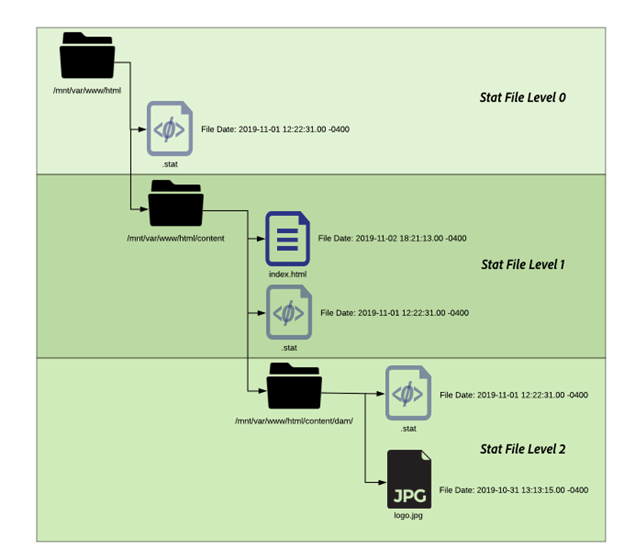

# Adobe Managed Services Dispatcher のフラッシュ


システムの効率とデータの整合性を維持するために不可欠な、キャッシュのフラッシュメカニズムとコンテンツアクティベーションワークフローのニュアンスについて説明します。

## 説明 {#description}


### 環境

Adobe Experience Manager

### 問題/症状

このドキュメントでは、フラッシュがどのように発生するのか、およびキャッシュのフラッシュと無効化を実行するメカニズムについて説明します。

### 仕組み

#### 操作順序

一般的なワークフローは、コンテンツ作成者がページをアクティブ化し、パブリッシャーが新しいコンテンツを受け取ると、フラッシュリクエストを Dispatcher にトリガーする場合に最も明確に示されます（下図を参照）。


このイベントの連鎖は、新しいアイテムや変更されたアイテムのみをフラッシュすることをハイライトします。  これにより、キャッシュをクリアする前にパブリッシャーがコンテンツを受け取るようになります。変更がパブリッシャーから取得できるようになる前にフラッシュが発生する競合状態を避けることができます。

#### レプリケーションエージェント

オーサー環境には、パブリッシャーを指すように設定されたレプリケーションエージェントがあり、何かがアクティベートされると、そのファイルとすべての依存関係をパブリッシャーに送信するトリガーが発生します。

パブリッシャーはファイルを受け取ると、受信時イベントをトリガーする Dispatcher を指すように設定されたレプリケーションエージェントを持ちます。 その後、フラッシュリクエストがシリアル化され、Dispatcher に POST されます。

<b>オーサーレプリケーションエージェント</b>

次に、設定済みの標準レプリケーションエージェントの例をスクリーンショットで示します。


通常、オーサーに対して、コンテンツのレプリケート先のパブリッシャーごとに 1 つまたは 2 つのレプリケーションエージェントが設定されます。

- 1 つ目は、コンテンツのアクティベーションをプッシュする標準レプリケーションエージェントです。
- 2 つ目はリバースエージェントです。  これはオプションで、リバースレプリケーションアクティビティとしてオーサーに取り込む新しいコンテンツが各パブリッシャーのアウトボックスにあるかどうかを確認するように設定されています


<b>パブリッシャーレプリケーションクライアント</b>

設定済みの標準フラッシュレプリケーションエージェントの例を次のスクリーンショットで示します。


<b>仮想ホストを受け取る Dispatcher フラッシュレプリケーション</b>

Dispatcher モジュールは特定のヘッダーを探し、POSTリクエストがAEM レンダーに渡すものか、またはフラッシュリクエストとしてシリアル化され、Dispatcher ハンドラー自体で処理する必要があるかを特定します。 次に、これらの値を示す設定ページのスクリーンショットを示します。


デフォルト設定ページには、 <b>シリアル化のタイプ</b> as *Dispatcher フラッシュ* エラーレベルを設定します。


日 <b>0.48181894</b> 「」タブをクリックすると、フラッシュリクエストを受け取る Dispatcher の IP アドレスを指すように設定されている URI を確認できます。 パス `/dispatcher/invalidate.cache` は、モジュールがフラッシュかどうかを判断する方法ではありません。フラッシュリクエストであることがわかるようアクセスログに表示される明白なエンドポイントにほかなりません。 日 <b>拡張</b> タブでは、dispatcher モジュールに対するフラッシュリクエストであると見なすために存在するものを確認します。


フラッシュリクエストの HTTP メソッドは、いくつかの特別なリクエストヘッダーを持つ以下のGETリクエストです。

- <b>CQ-Action</b>\
  リクエストに基づくAEM変数を使用します。値は通常、アクティベートまたは削除です。
- <b>CQ-Handle</b>\
  リクエストに基づいてAEM変数を使用します。値は通常、フラッシュされた項目の完全パスです（例：/content/dam/logo.jpg）
- <b>CQ-Path</b>\
  リクエストに基づいてAEM変数を使用します。値は通常、フラッシュされる項目の完全パスです（例：/content/dam）
- <b>ホスト</b>\
  ホストヘッダーが特定のをターゲットするようにスプーフィングされる場所です。 `<` VirtualHost`>`  これは、Dispatcher Apache web サーバー（/etc/httpd/conf.d/enabled_vhosts/aem_flush.vhost）で設定されます。 これは、aem_flush.vhost ファイルの ServerName または ServerAlias のエントリに一致するハードコードされた値です


日 <b>トリガー</b> tab 使用する切り替え済みのトリガーとその内容を確認します

- <b>デフォルトを無視</b>\
  これを有効にすると、ページのアクティベーション時にレプリケーションエージェントがトリガーされなくなります。 これは、オーサーインスタンスがページに変更を加えた場合にフラッシュがトリガーとなるものです。 これはパブリッシャーなので、このタイプのイベントはトリガーにしたくありません。
- <b>受信時</b>\
  新しいファイルを受け取ったら、フラッシュをトリガーします。 そのため、更新されたファイルをオーサーが送信すると、トリガーが発生してフラッシュリクエストが Dispatcher に送信されます。
- <b>バージョン管理なし</b>\
  新しいファイルを受け取ったので、パブリッシャーが新しいバージョンを生成しないように、これをチェックします。 ファイルを置き換え、パブリッシャーではなくオーサーのバージョン管理を信頼します。


一般的なフラッシュリクエストを curl コマンドで見てみましょう。


```
$ curl \
-H "CQ-Action: Activate" \
-H "CQ-Handle: /content/dam/logo.jpg" \
-H "CQ-Path: /content/dam/" \
-H "Content-Length: 0" \ 
-H "Content-Type: application/octect-stream" \
-H "Host: flush" \
http://10.43.0.32:80/dispatcher/invalidate.cache
```


このフラッシュの例では、をフラッシュします `/content/dam` を更新することによるパス `.stat` このディレクトリ内のファイル。

#### .stat ファイル

フラッシングメカニズムは本質的にシンプルです。の重要性を説明します。 <b>.stat</b> キャッシュファイルが作成されるドキュメントルートに生成されるファイル。

内 `.vhost` および `_farm.any` ファイル、ドキュメントルートディレクティブを設定して、キャッシュの場所と、エンドユーザーからのリクエストが入ったときにファイルを保存/提供する場所を指定します。

Dispatcher サーバーで次のコマンドを実行すると、次のように見つかります `.stat` ファイル。

`$ find /mnt/var/www/html/ -type f -name ".stat"`

キャッシュに項目があり、Dispatcher モジュールによってフラッシュリクエストが送信および処理されたときに、このファイル構造がどのように見えるかを次の図に示します。



<b>stat ファイルのレベル</b>

各ディレクトリには、.stat ファイルが存在します。 これは、フラッシュが発生したことを示すインジケーターです。  上記の例では、 <b>stat ファイルレベル</b> がに設定されました <b>3</b> 対応するファーム設定ファイル内。

stat ファイルレベル設定は、モジュールがトラバースして.stat ファイルを更新するフォルダー数の深さを示します。 .stat ファイルは空で、日付スタンプを含むファイル名にすぎず、手動で作成することもできますが、Dispatcher サーバーのコマンドラインで touch コマンドを実行します。

stat ファイルレベルの設定が高すぎると、各フラッシュリクエストが stat ファイルにタッチしているディレクトリツリーをトラバースします。  これは、大きなキャッシュツリーで大きなパフォーマンスヒットになる可能性があり、Dispatcher の全体的なパフォーマンスに影響を与える可能性があります。

このファイルレベルの設定が低すぎると、フラッシュリクエストが意図した以上にクリアされる可能性があります。 これにより、キャッシュから提供されるリクエストが少なくなり、キャッシュがより頻繁にチャーンし、パフォーマンスの問題が発生する可能性があります。

<b>注意：</b> 適切なレベルで statfilelevel を設定します。  フォルダー構造を見て、多くのディレクトリをトラバースする必要がなく、簡潔なフラッシュができるように設定されていることを確認します。 システムのパフォーマンステスト中にテストして、ニーズに合っていることを確認します。

言語をサポートしているサイトが良い例です。 一般的なコンテンツツリーには、次のディレクトリがあります。 `/content/brand1/en/us/`

この例では、stat ファイルレベル設定の 4 を使用します。 これにより、下にあるコンテンツをフラッシュする際に確保されます。 <b>us</b> 言語フォルダーもフラッシュされないフォルダーです。

<b>stat ファイルのタイムスタンプハンドシェイク</b>

コンテンツのリクエストが同じルーチンで発生する場合：

1. .stat ファイルのタイムスタンプは、リクエストされたファイルのタイムスタンプと比較されます
2. .stat ファイルがリクエストされたファイルよりも新しい場合、キャッシュされたコンテンツが削除され、AEMから新しいコンテンツが取得されてキャッシュされます。 その後、コンテンツが提供されます
3. .stat ファイルがリクエストされたファイルよりも古い場合、ファイルが新しいことを認識され、コンテンツが提供されます。


<b><u>キャッシュハンドシェイク：例 `[` 1`]` </u></b>

上記の例では、コンテンツ /content/index.htmlに対するリクエストです。

index.html ファイルの時間は 2019-11-01 @ 6:21PM です

最も近い.stat ファイルの時間は 2019-11-01 @ 12:22PM です

上記の内容を理解すると、インデックスファイルが.stat ファイルよりも新しく、ファイルをリクエストしたエンドユーザーにキャッシュから提供されることがわかります。

<b><u>キャッシュハンドシェイク：例 `[` 2`]` </u></b>

上記の例では、コンテンツ /content/dam/logo.jpgに対するリクエストです。

logo.jpg ファイルの時間は 2019-10-31 @ 1:13PM です

最も近い.stat ファイルの時間は 2019-11-01 @ 12:22PM です

この例でわかるように、ファイルは.stat ファイルより古いので、リクエストしたエンドユーザーに提供される前に、削除され、新しいファイルがAEMから取り出されてキャッシュ内で置換されます。

### ファームファイル設定

設定オプションの完全なセットに対するすべてのドキュメントについては、「」を参照してください。[AEM Dispatcher 設定ガイド](https://experienceleague.adobe.com/en/docs/experience-manager-dispatcher/using/configuring/dispatcher-configuration#configuring-dispatcher_configuring-the-dispatcher-cache-cache)

キャッシュのフラッシュに関連するものをいくつか取り上げます。

#### ドキュメントルート

この設定エントリは、ファームファイルの次のセクションにあります。


```
/myfarm {
    /cache {
        /docroot
```


Dispatcher がキャッシュディレクトリとしてデータを取り込み、管理するディレクトリを指定します。

<b>注意： </b>このディレクトリは、web サーバーが使用するように設定されているドメインの Apache ドキュメントのルート設定と一致する必要があります。

Apache ドキュメントルートのサブフォルダーにある各ファームごとにネストされた docroot フォルダーを持つことは、多くの理由で非常に困難です。

#### 統計ファイルレベル

この設定エントリは、ファームファイルの次のセクションにあります。


```
/myfarm {
    /cache {
        /statfileslevel
```


この設定では、フラッシュリクエストが送信されたときに生成される必要がある.stat ファイルの深さを測定します。

この `/statfileslevel` のドキュメントルートで、次の番号を設定します。 `/var/www/html/` のフラッシュ時に次の結果が得られます。 `/content/dam/brand1/en/us/logo.jpg`

- 0 – 次の統計ファイルが作成されます
   - /var/www/html/.stat
- 1 – 次の統計ファイルが作成されます
   - /var/www/html/.stat
   - /var/www/html/content/.stat
- 2 – 次の統計ファイルが作成されます
   - /var/www/html/.stat
   - /var/www/html/content/.stat
   - /var/www/html/content/dam/.stat
- 3 – 次の統計ファイルが作成されます

   - /var/www/html/.stat
   - /var/www/html/content/.stat
   - /var/www/html/content/dam/.stat
   - /var/www/html/content/dam/brand1/.stat
- 4 – 次の統計ファイルが作成されます

   - /var/www/html/.stat
   - /var/www/html/content/.stat
   - /var/www/html/content/dam/.stat
   - /var/www/html/content/dam/brand1/.stat
   - /var/www/html/content/dam/brand1/en/.stat
- 5 – 次の統計ファイルが作成されます

   - /var/www/html/.stat
   - /var/www/html/content/.stat
   - /var/www/html/content/dam/.stat
   - /var/www/html/content/dam/brand1/.stat
   - /var/www/html/content/damn/brand1/en/.stat
   - /var/www/html/content/damn/brand1/en/us/.stat


<b>注意：</b>タイムスタンプのハンドシェイクが発生すると、最も近い.stat ファイルが検索されることに注意します。

.stat ファイルのレベルが 0 で、stat ファイルが `/var/www/html/.stat` は、に存在するコンテンツを意味します `/var/www/html/content/dam/brand1/en/us/` 最も近い.stat ファイルを探し、5 つ上のフォルダーを移動して、レベル 0 に存在する唯一の.stat ファイルを見つけ、そのファイルと日付を比較します。 つまり、この高いレベルで 1 回フラッシュすると、キャッシュされたすべてのアイテムが基本的に無効になります。

#### 無効化の許可

この設定エントリは、ファームファイルの次のセクションにあります。


```
/myfarm {
    /cache {
        /allowedClients {
```


この設定内に、フラッシュリクエストを送信できる IP アドレスのリストを配置します。 フラッシュリクエストが Dispatcher に送信される場合、信頼された IP からのリクエストが必要です。 これを誤って設定しているか、信頼されていない IP アドレスからフラッシュリクエストが送信された場合は、ログファイルに次のエラーが表示されます。


```
[ Mon Nov 11 22:43:05 2019]  [ W]  [ pid 0000 (tid 139859875000000)]  Flushing rejected from 00.00.0.00
```


#### 無効化ルール

この設定エントリは、ファームファイルの次のセクションにあります。


```
/myfarm {
    /cache {
        /invalidate {
```


これらのルールは通常、フラッシュリクエストで無効化できるファイルを示します。

ページのアクティベーションによって重要なファイルが無効化されるのを防ぐために、無効化できるファイルと手動で無効化する必要のあるファイルを指定するルールを適用できます。 html ファイルの無効化のみを許可する設定のサンプルセットを次に示します。


```
/invalidate {
   /0000 { /glob "*" /type "deny" }
   /0001 { /glob "*.html" /type "allow" }
}
```


## 解決策 {#resolution}


### テスト/トラブルシューティング

ページをアクティベートし、ページのアクティベーションが成功したことを示す緑色の光が表示されたら、アクティベートしたコンテンツがキャッシュからもフラッシュされます。

ページを更新すると、古い情報が表示され、緑色の信号が表示されます。

フラッシュプロセスを手動でいくつか実行し、何が間違っているのかを確認してみましょう。  パブリッシャーのシェルから、curl を使用して次のフラッシュリクエストを実行します。


```
$ curl -H "CQ-Action: Activate" \
-H "CQ-Handle: /content/<PATH TO ITEM TO FLUSH>" \
-H "CQ-Path: /content/<PATH TO ITEM TO FLUSH>" \
-H "Content-Length: 0" -H "Content-Type: application/octet-stream" \
-H "Host: flush" \
http://<DISPATCHER IP ADDRESS>/dispatcher/invalidate.cache
```


テストフラッシュリクエストの例：


```
$ curl -H "CQ-Action: Activate" \
-H "CQ-Handle: /content/customer/en-us" \
-H "CQ-Path: /content/customer/en-us" \
-H "Content-Length: 0" -H "Content-Type: application/octet-stream" \
-H "Host: flush" \
http://169.254.196.222/dispatcher/invalidate.cache
```


リクエストコマンドを Dispatcher に送信したら、ログでの処理と、.stat ファイルでの処理を確認する必要があります。 ログファイルを追跡すると、次のエントリが表示され、フラッシュリクエストが Dispatcher モジュールにヒットしたことを確認できます


```
[ Wed Nov 13 16:54:12 2019]  [ I]  [ pid 19173:tid 140542721578752]  Activation detected: action=Activate [ /content/dam/logo.jpg] 
[ Wed Nov 13 16:54:12 2019]  [ I]  [ pid 19173:tid 140542721578752]  Touched /mnt/var/www/html/.stat
[ Wed Nov 13 16:54:12 2019]  [ I]  [ pid 19173:tid 140542721578752]  Touched /mnt/var/www/html/content/.stat
[ Wed Nov 13 16:54:12 2019]  [ I]  [ pid 19173:tid 140542721578752]  Touched /mnt/var/www/html/content/dam/.stat
[ Wed Nov 13 16:54:12 2019]  [ I]  [ pid 19173:tid 140542721578752]  "GET /dispatcher/invalidate.cache" 200 purge [ publishfarm/-]  0ms
```


モジュールが取得され、フラッシュリクエストが承認されたことがわかったら、.stat ファイルへの影響を確認する必要があります。 次のコマンドを実行し、別のフラッシュの実行時にタイムスタンプが更新されることを確認します。


```
$ watch -n 3 "find /mnt/var/www/html/ -type f -name ".stat" | xargs ls -la $1"
```


コマンド出力から、現在の.stat ファイルのタイムスタンプがわかります


```
-rw-r--r--. 1 apache apache 0 Nov 13 16:54 /mnt/var/www/html/content/dam/.stat
-rw-r--r--. 1 apache apache 0 Nov 13 16:54 /mnt/var/www/html/content/.stat
-rw-r--r--. 1 apache apache 0 Nov 13 16:54 /mnt/var/www/html/.stat
```


もう一度フラッシュを実行して、タイムスタンプの更新を確認します


```
-rw-r--r--. 1 apache apache 0 Nov 13 17:17 /mnt/var/www/html/content/dam/.stat
-rw-r--r--. 1 apache apache 0 Nov 13 17:17 /mnt/var/www/html/content/.stat
-rw-r--r--. 1 apache apache 0 Nov 13 17:17 /mnt/var/www/html/.stat
```


コンテンツのタイムスタンプと.stat ファイルのタイムスタンプを比較しましょう


```
$ stat /mnt/var/www/html/content/customer/en-us/.stat
  File: `.stat'
  Size: 0           Blocks: 0          IO Block: 4096   regular empty file
Device: ca90h/51856d    Inode: 17154125    Links: 1
Access: (0644/-rw-r--r--)  Uid: (   48/  apache)   Gid: (   48/  apache)
Access: 2019-11-13 16:22:31.000000000 -0400
Modify: 2019-11-13 16:22:31.000000000 -0400
Change: 2019-11-13 16:22:31.000000000 -0400
 
$ stat /mnt/var/www/html/content/customer/en-us/logo.jpg
File: `logo.jpg'
  Size: 15856           Blocks: 32          IO Block: 4096   regular file
Device: ca90h/51856d    Inode: 9175290    Links: 1
Access: (0644/-rw-r--r--)  Uid: (   48/  apache)   Gid: (   48/  apache)
Access: 2019-11-11 22:41:59.642450601 +0000
Modify: 2019-11-11 22:41:59.642450601 +0000
Change: 2019-11-11 22:41:59.642450601 +0000
```


タイムスタンプを見ると、どれも.stat ファイルよりも新しいため、キャッシュからファイルを提供するようモジュールに指示する.stat ファイルよりもコンテンツの時間が新しいことがわかります。

明らかに、このファイルのタイムスタンプは更新されており、「フラッシュ」または置換の条件を満たしていません。
