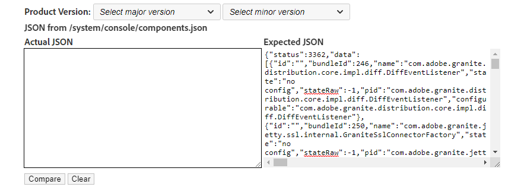

# Experience Manager — 更新後に OSGi バンドルのバージョンを検証する方法を教えてください。

## 説明 {#description}

<b>環境</b>
Adobe Experience Manager

<b>問題/症状</b>
更新後に OSGi バンドルのバージョンを確認して、インストールが正常に完了したことを確認する方法は？

## 解決策 {#resolution}

<b>解決する手順</b>
1. 次の JSON をコピー/貼り付け： <b>*http://aemhost1:port/*system/console/bundles.json</b> から <b>実際の JSON</b> テキストフィールド。
2. 選択 <b>製品バージョン</b> から *メジャーバージョン* および *マイナーバージョン* 自動入力するドロップダウンメニュー <b>期待される JSON</b> フィールドにコピーするか、別のAEMインスタンスから JSON を <b>期待される JSON</b> フィールド ( <b>*http://aemhost2:port/*system/console/bundles.json</b>) をクリックします。
3. クリック <b>比較</b> をクリックして差分を表示します。\
   

<b>比較の結果</b>

1. *類似* バンドルは白で表示され、 *異なる* バンドルのバージョンは黄色で表示され、 *新しく追加された* バンドルはアクアで表示され、 *削除済み* 明るい赤のバンドル。
2. 次を使用してデータをフィルター <b>フィルター</b> ボックス\
   

\*ありがとうございます [シャムサンダーハッサンチクケゴウダ](https://www.linkedin.com/in/sham-sundar-hassan-chikkegowda-6b03a517) オリジナルを提供するために [ソースコード](https://github.com/Schikkeg/schikkeg.github.io/blob/master/tools/coi.html) このツール用。 彼の個人サイトは訪問できます [ここ](https://www.aemstuff.com/).
