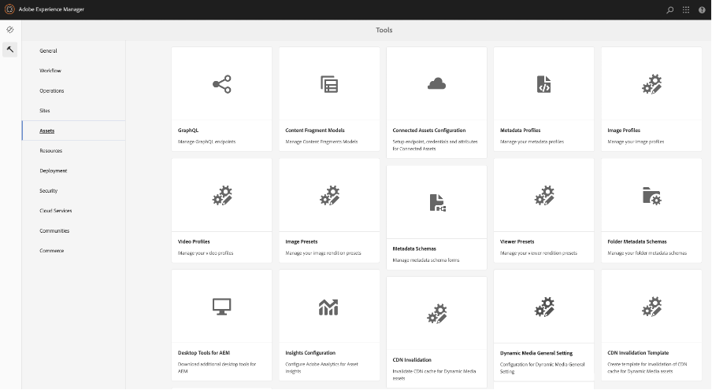

# DM Assets のDynamic Media URL の変更

この記事では、DM アセットのDynamic Media URL を変更する方法について説明します。

## 説明 {#description}

### 環境

- Experience Manager Assets
- Experience Manager 6.5

### 問題/症状

Adobe Experience Manager（AEM）オーサーインスタンス（バージョン 6.5.11 以降）で、「一般設定」セクションを使用して、DM サーバー設定を指定し、DM アセットのパブリッシュサーバー URL またはDynamic Media URL を変更できます。

Dynamic Mediaの一般設定ページを開くには、AEM オーサーインスタンスで、次をクリックします。 <b>ツール</b>に移動します。 <b>アセット</b>に移動します。 <b>Dynamic Mediaの一般設定</b>.

AEM オーサーインスタンスにDynamic Mediaが設定されていることを確認します。 クリックする <b>ツール</b>に移動します。<b> Cloud Service</b> その後、次に移動 <b>Dynamic Media設定</b>.

公開先サーバー名は、Dynamic Media アカウントに固有のすべてのシステム生成 URL 呼び出しで使用される Content Deliver Network （CDN）サーバーです。

カスタムドメイン名がAdobeのコンテンツ配布ネットワーク（CDN）サーバーにマッピングされていることを確認するか、独自の CDN プロバイダーのドメイン名を使用している場合は、オリジンサーバーにマッピングする必要があります\*

詳しくは、\*AdobeDynamic Media サポートにお問い合わせください。

## 解決策 {#resolution}

公開先サーバー名を変更したら、変更内容を保存してください。 変更しない <b>公開元サーバー名</b> AdobeのDynamic Media サポート技術者から指示されない限り、

Sites ページ上の既存のDynamic Media コンポーネントの公開先サーバー名を変更する手順：

- 添付パッケージをインストールして、パブリッシュサーバー URL ノードを作成します。
- パッケージがインストールされると、AEM オーサーに 2 つのファイルが作成されます

   - [/libs/dam/gui/content/s7dam/updatepublishserverurl](http://vgaur-wx-1:4502/crx/de/index.jsp#/crx.default/jcr%3aroot/libs/dam/gui/content/s7dam/updatepublishserverurl "CRXDE Liteーでパスを表示")
   - [/libs/dam/gui/components/s7dam/updatepublishserverurl/updatepublishserverurl.js](http://vgaur-wx-1:4502/crx/de/index.jsp#/crx.default/jcr%3aroot/libs/dam/gui/components/s7dam/updatepublishserverurl/updatepublishserverurl.jsp "CRXDE Liteーでパスを表示")p

.         

- &#x200B;&#x200B;&#x200B;&#x200B;&#x200B;&#x200B;&#x200B;次の URL の「path」パラメーターにAEM Sitesのパスを入力します。http://`<` aem-server`>` :portnumber/libs/dam/gui/content/s7dam/updatepublishserverurl.html?path=/content/mysite&amp;update=true&#x200B;&#x200B;&#x200B;&#x200B; &#x200B;&#x200B;&#x200B;
- その URL を提供すると、指定したAEM Sites パス上のすべての Sites ページのすべてのDynamic Media コンポーネントの DM URL が自動更新され、このタイプの出力が表示されます

すべてのDynamic Media コンポーネントの URL が、AEM サイトの新しい公開先サーバー名に変更されます。
これは、古い公開サーバー名を使用した DM コンポーネントのビューです

これは DM コンポーネントのビューで、次の URL にアクセスすると公開先サーバー名が変更されます。http://`<` aem-server`>` :portnumber/libs/dam/gui/content/s7dam/updatepublishserverurl.html?path=/content/mysite&amp;update=true

メモ：AEM Sites パス上のすべてのDynamic Media コンポーネントのリストを取得するには、次の URL を呼び出します。 <u style="text-decoration:underline">http://`<` aem-server`>` :portnumber/libs/dam/gui/content/s7dam/updatepublishserverurl.html?path=/content/mysite</u>

&#x200B;&#x200B;&#x200B; &#x200B;&#x200B;&#x200B;&#x200B;
