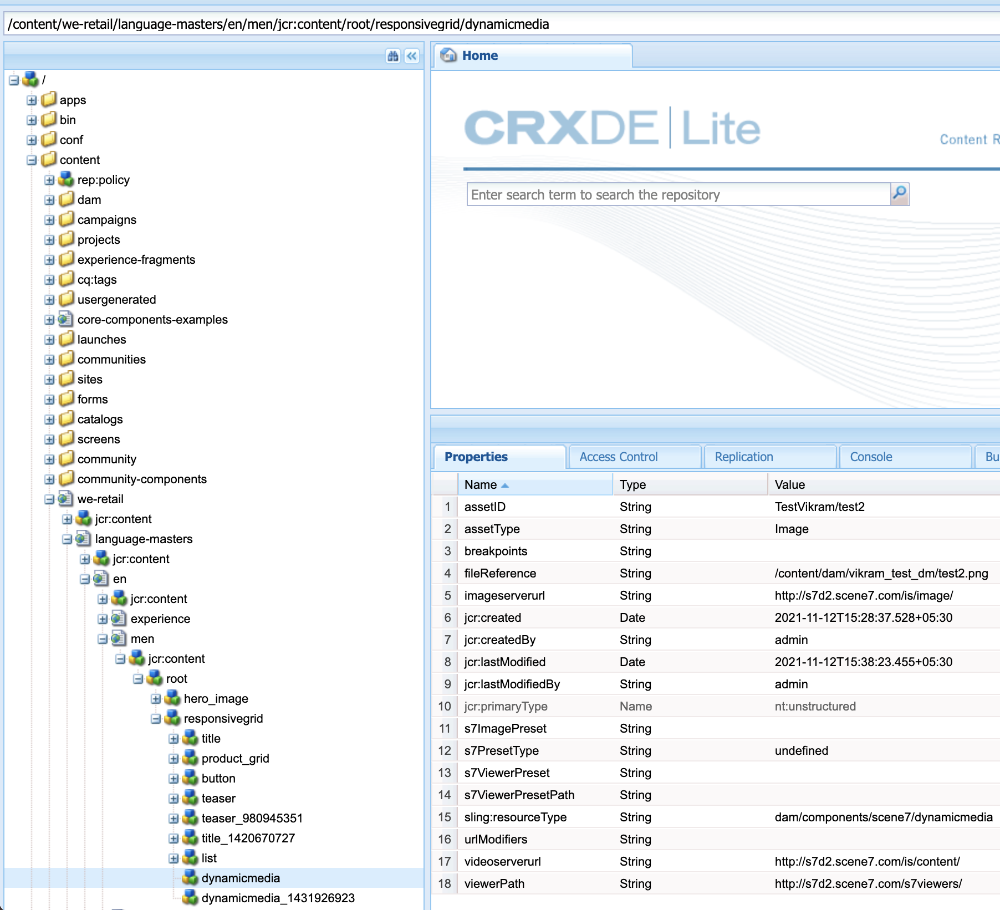

# DM Assets のDynamic Media URL の変更

この記事では、DM アセットのDynamic Media URL を変更する方法について説明します。

## 説明 {#description}

### 環境

- Experience Manager Assets
- Experience Manager 6.5

### 問題／症状

Adobe Experience Manager(AEM) オーサーインスタンス（バージョン 6.5.11 以降）で、「一般設定」セクションを使用して DM Server 設定を指定し、DM アセットの公開サーバー URL またはDynamic Media URL を変更できます。

Dynamic Mediaの一般設定ページを開くには、AEMオーサーインスタンスで、 <b>ツール</b>を選択し、次にに移動します。 <b>Assets</b>を選択し、次にに移動します。 <b>Dynamic Media General Setting</b>.

AEMオーサーインスタンス上でDynamic Mediaが設定されていることを確認します。 クリック： <b>ツール</b>を選択し、次にに移動します。<b> Cloud Service</b> その後、 <b>Dynamic Media Configuration</b>.

Published Server Name は、Dynamic Mediaアカウントに固有のすべてのシステム生成 URL 呼び出しで使用される、コンテンツ配信ネットワーク (CDN) サーバーです。

カスタムドメイン名がAdobeのコンテンツ配布ネットワーク (CDN) サーバーにマッピングされているか、独自の CDN プロバイダーのドメイン名を使用している場合は、アドビのオリジンサーバーにマッピングされている必要があります。\*

\*詳しくは、AdobeのDynamic Mediaサポートにお問い合わせください。

## 解決策 {#resolution}

公開先サーバー名を変更したら、変更を保存してください。 変更しない <b>オリジンサーバー名</b> ただし、AdobeのDynamic Mediaサポート技術者が指示を受けない限り。

Sites ページ上の既存のDynamic Mediaコンポーネントの「公開先サーバー名」を変更する手順は、次のとおりです。

- 添付のパッケージをインストールして、パブリッシュサーバーの URL ノードを作成します。
- パッケージがインストールされると、AEMオーサー上に 2 つのファイルが作成されていることがわかります。

   - [/libs/dam/gui/content/s7dam/updatepublishserverurl](http://vgaur-wx-1:4502/crx/de/index.jsp#/crx.default/jcr%3aroot/libs/dam/gui/content/s7dam/updatepublishserverurl "ビューのパスをCRXDE Lite")
   - [/libs/dam/gui/components/s7dam/updatepublishserverurl/updatepublishserverurl.js](http://vgaur-wx-1:4502/crx/de/index.jsp#/crx.default/jcr%3aroot/libs/dam/gui/components/s7dam/updatepublishserverurl/updatepublishserverurl.jsp "ビューのパスをCRXDE Lite")p

.         

- &#x200B;&#x200B;&#x200B; &#x200B; &#x200B;   URL の「path」パラメーターでAEM Sitesのパスを入力します： http://`<` aem-server`>` :portnumber/libs/dam/gui/content/s7dam/updatepublishserverurl.html?path=/content/mysite&amp;update&#x200B;=&#x200B; &#x200B; &#x200B; &#x200B; &#x200B; &#x200B; 
- この URL を提供すると、前述のAEM Sitesパス上のすべての Sites ページのすべてのDynamic Mediaコンポーネントの DM URL が自動的に更新され、このタイプの出力が表示されます

すべてのDynamic Mediaコンポーネントの URL が、AEMサイトの新しい公開先サーバー名に変更されます。
これは、古い公開先サーバー名を使用した、DM コンポーネントのビューです

これは、DM コンポーネントのビューです。次の URL にヒットした後に、公開先サーバー名が変更されます。 http://`<` aem-server`>` :portnumber/libs/dam/gui/content/s7dam/updatepublishserverurl.html?path=/content/mysite&amp;update=true

注意： AEM Sitesパス上のすべてのDynamic Mediaコンポーネントのリストを取得するには、次の URL を呼び出します。 <u style="text-decoration:underline">http://`<` aem-server`>` :portnumber/libs/dam/gui/content/s7dam/updatepublishserverurl.html?path=/content/mysite</u>

&#x200B;&#x200B;&#x200B;&#x200B;&#x200B;&#x200B;&#x200B;T
