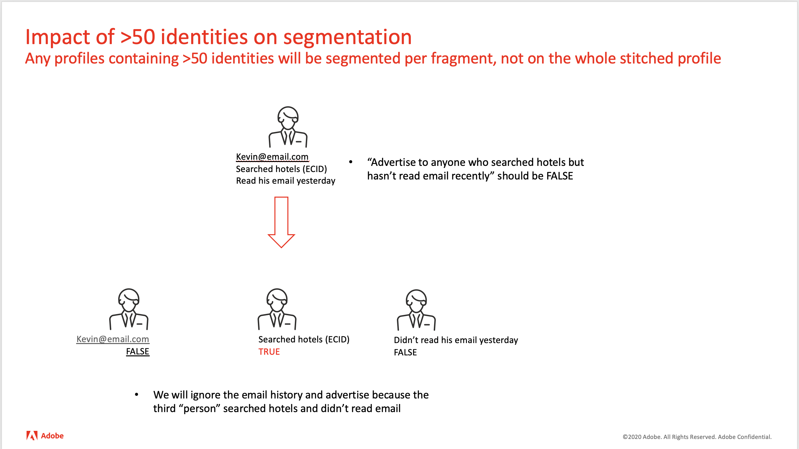

# 50 個を超える ID を持つセグメント内のプロファイルの選定


フラグメントがをに評価しないようにするには `TRUE`の場合、1 つのアプローチは、プロファイル属性の両方に条件を含めることです <b>および</b> イベント。 ID グラフに 1 つの ID のエントリが 50 個を超えているかどうかを判断するには、Postmanを使用して、ID ID を持つ API 経由で UPS を呼び出します。

## 説明 {#description}


### <b>環境</b>

Adobe Experience Platform(AEP)


### <b>問題／症状</b>

50 個を超える ID を持つプロファイルはセグメントに適合できますか？





## 解決策 {#resolution}


プライベートグラフを使用するようにセグメントを定義する場合、通常のプロセスでは、ID グラフのすべての ID を使用してプロファイルフラグメントが照会され、結果がプロファイルレコードとイベントレコードを組み合わせた単一のプロファイルに取り込まれます。 ただし、ID グラフに 50 エンティティを超える場合、プロファイルフラグメントは 1 つのプロファイルに組み立てられません。 代わりに、各プロファイルフラグメントはプロファイル全体として扱われ、各フラグメントに対して個別にセグメント評価がおこなわれます。

例えば、カリフォルニア在住者を含むように定義されたセグメントは、 `TRUE` state 属性を含むプロファイルフラグメントに対して、他のプロファイルおよびイベントフラグメントは、 `FALSE`. 同様に、Web ページの閲覧を含めるように定義されたセグメントは、 `TRUE` Analytics レポートスイートフラグメントの場合、プロファイルフラグメントと他のイベントフラグメントは、 `FALSE`. セグメントに負の条件が含まれる場合のリスクです ( 例： *過去 1 週間にメールが送信されませんでした*) をクリックします。 電子メールイベントは、どのプロファイルや他のイベントレコードにも関連付けられないので、プロファイルや他のイベントの評価で偽陽性が生じる可能性があります。


フラグメントがをに評価しないようにするには `TRUE`の場合、1 つのアプローチは、プロファイル属性の両方に条件を含めることです <b>および</b> イベント ( 例： *customer_id が存在し、少なくとも 1 つのイベントが存在する場所*)*.* 両方の条件を持つフラグメントがないので、どのフラグメントも次のように評価されません。 `TRUE`. 通常、セグメント化結果を変更することなく、プロファイルとイベントの両方に存在テストを追加できます（例：既知の顧客をセグメント化する際の CRM ID のテスト）。

ID グラフに 1 つの ID のエントリが 50 個を超えているかどうかを判断するには、 Postmanを使用して、以下に示すように、ID を持つ API 経由で UPS を呼び出します。  最大 50 個を超えた場合、応答には注意されたエラーが含まれます。

Postman API 設定：


```
GET /data/core/ups/access/entities?entityId=KRN1136260447&entityIdNS=custid&schema.name=_xdm.context.profile HTTP/1.1
Host: platform.adobe.io
Content-Type: application/json
Authorization: Bearer 
x-gw-ims-org-id: <b></b><b></b>*
x-api-key: acp_onboarding
```

<br>応答：<br>

```
{
    "message": "Received too many related identities. Received: 85, Maximum: 50.",
    "statusCode": 422,
    "type": "http://ns.adobe.com/aep/errors/UPSDK-112004-422",
    "title": "Too many related identities.",
    "error-code": "UPSDK-112004-422",
    "error-message": "Received too many related identities. Received: 85, Maximum: 50.",
    "status": 422
}
```

