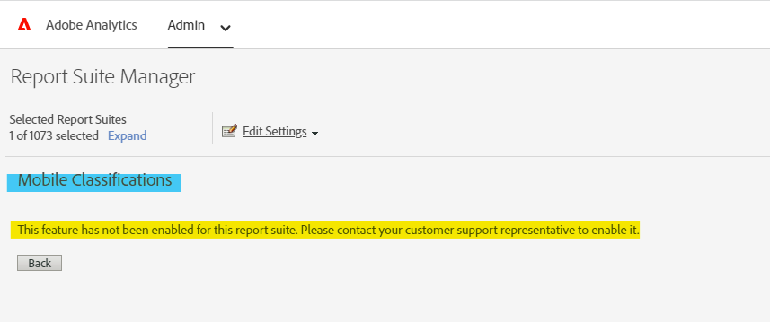

# モバイルアプリのディメンションの分類を有効/有効にする

## 説明 {#description}

### <b>環境</b>

- Customer Journey Analytics
- Analytics

### <b>問題/症状</b>

通常、レポートスイートマネージャーのモバイル分類にアクセスする場合 – `>`  アプリ管理 – `>`  アプリの分類によって、以下に示すメッセージが表示される場合があります。

モバイル分類：「」*この機能はこのレポートスイートに対して有効になっていません。 有効にするには、カスタマーサポート担当者にお問い合わせください。*&#39;（後述）。

モバイルアプリのディメンションの分類を有効にするには、まず、そのレポートスイートの「アプリレポート」を有効にする必要があります。

## 解決策 {#resolution}

<b>前提条件</b>：製品管理者権限。  <b>次の手順に従って、アプリレポートを有効にします。</b>
- Analytics – 管理者 – レポートスイートに移動し、目的のレポートスイートを選択します。 設定を編集/ アプリ管理に移動します。<b> </b>レポートスイートマネージャーのアプリレポート。
- 「」をクリック&#x200B;<b>*最新のアプリレポートを有効にする</b>*.&#39; 必要に応じて、その他を有効にすることもできます。

     
 
- 有効にすると、確認 Ping がポップアップ表示されます。

しばらくすると、Adobe Analyticsに再ログインすると、「モバイルアプリの分類」ページが表示されます（「設定を編集」 – 「アプリ管理」 – 「アプリの分類」）。

アプリ管理の詳細については、次をクリックしてください： [こちら](https://experienceleague.adobe.com/docs/analytics/admin/admin-tools/manage-report-suites/edit-report-suite/app-management/app-reporting.html).
