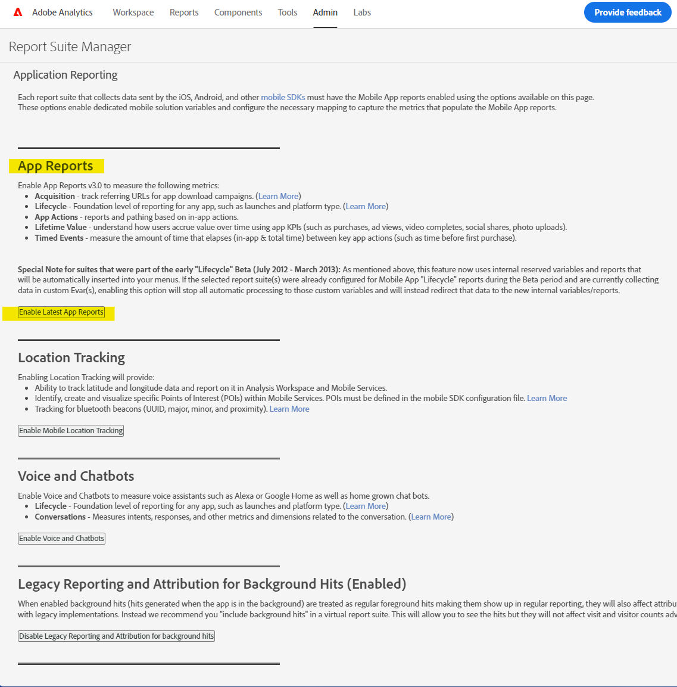

# モバイルアプリディメンションの分類を有効化/有効化

## 説明 {#description}

### <b>環境</b>

- Customer Journey Analytics
- Analytics

### <b>問題/症状</b>

一般に、Report Suite Manager のモバイル分類にアクセスする際に、`>`  アプリ管理 —`>`  アプリの分類には、以下に示すメッセージが表示される場合があります。

モバイル分類： &#39;*この機能は、このレポートスイートで有効になっていません。 有効にするには、カスタマーサポート担当者にお問い合わせください。*&#39; （以下を参照）

モバイルアプリのディメンションの分類を有効にするには、まずそのレポートスイートの「アプリレポート」を有効にする必要があります。

## 解決策 {#resolution}

<b>前提条件</b>：製品管理者権限。  <b>以下の手順に従って、アプリのレポートを有効にします。</b>
- Analytics /管理者/レポートスイートに移動し、目的のレポートスイートを選択します。 設定の編集 — アプリ管理 — に移動します。<b> </b>Report Suite Manager のアプリレポート。
- 「 」をクリックします。<b>*最新のアプリレポートを有効にする</b>*.` 必要に応じて、他のユーザーを有効にすることもできます。

     
 
- 有効にすると、確認 ping がポップアップ表示されます。

しばらくすると、Adobe Analyticsに再ログインすると、モバイルアプリ分類ページが使用可能になります（設定の編集/アプリ管理/アプリ分類）。

アプリ管理について詳しくは、 [ここ](https://experienceleague.adobe.com/docs/analytics/admin/admin-tools/manage-report-suites/edit-report-suite/app-management/app-reporting.html).
