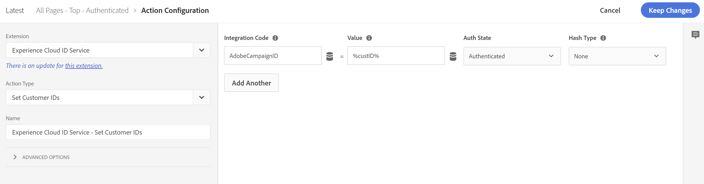

# Adobe Campaignで、Experience Cloud/オーディエンスライブラリ/AAMオーディエンスとセグメントにボリュームやサイズがない

## 説明 {#description}

<br>問題/症状：<br><br>
すべてが正しく設定されているように見えますが、Adobe Campaignでは、Experience Cloud/Audience Library/AAMのオーディエンスとセグメントのボリュームやサイズがありません
<br><br>環境設定：<br><br>
- Campaign Classicまたは標準
- AAMおよび/または Audience Library
- Campaign Standardオーディエンス (People コアサービス、オーディエンスライブラリ、AAM) を使用するようにExperience Cloudまたはクラシックを正常に設定しました
- Campaign Classic:ユーザーは、Adobeの IMS を使用してCampaign Classicにログインできます
- AAMセグメントまたはオーディエンスライブラリオーディエンスは、Campaign UI 内の宣言済み ID データソースを使用して Campaign に送信するように設定されています。


## 解決策 {#resolution}

根本原因：<br>
Campaign の主な目的の 1 つは、E メールや SMS などのメッセージを 既知の個人に対して、AAM（オーディエンスライブラリ）は、顧客 ID に使用するものと同じ ID を (AAM) 独自の宣言済み ID データソースに保存する必要があります。 この統合では、AAM（オーディエンスライブラリ）は、選択したセグメント/オーディエンスに属する顧客の顧客 ID のリストを Campaign に送信するだけです。これにより、Campaign は同じ顧客のリストを識別して構築できます。 送信する ID がAAMにない場合、オーディエンスはAAM（オーディエンスライブラリ）から Campaign に送信されません。
解決する手順：
1. エンドユーザーの認証時に、必要な顧客 ID がページに表示されるようにします。
2. エンドユーザーの認証時に、 [Experience CloudID サービスの setCustomerID 関数](https://experienceleague.adobe.com/docs/id-service/using/id-service-api/methods/setcustomerids.html?lang=en) ( または、Experience Cloudコード/エイリアスを使用して、データ収集内で「統合 ID サービス — 顧客 ID を設定」アクションを使用します )。AdobeCampaignID。 以下に例を示します。


   ```
   Visitor.setCustomerIDs({          "AdobeCampaignID":{              "id":"YOUR CUSTOMER ID",              "authState":Visitor.AuthState.AUTHENTICATED          }      });
   ```


      またはデータ収集内：


   

   ここで、%custID%は、必要な顧客 ID が格納されるデータ要素を表します。


3. setCustomerID 関数が呼び出されたときに送信される demdex.net ネットワーク呼び出しの d_cid_ic パラメーターを探して、ID がAAMに送信されていることを検証します。 AdobeCampaignID 統合コード、顧客 ID、値 1（認証済み）が印刷不可文字で区切られて表示されます。 

   
4. AAMで顧客 ID が収集され、Campaign でのオーディエンスサイズが監視されるまで数日待ちます。


