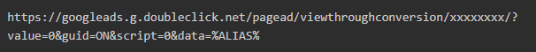

# Googleの宛先 – AAM

URL 宛先を設定する方法について詳しくは、この記事を参照してください。

## 説明 {#description}

### 環境

Audience Manager

### 問題/症状

この記事では、4 つの主なクエリについて詳しく説明します。

1. Google が持つ統合のタイプの数。
2. S2S 宛先の設定方法（サーバー間宛先）。
3. RLSA （検索広告のリマーケティングリスト）。
4. ポイント。

## 解決策 {#resolution}

<b>宛先のタイプ</b>

S2S の宛先

URL の宛先

<b>URL の宛先 – Google Ads リマーケティングリスト</b>

URL の宛先を設定するために従う必要がある手順は、次のとおりです。

- Google Ads アカウントで、 [web サイトのリマーケティングリストの作成](https://support.google.com/google-ads/answer/2454064?hl=en) さらに、コンバージョン ID を書き留めます。
- 次の URL をベース URL とセキュア URL のテンプレートとして使用します。 「xxxxxxxx」セクションをコンバージョン ID に置き換えます。

- AAMで URL 宛先を作成します。次のリンクに従ってください（[URL 宛先の作成](https://experienceleague.adobe.com/en/docs/audience-manager/user-guide/features/destinations/custom-destinations/create-url-destination)）に設定します。
- URL 宛先の「セグメントマッピング」セクションで、手順 2 のコードを「URL」フィールドと「セキュア URL」フィールドに追加します。 「URL」フィールドと「セキュア URL」フィールドに、それぞれhttp: and https: inというプレフィックスを付けます。

URL には 2 つのタイプがあります

- ベース URL またはセキュアでない URL コード - HTTP で始まる

- セキュア URL コード - HTTPS で開始

- 「保存」をクリックします。
- Audience Managerでこの宛先に新しいセグメントをマッピングする場合、マッピングを <b>aam=segmentID </b>および置換 <b>segmentId </b>各セグメントの ID を持つもの。
- Google Ads でバケットを定義する場合は、手順 6 で定義したマッピングに一致するルールを作成します。

<b>S2S の宛先：</b>

1. Googleの S2S 宛先の作成から開始するには、CC またはコンサルタントがアカウントタイプと共に渡されます。 アカウントタイプは、INVITE_ADVERTISER、INVITE_PARTNER、DFP、ADX、ADX_PUBLISHER、DFP_BY_GOOGLE、DFP_BY_GOOGLEのいずれかになります。 また、このタイプは、Googleの末尾で許可リストに登録されている必要があります。 （Googleのチームに問い合わせて、このパーツを確認できます）。
2. この詳細が使用可能になったら、CC またはコンサルタントが宛先を作成できます。

<b>ポイント： </b>

- Google S2S Destination 設定では、次の 6 つのデバイスタイプすべてについてデータ転送をサポートします。  <b>web-cookie/iOS-mobile/android-mobile/Roku/Microsoft/Amazon Fire TV</b>.
- Google Ads Remarking List の URL を作成するには、必ずを使用してください。 <b>&quot;%ALIAS%&quot;</b> （どちらのタイプの URL でも）。 これは、実行時に置き換えられるマクロです。
- Google 用 S2S 宛先の作成中にエラーが発生した場合は、以下の点を確認してください。

1. Googleの末尾で、アカウントを許可リストに登録する必要があります。
2. （プロトコル、サーバー、形式、ターゲットデータソースなど）などの正しい詳細を使用していることを確認してください。 S2S セグメントのリンクを参照してください。

