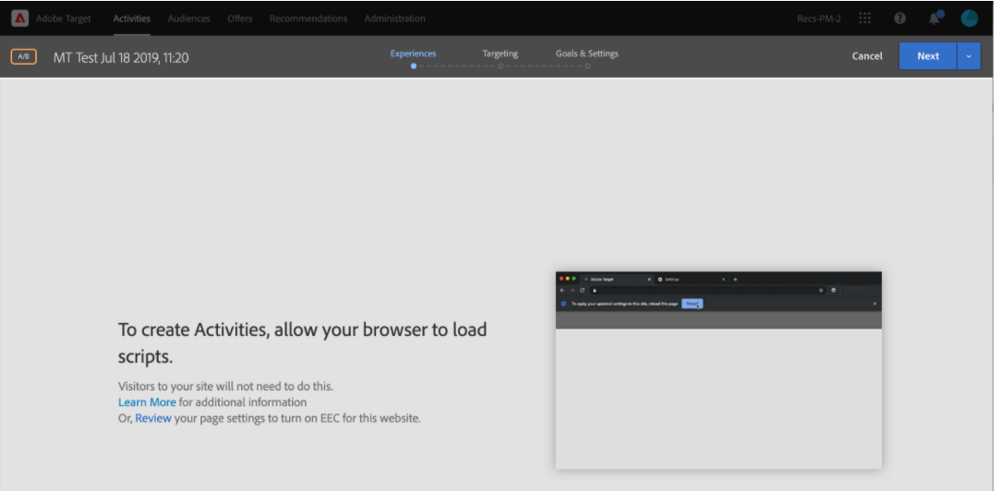

# Target VEC のデバッグ/トラブルシューティング

## 説明

 1.ページターゲット VEC でページ URL をAdobeできません。      以下にいくつかのサンプルエラーを示します。   a)      b)       c)   

## 解像度

1. クッキーやキャッシュを消去したり、Web サイトを匿名モードで開いたりしてみてください。 
2. Mozilla Firefox、Microsoft Edge 3 など、別のブラウザーを使用してみてください。そのようなエラーの場合は、VEC ヘルパーブラウザー拡張機能をインストールします。 a) 次のバージョンから拡張機能をインストールします。 [https://chrome.google.com/webstore/detail/adobe-target-vec-helper/ggjpideecfnbipkacplkhhaflkdjagak](https://chrome.google.com/webstore/detail/adobe-target-vec-helper/ggjpideecfnbipkacplkhhaflkdjagak)
b) 拡張機能を使用するには、VEC を使用しているときに、Chrome ブラウザーのツールバーにある「 VEC ヘルパーブラウザー拡張」アイコン ( ) をクリックします。 
c) 「<b>target ライブラリを挿入する</b>「 」と「 cookies 」を切り替えて「オン」にします。

d) オーサリングを有効にするために、拡張機能がページにターゲットライブラリを追加することを許可するよう求めるポップアップが表示されます。この許可は必要です。
e) サイト設定から安全でないコンテンツを許可する ([https://experienceleague.adobe.com/docs/target/using/experiences/vec/troubleshoot-composer/mixed-content.html?lang=en](https://experienceleague.adobe.com/docs/target/using/experiences/vec/troubleshoot-composer/mixed-content.html?lang=en))

- ロック（注意）アイコンをクリックし、「サイトの設定」をクリックします。
- 安全でないコンテンツにスクロールし、ドロップダウンリストを使用して「ブロック（デフォルト）」を「許可」に変更します。
- VEC ページをリロードします。

f) 次の手順で、EEC（拡張 Experience Composer）を無効に設定します

- Target-Administration-VEC に移動 — EEC を切り替え

注意：問題が解決しない場合は、ブラウザーのデベロッパーコンソールを開き、そこでエラーメッセージを探します。
3. Web サイトに複数レベルの iframe が含まれている場合、ターゲットはサポートされません。 

<b>VEC でのログイン後ページへのアクセス方法</b>
1. VEC でページを読み込み、「ブラウザー」タブをクリックし、資格情報を入力してから、目的のページに移動します。 
2. 「構成」タブをクリックし、VEC 内で変更をおこないます。 
OR
1. 新しいタブで Web サイトを開き、ログイン資格情報を入力します。
2. Target で VEC を開き、ログイン後に直接ページを読み込みます。 
3. これで、変更をおこなうためにページが VEC に読み込まれます。
