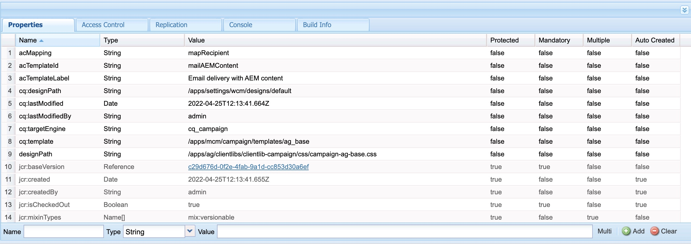

# AEM E メールテンプレートがAdobe Campaignと同期されません。

## 説明

Adobe Campaignの cq:acLinks プロパティと cq:acUUID プロパティは、既にキャンペーン承認ワークフローが実行されているサイトのテンプレートをコピーして貼り付けようとしても、コピー&amp;ペースト操作時に削除されません。
    このため、AdobeキャンペーンはAEMから電子メールテンプレートを同期できず、エラーが発生します。cq:acLinks として重複した acUUID が見つかり、 cq:acUUID プロパティは一意のプロパティです。
    <b>再現手順：</b>
 1:AEMでサイトの電子メールテンプレートを作成します。
 2:キャンペーン承認ワークフローを実行します。
 3:ワークフロー手順を完了して、テンプレートを承認します。
 4:crx/de に移動します。
 5:コピー/貼り付けられたテンプレートには、 cq:acLinks および cq:acUUID プロパティが含まれます。

<b>ログのエラー：</b>
 エラーログに関連するエラーは見つかりません。     <b>「コピー&amp;ペースト後」crx/de の「テンプレート」のプロパティ：</b>     <b>経験豊富な行動：</b>          <b>予期される動作：</b>
    

## 解像度

campaign-property-modification-service は、コピー&amp;ペースト機能でキャンペーンニュースレターのプロパティを変更するために使用されるサービスユーザーです。
この usercampaign-property-modification-service には、コンテンツフォルダーに対する読み取りおよび変更権限が必要です。

コンテンツフォルダーに対する読み取りおよび変更の権限がない場合、コピー&amp;ペーストされたサイトテンプレートの cq:acLinks および cq:acUUID プロパティをクリーンアップできません。

ユーザーに必要な権限を指定すると、プロパティがクリーンアップされます。

<b>ユーザー権限のスクリーンショット：</b>

