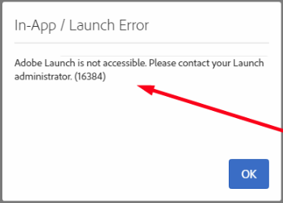

# ACS でローンチ同期が機能していません

## 説明 {#description}

<b>環境</b>

Adobe Campaign Standard

<b>問題／症状</b>

次のエラーが発生する可能性があります：
   

## 解決策 {#resolution}

この問題は、サインアウトして再度サインインすることで解決できます。

<b>原因</b>：

Launch は、ブラウザー固有の問題が原因で存在しない可能性のある一部のパラメーターを想定しています。
