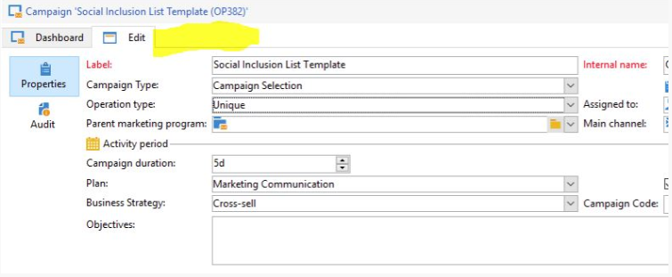

# キャンペーンのターゲティングとワークフロータブを表示できません |Campaign Classic

## 説明

「ターゲティングとワークフロー」タブは、キャンペーンには表示されません。        例：      

## 解像度

この問題が発生するのは、キャンペーンテンプレートプロパティの「キャンペーンで使用される機能」のオプションが有効になっていないためです。

- キャンペーンに関連付けられているキャンペーンテンプレートを確認します。
- キャンペーンテンプレートを開きます。
- 「キャンペーンの詳細設定を編集」に移動します。

この画面には、「ターゲティングとワークフロー」が表示され、値を「はい」に選択します。

