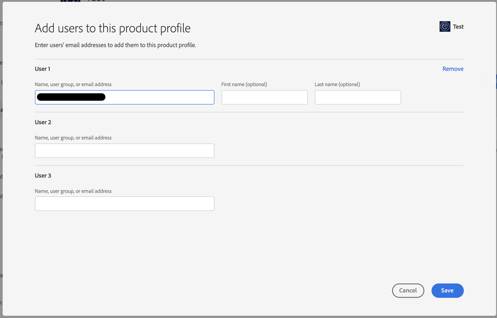

# AD グループをAAMグループにリンクするAAMオプションが表示されていません

## 説明 {#description}

<b>環境</b>

- Adobe Audience Manager

<b>問題／症状</b>

製品プロファイルとAdmin ConsoleRBAC 権限グループをAudience Managerする方法は？

## 解決策 {#resolution}

Audience Managerへの管理者アクセス権と、Admin Consoleでの製品管理者アクセス権が必要です。

1) 「Audience Manager」で RBAC 権限グループを作成します。 選択した権限グループ名をメモしておきます。

1) Admin ConsoleのAudience Manager製品に移動し、新しい製品プロファイルを作成して、ドロップダウンメニューで先ほど作成した権限グループを選択します。

1) 作成した製品プロファイルに関連するユーザーを追加します。

