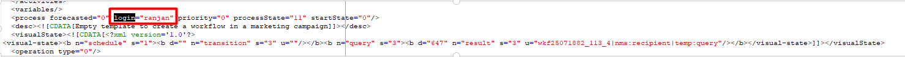

# Campaign Classicでワークフローを開始できない

## 説明 {#description}


<b>環境</b>

- Adobe Campaign Classic

- Adobe Campaign Classic v7

<b>問題／症状</b>

次のワークフローは、ワークフローのプロパティで「作成者」フィールドを変更した後も実行されません。

ワークフローの内部名： ``prdWKFXXXX``

このワークフローを実行しようとすると、Campaign ジョブ（operationMgt）監視ワークフローで無効なログインエラーがスローされる。

<b>ワークフローからのエラー</b>: （Campaign ジョブ（operationMgt））


```
BAS-010003 Unable to complete operation in current status.
WKF-560044 Error while sending notification with delivery template 'notify supervisor.' Please refer to the delivery log ID 00000 for more information (object associated with the workflow task).
DLV-490118 Error during preparation. Please refer to the delivery action journal '27626534' for more information.
SCR-160012 JavaScript: Error while evaluating script 'operationMgt/scheduler'.
XSV-350012 Invalid login or password. Connection denied.
```


キャンペーン「キャンペーン名（ワークフローの内部名）」のターゲティングワークフロー「prdWKF0000」を開始しました

<b>分析： </b>
このワークフローの開始中： `prdWKF00000`ワークフローの Campaign ジョブ（operationMgt）が失敗し始めました。 この原因に関する詳細を探し、その後ワークフロー XML を確認したところ、問題が特定されました。


```
<process forecasted="0" login="xxxxx@xxxx.com" priority="0"

           processState="20" startState="0"/>
```


上記のオペレーターが無効になっていたため、キャンペーンジョブワークフローが失敗しました。


## 解決策 {#resolution}


ログインをアクティブなオペレーターに置き換え、ワークフローへの変更を保存して、ワークフローを再実行します。 これで問題は解決するはずです。


```
<process forecasted="0" login="ranjan" priority="0"
           processState="20" startState="0"/>
```



