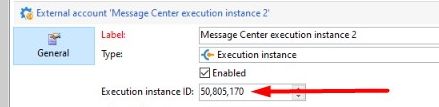

# Campaign Classic:PGS-220000 PostgreSQL:エラー：範囲外の大きさ

## 説明

Message Center からアーカイブワークフロー (mcSynch) を実行する際に、次のエラーが報告されました。

## 解像度

問題となるのは、RT 実行インスタンスを識別するために使用された実行インスタンス ID です。

上記のように、使用される値は 50,805,170 です。 実行インスタンス ID は、次のようにアーカイブワークフローで使用されます。

vars.CELL_OFFSET + &quot;\*&quot; + vars.cellId + &quot; + @id&quot;

ここで、

- CELL_OFFSET は、「接続情報」アクティビティによって作成される定数 (72057594037927936) です。

- cellId は実行インスタンス ID です

上記の 2 つの数値は乗算されます。 最終結果の数が Postgres bigint 型の最大値 (https://www.postgresql.org/docs/10/datatype-numeric.html) より大きくなっています

2 つの値は、次のようにクエリに追加されます。

選択   <b>:#(1)# \* :#(2)# + B0.iBatchEventId</b>, B0.iBatchEventId, B0.iStatus, B0.iRetry, B0.tsSubmit, B0.tsScheduled, B0.tsExpiration, B0.tsCreated, B0.tsProcessing, B0.tsProcessed, B0.tsLastModified,B0.sType, B0.iDeliveryId, B0.iWishedChannel, B0.sExternalId, B0.sOrigin, B0.sEmail, B0.iEmailFormat, B0.sMobilePhone, B0.sRegistrationToken,b0.iMobileAppId, B0.sLine1, B0.sLine2, B0.sLine3, B0.sLine4, B0.sLine5, B0.sLine6, B0.sLine7, B0.sCountryCode, B0.sContryCode, B0.sLanguage, B0.iFolderId, B0.iCreatedById, B0.mData FROM NmsBatchEvent B0 WHERE ((B0.iFolderId IN) （XtkRights WHERE から SELECT xr.iFolderId IN）XR.iOperatorId IN (3798) OR B0.iFolderId=0) AND (((B0.iFolderId IN (SELECT XR.iFolderId FROM XTK WHERE.iOperatorId IN 3 (I))(798)) または B0.iFolderId=0)) および ((B0.iBatchEventId :#(3)#)) および (B0.tsLastModified :#(4)#))) の順番は truncdate(B0.tsLastModified,#(#)5)#, &#39;ヨーロッパ/ロンドン&#39;), B0.iBatchEventId LIMIT 501&#39; Param(0)=72057594037927936\n — :#(1)#

Param(1)=50805170\n — :#(2)#

Param(2)=0\n Param(3)=09/04/2021 05:00:26\n Param(4)=1

解決策は、より小さい数字を実行インスタンス ID として使用することです。
