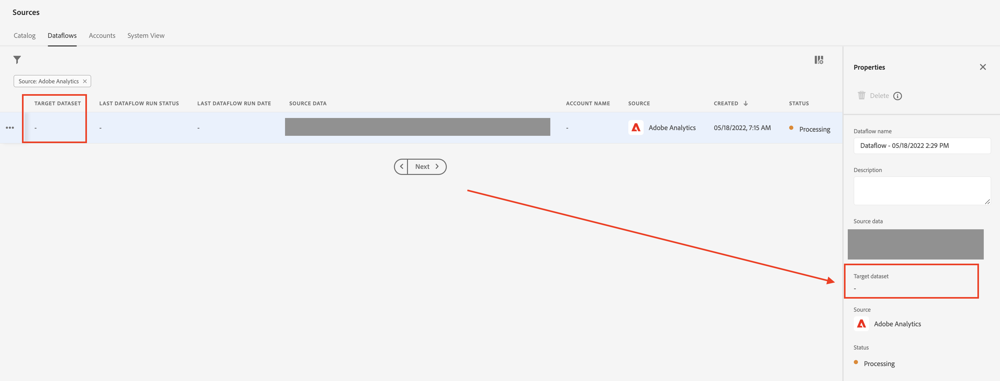

# AEP — コネクタが設定されている場合でも、Adobe Analyticsデータが流れ込まない

## 説明

この例では、ソースコネクタが設定されている場合でも、Adobe Analyticsデータが流れ込みません。

## 解決策

データフロー設定を確認した後、ターゲットデータセットがないことがわかりました。 ターゲットデータセットがないことは、データフローがデータを取り込まない原因です。

「ソース」で、 [!UICONTROL データフロー] タブに移動し、関連するデータフローを選択し、「 」をチェックします。[!UICONTROL Target データセット]「 — 以下を参照。

空の場合は、新しいデータフローを再作成する必要があります。
