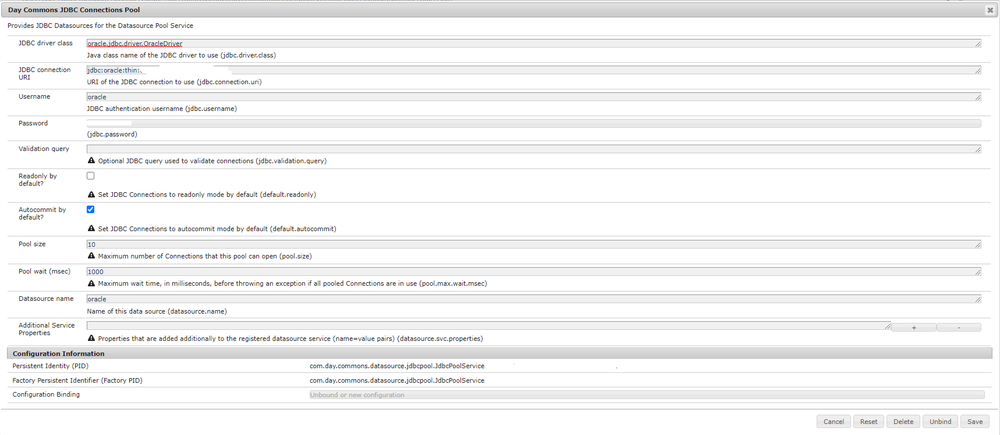

# AEM as a cloud service からOracleデータベースに接続する方法


ここでは、Adobe Experience Manager（AEM） as a Cloud Service からOracleデータベースに接続する方法について説明します。

## 説明 {#description}


<b>環境</b>

Adobe Experience Manager

<b>問題／症状</b>

AEM as a cloud service からOracleデータベースに接続する方法


## 解決策 {#resolution}


AEM as a Cloud Service からOracleデータベースに接続するには、次の手順を実行します。

- POM での Maven 依存関係の追加

- Oracleデータベースに接続するためのAEM サービス

- OSGi 設定

<u><b>POM での Maven 依存関係の追加</b></u>

<b>手順 1:</b> プロジェクトのメインに以下の Maven 依存関係を含める `pom.xml`


```
<dependency>
 <groupId>com.oracle.database.jdbc</groupId>
 <artifactId>ojdbc-bom</artifactId>
 <version>21.5.0.0</version>
 <type>pom</type>
 <scope>import</scope>
 </dependency>
```


<b>手順 2: </b>以下の Maven 依存関係をに含める `pom.xml` 「コア」と「すべて」の両方。


```
<dependency>
 <groupId>com.oracle.database.jdbc</groupId>
 <artifactId>ojdbc8</artifactId>
 </dependency>
 <dependency>
 <groupId>com.oracle.database.jdbc</groupId>
 <artifactId>ucp</artifactId>
 </dependency>
 <dependency>
 <groupId>com.oracle.database.xml</groupId>
 <artifactId>xdb</artifactId>
 </dependency>
```


<u><b>Oracleデータベースに接続するためのAEM サービス</b></u>

AEM as a Cloud Service からデータベースに接続するためのサンプルサービスコード。 パス {0} に含めることができます

パス {0} » プロジェクトフォルダー» core » service

<b>DatabaseService.java</b>


```
package com.mysite.core.services;
public interface DatabaseService {
}
```


<b>DatabaseServiceImpl.java</b>


```
package com.mysite.core.services;
import com.day.commons.datasource.poolservice.DataSourcePool;
import org.osgi.service.component.annotations.Activate;
import org.osgi.service.component.annotations.Component;
import org.osgi.service.component.annotations.Reference;
import org.slf4j.Logger;
import org.slf4j.LoggerFactory;
import javax.sql.DataSource;
import java.sql.Connection;
@Component(
 service = DatabaseService.class,
 immediate = true
)
public class DatabaseServiceImpl implements DatabaseService {
 private final Logger LOGGER = LoggerFactory.getLogger(DatabaseService.class);
 @Reference
 private DataSourcePool dataSourcePool;
 @Activate
 public void activate() {
 try {
 DataSource dataSource = (DataSource) dataSourcePool.getDataSource("oracle");
 Connection connection = dataSource.getConnection();
 if (connection != null) {
 if (!connection.isClosed()) {
 LOGGER.info("Connected with connection #4");
 connection.close();
 }
 }
 else {
 LOGGER.info("Connection is null");
 }
 } catch (Exception ex) {
 LOGGER.error("It was not possible to get the data source: " + ex.getMessage(), ex);
 }
 }
}
```


<u><b>OSGi 設定</b></u>

<b>手順 1:</b> ローカルのAEM OSGi 設定（http://localhost:4502/system/console/configMgr）に移動します。

<b>手順 2:</b> 「JDBC 接続プール」を検索し、DB に関して以下の値を設定します（サンプル値のスクリーンショットを参照）

- JDBC Driver クラス
- JDBC 接続 URL
- ユーザー名とパスワード
- データソース名




<b>手順 3:</b> 以下のリンクの手順に従って、OSGi 設定をに変換します。 `.cfg.json` をファイル化し、AEMaaCS 標準に従って、同じをプロジェクト設定に追加します。

[https://experienceleague.adobe.com/docs/experience-manager-cloud-service/content/implementing/deploying/configuring-osgi.html?lang=en#generating-osgi-configurations-using-the-aem-sdk-quickstart](https://experienceleague.adobe.com/docs/experience-manager-cloud-service/content/implementing/deploying/configuring-osgi.html?lang=en#generating-osgi-configurations-using-the-aem-sdk-quickstart)
