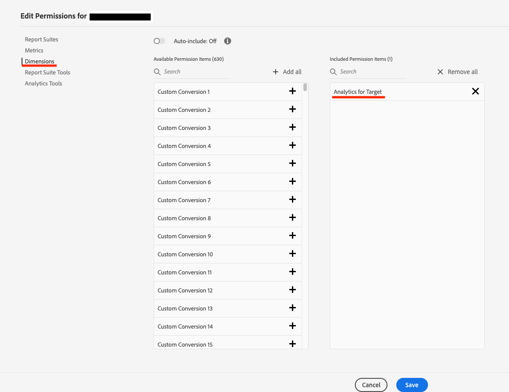

# Adobe Analytics で A4T レポートディメンションを表示するための権限

## 説明 {#description}

<b>環境</b>
- Customer Journey Analytics
- Analytics

<b>問題/症状</b> A4T レポートのDimensionがAdobe Analysis Workspaceに表示されるためには、どのような権限が必要ですか？

## 解決策 {#resolution}

次の手順に従います。
1. まず、 <b>製品プロファイル</b> （Admin Consoleによる権限を付与したいAdobe Analyticsの）。
2. を選択 <b>Dimension</b> 未満 <b>Adobe Analytics</b> 権限項目。\
   
3. ディメンション権限の場合 <b>Analytics for Target</b> が付与され、ディメンション項目 <b>Target アクティビティ</b>, <b>Target エクスペリエンス</b>, <b>Target アクティビティがエクスペリエンスを超えています</b>, <b>コントロールとターゲット</b>等が表示されます。

- A4T レポート - Analytics でのレポート - Dimension

  https://experienceleague.adobe.com/docs/target/using/integrate/a4t/reporting.html?lang=ja&amp;mt=false#dimensions
- Adobe Analyticsの製品プロファイル - Adobe Analytics権限項目

  https://experienceleague.adobe.com/docs/analytics/admin/admin-console/permissions/product-profile.html?lang=eng#dimensions
