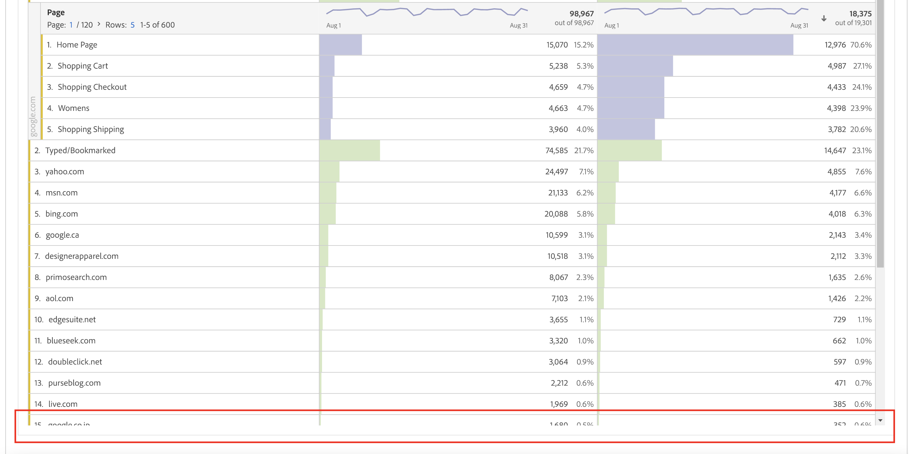

# PDF のスケジュールやダウンロードの際に Workspace プロジェクトが切り詰められる

## 説明 {#description}

次の例のように、スケジュールまたはダウンロードされた PDF に、切り詰められた行が含まれています。 

## 解決策 {#resolution}

切り捨てられたフリーフォームテーブルで、「デフォルトの高さに戻る」アイコンをクリックし、プロジェクトを保存して、Workspace プロジェクトを再スケジュールまたはダウンロードし直します。

根本原因：
これは、折りたたまれたパネルとよく似ており、折りたたまれた pdf をダウンロードしても、パネルを展開することはできません。
同じ理由で、「デフォルトの高さに戻る」アイコンをクリックすることで、切り詰められたフリーフォームテーブルを展開する必要があります。これは、設計どおりに動作しています。
