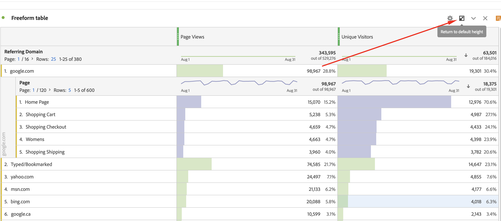

# PDFのスケジュールまたはダウンロード中に Workspace プロジェクトが切り捨てられました

## 説明

スケジュール済みまたはダウンロード済みのPDFに、次の例のように切り捨てられた行が含まれています。  
 

## 解像度

切り捨てられたフリーフォームテーブルで、「デフォルトの高さに戻る」アイコンをクリックし、プロジェクトを保存して、Workspace プロジェクトを再スケジュールまたはダウンロードし直します。

根本原因：折りたたまれたパネルと非常に似ていますが、折りたたまれた PDF をダウンロードしても、パネルは展開されません。
同じ理由で、「デフォルトの高さに戻る」アイコンをクリックして、切り捨てられたフリーフォームテーブルを展開する必要があります。 デザインとして機能しています。
