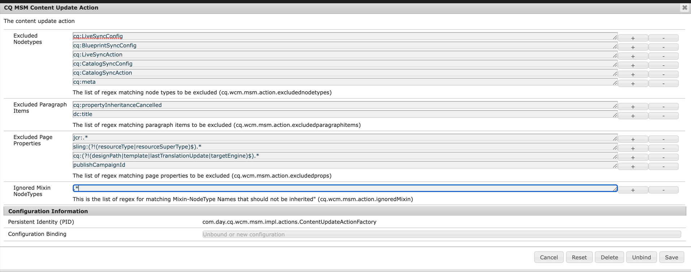

# 競合する mixin （および ClassicUI の使用）が原因でロールアウトが失敗する

## 説明


いくつかの競合が原因で、ページのロールアウトが失敗しています *`jcr:mixinTypes`* ページのサムネールノード上に表示されます。

この競合は、ページがサムネールで設定されたときに発生します <b>クラシック UI の使用</b> 最初にロールアウトされました（最初のロールアウトが機能します）。

この時点で、次の間でページのサムネール構造に mixin が競合しているので、マスターページのロールアウトの実行が失敗します。

- `dam:Thumbnails`
- `cq:LiveRelationship`


ログに表示されるエラーは次のとおりです。


```
27.07.2022 15:48:07.091 *ERROR* 0:0:0:0:0:0:0:1 1658929687039 POST /bin/wcmcommand HTTP/1.1 com.day.cq.wcm.msm.impl.commands.RolloutCommand Error during roll-out.
com.day.cq.wcm.api.WCMException: com.day.cq.wcm.api.WCMException: com.day.cq.wcm.api.WCMException: com.day.cq.wcm.api.WCMException: com.day.cq.wcm.api.WCMException: com.day.cq.wcm.api.WCMException: javax.jcr.nodetype.ConstraintViolationException: No matching node definition found for dam:thumbnails
    at com.day.cq.wcm.msm.impl.RolloutManagerImpl.rolloutResource(RolloutManagerImpl.java:824) com.day.cq.wcm.cq-msm-core:5.11.84
    at com.day.cq.wcm.msm.impl.RolloutManagerImpl.rolloutPage(RolloutManagerImpl.java:693) com.day.cq.wcm.cq-msm-core:5.11.84
    at com.day.cq.wcm.msm.impl.RolloutManagerImpl.rolloutPageRelations(RolloutManagerImpl.java:624) com.day.cq.wcm.cq-msm-core:5.11.84
    at com.day.cq.wcm.msm.impl.RolloutManagerImpl.rollout(RolloutManagerImpl.java:515) com.day.cq.wcm.cq-msm-core:5.11.84
    at com.day.cq.wcm.msm.impl.commands.RolloutCommand.performCommand(RolloutCommand.java:153) com.day.cq.wcm.cq-msm-core:5.11.84
    at com.day.cq.wcm.core.impl.commands.WCMCommandService$CommandHolder.performCommand(WCMCommandService.java:178) com.day.cq.wcm.cq-wcm-core:5.11.312
    at com.day.cq.wcm.core.impl.commands.WCMCommandServlet.performCommand(WCMCommandServlet.java:120) com.day.cq.wcm.cq-wcm-core:5.11.312
    at com.day.cq.commons.servlets.AbstractCommandServlet.doPost(AbstractCommandServlet.java:49) com.day.cq.cq-commons:5.11.18
    at org.apache.sling.api.servlets.SlingAllMethodsServlet.mayService(SlingAllMethodsServlet.java:146) org.apache.sling.api:2.20.0
    at org.apache.sling.api.servlets.SlingSafeMethodsServlet.service(SlingSafeMethodsServlet.java:342) org.apache.sling.api:2.20.0
    ..
Caused by: com.day.cq.wcm.api.WCMException: com.day.cq.wcm.api.WCMException: com.day.cq.wcm.api.WCMException: com.day.cq.wcm.api.WCMException: com.day.cq.wcm.api.WCMException: javax.jcr.nodetype.ConstraintViolationException: No matching node definition found for dam:thumbnails
    at com.day.cq.wcm.msm.impl.RolloutManagerImpl.rolloutResource(RolloutManagerImpl.java:824) com.day.cq.wcm.cq-msm-core:5.11.84
    at com.day.cq.wcm.msm.impl.RolloutManagerImpl.rolloutResource(RolloutManagerImpl.java:811) com.day.cq.wcm.cq-msm-core:5.11.84
    ... 135 common frames omitted
Caused by: com.day.cq.wcm.api.WCMException: com.day.cq.wcm.api.WCMException: com.day.cq.wcm.api.WCMException: com.day.cq.wcm.api.WCMException: javax.jcr.nodetype.ConstraintViolationException: No matching node definition found for dam:thumbnails
    at com.day.cq.wcm.msm.impl.RolloutManagerImpl.rolloutResource(RolloutManagerImpl.java:824) com.day.cq.wcm.cq-msm-core:5.11.84
    at com.day.cq.wcm.msm.impl.RolloutManagerImpl.rolloutResource(RolloutManagerImpl.java:811) com.day.cq.wcm.cq-msm-core:5.11.84
    ... 136 common frames omitted
Caused by: com.day.cq.wcm.api.WCMException: com.day.cq.wcm.api.WCMException: com.day.cq.wcm.api.WCMException: javax.jcr.nodetype.ConstraintViolationException: No matching node definition found for dam:thumbnails
    at com.day.cq.wcm.msm.impl.RolloutManagerImpl.rolloutResource(RolloutManagerImpl.java:824) com.day.cq.wcm.cq-msm-core:5.11.84
    at com.day.cq.wcm.msm.impl.RolloutManagerImpl.rolloutResource(RolloutManagerImpl.java:811) com.day.cq.wcm.cq-msm-core:5.11.84
    ... 137 common frames omitted
Caused by: com.day.cq.wcm.api.WCMException: com.day.cq.wcm.api.WCMException: javax.jcr.nodetype.ConstraintViolationException: No matching node definition found for dam:thumbnails
    at com.day.cq.wcm.msm.impl.RolloutManagerImpl.rolloutResource(RolloutManagerImpl.java:824) com.day.cq.wcm.cq-msm-core:5.11.84
    at com.day.cq.wcm.msm.impl.RolloutManagerImpl.rolloutResource(RolloutManagerImpl.java:811) com.day.cq.wcm.cq-msm-core:5.11.84
    ... 138 common frames omitted
Caused by: com.day.cq.wcm.api.WCMException: javax.jcr.nodetype.ConstraintViolationException: No matching node definition found for dam:thumbnails
    at com.day.cq.wcm.msm.commons.BaseAction.execute(BaseAction.java:154) com.day.cq.wcm.cq-msm-commons:1.1.2
    at com.day.cq.wcm.msm.impl.RolloutManagerImpl.rolloutResource(RolloutManagerImpl.java:790) com.day.cq.wcm.cq-msm-core:5.11.84
    ... 139 common frames omitted
Caused by: javax.jcr.nodetype.ConstraintViolationException: No matching node definition found for dam:thumbnails
    at org.apache.jackrabbit.oak.plugins.nodetype.EffectiveNodeTypeImpl.getNodeDefinition(EffectiveNodeTypeImpl.java:454) org.apache.jackrabbit.oak-core:1.8.22
    at org.apache.jackrabbit.oak.plugins.nodetype.ReadOnlyNodeTypeManager.getDefinition(ReadOnlyNodeTypeManager.java:396) org.apache.jackrabbit.oak-core:1.8.22
    at org.apache.jackrabbit.oak.jcr.session.NodeImpl$29.perform(NodeImpl.java:1031) org.apache.jackrabbit.oak-jcr:1.8.22
    at org.apache.jackrabbit.oak.jcr.session.NodeImpl$29.perform(NodeImpl.java:1023) org.apache.jackrabbit.oak-jcr:1.8.22
    at org.apache.jackrabbit.oak.jcr.delegate.SessionDelegate.perform(SessionDelegate.java:207) org.apache.jackrabbit.oak-jcr:1.8.22
    at org.apache.jackrabbit.oak.jcr.session.ItemImpl.perform(ItemImpl.java:112) org.apache.jackrabbit.oak-jcr:1.8.22
    at org.apache.jackrabbit.oak.jcr.session.NodeImpl.getDefinition(NodeImpl.java:1023) org.apache.jackrabbit.oak-jcr:1.8.22
    at com.day.cq.wcm.msm.commons.ItemFilterImpl.excludes(ItemFilterImpl.java:91) com.day.cq.wcm.cq-msm-commons:1.1.2
    at com.day.cq.wcm.msm.impl.actions.ContentCopyActionFactory$ContentCopyAction.applyFilters(ContentCopyActionFactory.java:293) com.day.cq.wcm.cq-msm-core:5.11.84
    at com.day.cq.wcm.msm.impl.actions.ContentCopyActionFactory$ContentCopyAction.createCopy(ContentCopyActionFactory.java:245) com.day.cq.wcm.cq-msm-core:5.11.84
    at com.day.cq.wcm.msm.impl.actions.ContentCopyActionFactory$ContentCopyAction.doExecute(ContentCopyActionFactory.java:208) com.day.cq.wcm.cq-msm-core:5.11.84
    at com.day.cq.wcm.msm.commons.BaseAction.execute(BaseAction.java:134) com.day.cq.wcm.cq-msm-commons:1.1.2
    ... 140 common frames omitted
```


<b>再現手順：</b>

1. vanilla AEM 6.5.13.0を起動します
2. に移動します。 <b>`/siteadmin`</b> ( 例： <b>クラシック UI</b>)
3. ページプロパティを開く `/content/we-retail/language-master/en/women`
4. 画像内 *タブ* 任意の画像をサムネールとして設定
5. ページをロールアウト
6. 次に移動： <b>[!DNL Sites] UI</b>
7. ページプロパティを開く `/content/we-retail/us/en/women` 再度
8. 内 *[!UICONTROL サムネール]* 「 」タブで、「 」をクリックします。 *[!UICONTROL プレビューを生成]* 変更を保存します。
9. でページを再度ロールアウトするようになりました `/siteadmin`


## 解像度


この問題は、AEMが作成できないので、ロールアウト中に発生します。 `dam:thumbnails` 以下のノード `jcr:content` （ライブコピーページの場合）`/content/we-retail/us/en/women/jcr:content/image/file/jcr:content`) とその理由は、ロールアウト mixinType 中です。 `dam:Thumbnails` はライブコピーページノードに適用されません `/content/we-retail/us/en/women/jcr:content/image/file/jcr:content` および `dam:Thumbnails` フォルダーは以下にのみ作成できます `dam:Thumbnails` nodeType.

MSM のデフォルトの動作では、ロールアウト 0 の間にソースのノードに追加された新しい mixin が無視され、次に追加されません。 `/content/we-retail/us/en/women/jcr:content/image/file/jcr:content`.

この問題を修正するには、コンテンツ更新アクション設定でこの動作を変更します。
以下のスクリーンショットに示すように、すべての mixin タイプは無視されます。



次を使用するように更新する必要があります。


```
(?!.*dam:Thumbnails).*
```


次のスクリーンショットに示すように：


これで問題が解決します。

0 https://experienceleague.adobe.com/docs/experience-manager-64/administering/introduction/msm-sync.html?lang=en#excluding-properties-and-node-types-from-synchronization
