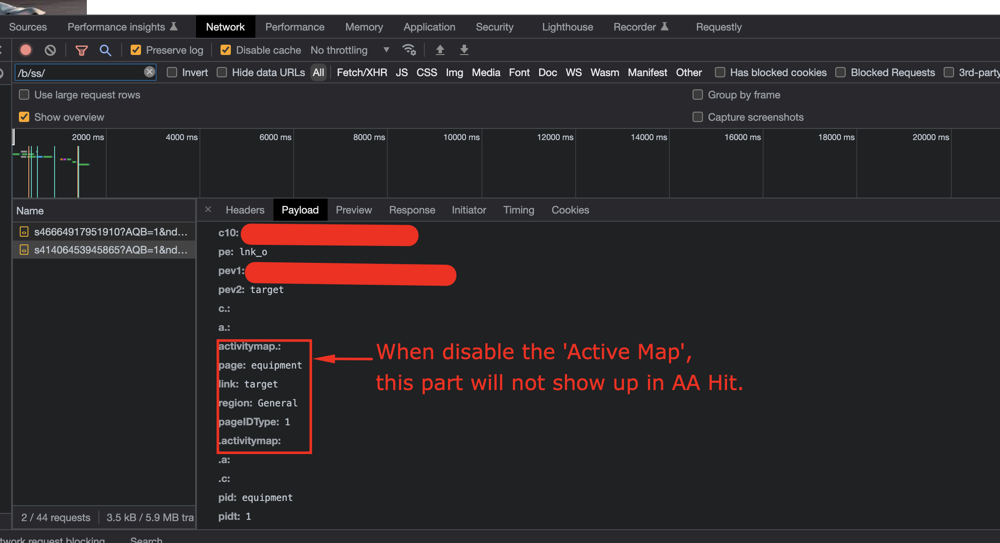

# Active Map のデータ収集を無効にする方法

## 説明

何らかの理由で、Active Map のデータは収集されなくなりました。Active Map のデータ収集を無効にするにはどうすればよいですか。
  

## 解決策

- <b>Adobe Analyticsライブラリが顧客サーバーで管理されている場合（AppMeasurement.js が自己ホストされている）</b>

AppMeasurement.js ファイルから AppMeasurement_Module_ActivityMap モジュールを削除します。

- <b>Adobe AnalyticsライブラリがAdobe側で管理されている場合 (AppMeasurement.js はAdobeCDN を介してホストされる )</b>

AEP データActivity Map(Launch)UI で、Adobe Analytics Extension の設定に移動し、チェックボックスをオフにして設定を無効にして、ビルドを公開します

- 

- <b>Active Map を無効にした後、「s_c_il」コマンドでブラウザ「コンソール」メニューから「Active Map」モジュールが読み込まれないことを確認します</b>

Active Map モジュールが読み込まれました

Active Map モジュールが読み込まれていません

- <b>Active Map を無効にした後、ブラウザーの「ネットワーク」メニューを使用してAdobe Analyticsサーバーコールを確認します</b>.

