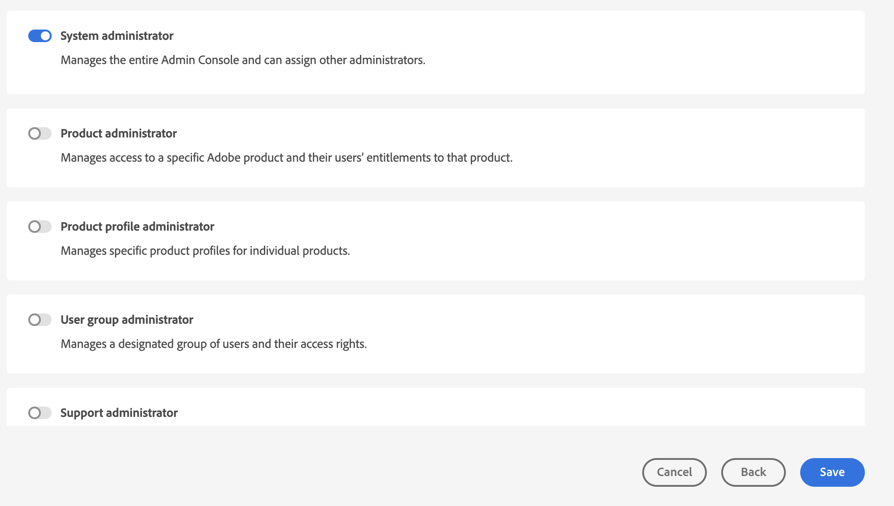
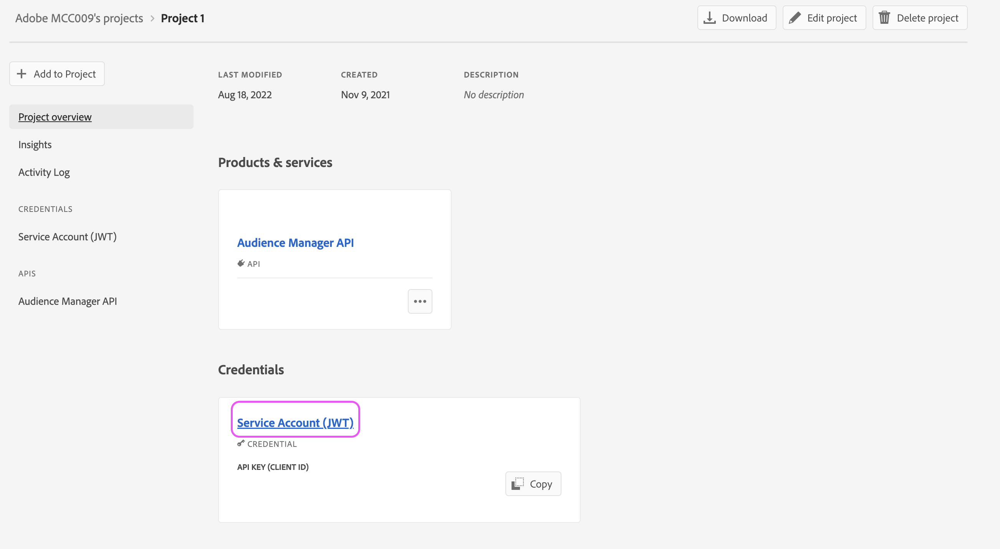

# AAM API アクセスの設定方法

## 説明

この記事では、デベロッパーコンソールでプロジェクトを作成してAudience ManagerAPI JWT 資格情報を生成する方法について説明します。

## 解決策

Audience ManagerAPI の資格情報を生成するには、Admin Consoleのシステム管理者権限が必要です。 手順 1 および 2 では、これらのエスカレーションされた権限を付与する方法の概要を説明します。 現在のシステム管理者は、追加のユーザーにエスカレーションされた管理者権限を付与するのではなく、自身でこれらの手順に従うことをお勧めします。その場合は、手順 3 に直接進みます。

1. 次に移動： [Admin Console](https://adminconsole.adobe.com/) をクリックし、次を選択します。 [!UICONTROL 管理者の追加] から [!UICONTROL クイックリンク] メニュー：

   

1. アクセス権を付与するすべてのユーザーの電子メールを入力します。 次のページで、「[!UICONTROL システム管理者]」（権限レベル）

   

1. に移動します。 [https://developer.adobe.com/console](https://developer.adobe.com/console) . 前の手順でシステム管理者権限が付与されているにもかかわらず、まだアクセス権がない場合は、Cookie/キャッシュを更新してみてください。

1. から新しいプロジェクトを作成 [!UICONTROL クイックスタート] メニュー ( または [!UICONTROL プロジェクト] 上部のナビゲーションのメニュー ):

   

1. プロジェクトにAudience ManagerAPI を追加します。

   

   

1. 次の手順に従って、JWT 資格情報を生成（またはアップロード）します。 開発コンソールを使用して資格情報を生成する場合は、秘密鍵を安全に保存してください。 秘密鍵は後の手順で必要になります。 

   

1. 次に、関連する製品プロファイルに資格情報を割り当てるよう求められます。 組織が役割に基づくアクセス制御を利用する場合は、次の手順に従って技術ユーザーアカウントを作成し、そのアカウントを関連する RBAC グループに追加する必要があります。 [https://experienceleague.adobe.com/docs/audience-manager/user-guide/api-and-sdk-code/rest-apis/aam-api-getting-started.html?lang=en#technical-account-rbac-permissions](https://experienceleague.adobe.com/docs/audience-manager/user-guide/api-and-sdk-code/rest-apis/aam-api-getting-started.html?lang=en#technical-account-rbac-permissions)

1. これらの手順が完了したら、アクセストークンを生成して最初の API リクエストをおこなうことができます。 まず、開発コンソールの資格情報の概要ページをクリックします。

   

1. ページ上部の「JWT を生成」タブをクリックし、手順 6 でダウンロードしたファイルの秘密鍵全体に貼り付けて、「トークンを生成」をクリックします。

   

最後に、前の手順で取得したアクセストークンを使用して API リクエストを実行できます。 呼び出しは、 [!DNL Postman]cURL コマンドを使用して直接、または API ドキュメントページから直接アクセスできます。 [https://bank.demdex.com/portal/swagger/index.html#/](https://bank.demdex.com/portal/swagger/index.html#/)

ドキュメントのデモ機能を使用して呼び出しをおこなうには、上記の手順に従ってトークンを生成し、ページの右側の「認証」をクリックしてトークンを入力します。

また、上のスクリーンショットで示したように、aam.adobe.io サーバーを選択していることも確認してください。 これで、任意の API リクエストでデモ機能を利用できるようになりました。そのためには、該当するパラメーターを入力し、「試す」ボタンをクリックします。

これにより、実際の API リクエストがインスタンスに送信されることに注意してください。 次を利用する場合、 `DELETE`, `PUT`または `POST` リクエストを送信する際に、インスタンスに意図しない変更を加える可能性があります。 リクエストを送信する前に、必ずこれらの各 API 呼び出しのドキュメントをよくお読みください。
