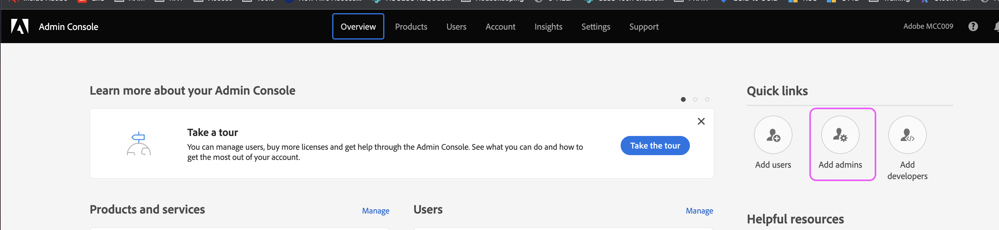

# AAM API アクセスの設定方法

Developer Console でプロジェクトを作成して、Audience ManagerAPI JWT 資格情報を生成する方法を説明します。

## 説明 {#description}

### 環境

Adobe Audience Manager

### 問題/症状

Audience ManagerAPI の資格情報の設定と生成方法

## 解決策 {#resolution}

Audience ManagerAPI の資格情報を生成するには、Admin Consoleのシステム管理者権限が必要です。 ステップ 1 と 2 では、エスカレーションされた権限を付与する方法について説明します。 現在のシステム管理者は、エスカレーションされた管理者権限を追加のユーザーに付与するのではなく、これらの手順を自分で実行する場合があります。この場合は、手順 3 に直接スキップします。

1. に移動します。 [Admin Console](https://adminconsole.adobe.com/) を選択し、「クイックリンク」メニューから「管理者を追加」を選択します。     
2. アクセスを許可するすべてのユーザーに向けてメールを入力します。 次のページで、権限レベルとして「システム管理者」を選択します。     
3. に移動します。 [https://developer.adobe.com/console](https://developer.adobe.com/console) . 前の手順でシステム管理者権限を付与されているにもかかわらず、アクセス権がまだない場合は、cookie/キャッシュを更新してみてください。
4. クイックスタートメニュー（または上部のナビゲーションのプロジェクトメニュー）から新しいプロジェクトを作成します。     
5. Audience ManagerAPI をプロジェクトに追加します。     
   
6. 手順に従って、JWT 資格情報を生成（またはアップロード）します。 開発コンソールを使用して資格情報を生成する場合は、必ず秘密鍵を安全に保存してください。 後の手順で秘密鍵が必要になります。     
7. 次に、関連する製品プロファイルに資格情報を割り当てるように求められます。 役割ベースのアクセス制御を利用する組織では、次の手順に従ってテクニカルユーザーアカウントを作成し、そのアカウントを関連する RBAC グループに追加する必要があります。 [https://experienceleague.adobe.com/docs/audience-manager/user-guide/api-and-sdk-code/rest-apis/aam-api-getting-started.html?lang=en#technical-account-rbac-permissions](https://experienceleague.adobe.com/docs/audience-manager/user-guide/api-and-sdk-code/rest-apis/aam-api-getting-started.html?lang=en#technical-account-rbac-permissions)
8. これらの手順が完了したら、アクセストークンを生成して、最初の API リクエストを行うことができます。 まず、開発コンソールの資格情報の概要ページをクリックします。     
9. ページ上部の「Generate JWT」タブをクリックし、手順 6 でダウンロードしたファイルから秘密鍵の全体を貼り付けて、「Generate Token」をクリックします。     

最後に、前の手順で取得したアクセストークンを利用して API リクエストを行うことができます。 呼び出しは、Postmanなどの任意の API プラットフォームから、cURL コマンドを使用して直接実行することも、API ドキュメントページから実行することもできます。 [https://bank.demdex.com/portal/swagger/index.html#/](https://bank.demdex.com/portal/swagger/index.html#/)

アドビのドキュメントのデモ機能を使用して呼び出しを行うには、上記の手順に従ってトークンを生成し、ページの右側にある「認証」をクリックしてトークンを入力します。

また、上のスクリーンショットに示されているように、aam.adobe.io サーバーを選択していることを確認します。 これで、関連するパラメーターを入力して「試す」ボタンをクリックすることで、任意の API リクエストでデモ機能を利用できます。

これにより、実際の API リクエストがインスタンスに送信されることに注意してください。 DELETE、PUTまたはPOSTのリクエストを利用している場合、インスタンスに意図しない変更を加えている可能性があります。 リクエストを送信する前に、これらの各 API 呼び出しのドキュメントを必ず慎重に読んでください。
