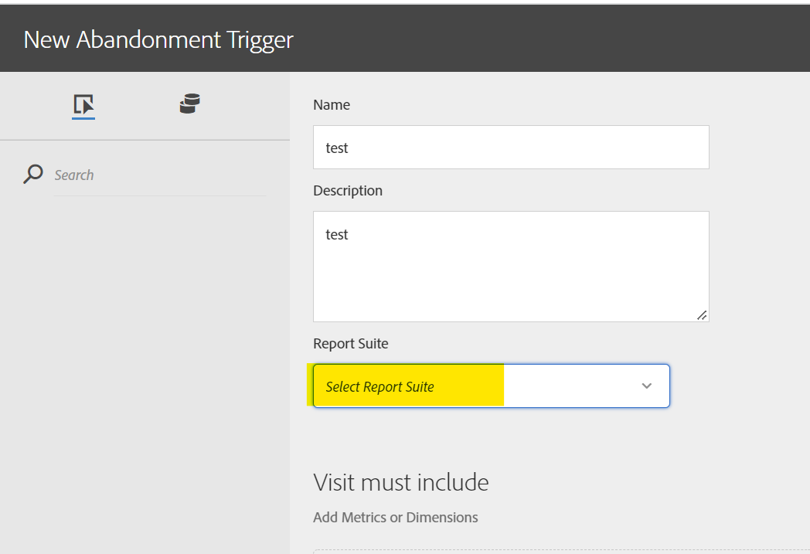

# レポートスイート ID がトリガーUI 内のドロップダウンで使用できない

## 説明 {#description}

<b>環境</b> Analytics   <b>問題/症状</b> レポートスイート ID がExperience CloudトリガーUI 内のドロップダウンに入力されない原因として考えられるものは何ですか？

## 解決策 {#resolution}

これは、レポートスイートが組織Experience Cloudにマッピングされていない場合に発生します。詳しくは、Adobeカスタマーケアにお問い合わせください。

  