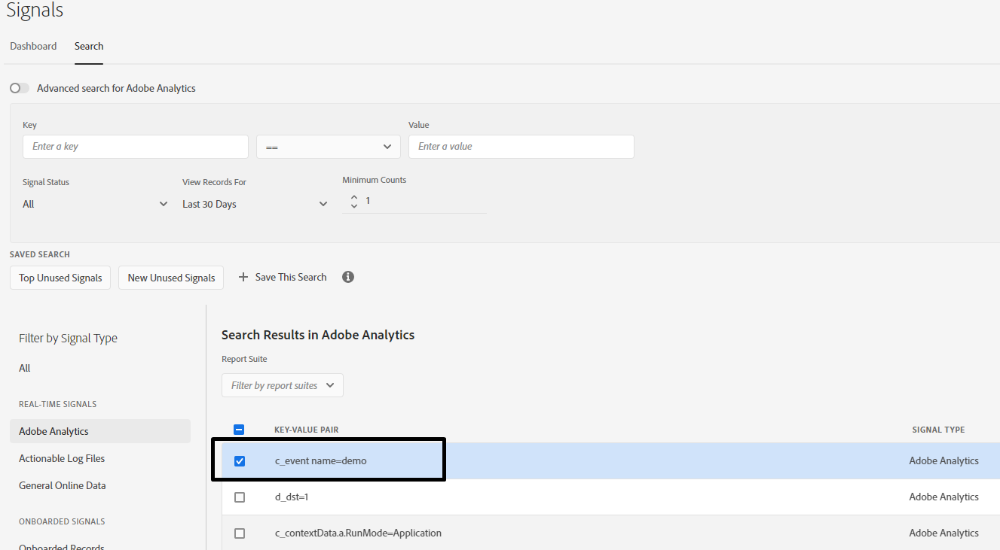

# シグナルダッシュボードから新規特性を作成中にエラーが発生しました

正しいシグナル条件を選択して、シグナルダッシュボードに存在するシグナルから新しい特性を作成する方法を説明します。

## 説明 {#description}

### 環境

Audience Manager

### 問題/症状

正しいシグナル条件を選択して、シグナルダッシュボードに存在するシグナルから新しい特性を作成する方法を説明します。

シグナルダッシュボードに存在するシグナルから新しい特性を作成する際に、以下のエラーが発生します。

- 使用されているシグナル：

## 解決策 {#resolution}

指定されたエラーでは、シグナル内のキーには二重引用符（&quot;）、ドット（.）、ハイフン（–）、アンダースコア（_）のみを含めることができるとしています。

シグナルを詳しく調べると、どの特性の検証が失敗したかにより、以下に強調表示されているように 1 つのスペースが含まれていることが特定されました。

正しい信号条件を選択することは非常に重要です。

参照：

特性ルール –  [https://experienceleague.adobe.com/docs/audience-manager/user-guide/features/traits/trait-builder/manage-trait-rules.html?lang=en](https://experienceleague.adobe.com/docs/audience-manager/user-guide/features/traits/trait-builder/manage-trait-rules.html?lang=en)

名前要件 –  [https://experienceleague.adobe.com/docs/audience-manager/user-guide/features/traits/trait-key-name-requirements.html?lang=en](https://experienceleague.adobe.com/docs/audience-manager/user-guide/features/traits/trait-key-name-requirements.html?lang=en)
