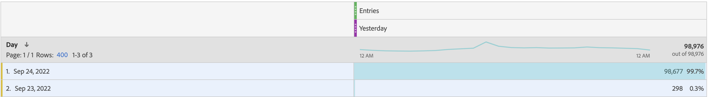

# 入口指標予定レポートには、レポートウィンドウ外の項目が含まれます

## 説明

<b>問題：
  </b>
 スケジュール済み入口指標レポートには、レポートウィンドウ外のデータが含まれます。
 次の図に示すように、レポートウィンドウは「昨日」ですが、予定レポートには昨日のデータ（9 月 24 日）だけでなく、他の日のデータも含まれていました。
 理由とは何ですか？また、昨日のデータのみを予定レポートに含めるにはどうすればよいですか？
  
  
 

## 解像度

<b>理由：</b>
入口は訪問ベースの指標なので、
入口数やバウンス率などの訪問ベースの指標は、レポートウィンドウの開始日範囲の前日にデータを属性付けできます。 このアトリビューションの最も一般的なシナリオは、訪問が午前 0 時にまたがる場合です。 例：

1. ユーザーが 9 月 23 日 (PT) の午後 11 時 50 分にホームページを訪問しました。
2. 複数のページを訪問した後、ユーザーは 9 月 24 日 (PT) 午前 12 時 10 分にホームページを離れました。

この例では、「レポートウィンドウ」が 9 月 24 日（昨日）の場合、この訪問はレポートに含まれます。 
ただし、入口指標は 9 月 23 日に属性なので、日Dimensionの「2022 年 9 月 23 日」もレポートに表示されます。
 
<b>解決策：</b>
これはデザインとして機能しますが、回避策として、行数を 1 に設定し、まともな形で日ディメンションを並べ替えた後、レポートを保存して再スケジュールすることができます。 次の画像のように、「昨日」のデータのみを含むレポートを受け取る場合があります。
 

