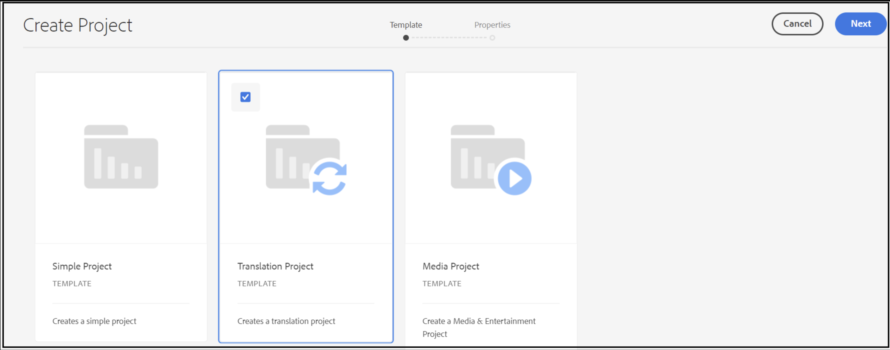

# 使用可能なプロジェクトテンプレートがありません

## 説明 {#description}

### 環境

- Adobe Experience Manager

### 問題／症状

お客様のユーザーは、から新しいプロジェクトを作成しようとするときに、管理者権限を含め、Admin Consoleで必要なすべての権限を割り当てられます。 <b>AEM Start </b>`>`  <b>プロジェクト</b> `>`<b></b> の作成 `>`  <b>プロジェクト</b>を指定した場合、使用できるプロジェクトテンプレートがないので、プロジェクトを作成できません。

ユーザーガイドに従って、 [AEMには、3 つの異なるテンプレートが付属しています](https://experienceleague.adobe.com/docs/experience-manager-cloud-service/content/sites/authoring/projects/overview.html?lang=en#project-templates)標準：

- 単純なプロジェクト：他のカテゴリに適合しないプロジェクトのリファレンスサンプル（包括的）です。 3 つの基本的な役割（所有者、エディター、監視者）と 4 つのワークフロー（プロジェクトの承認、ローンチをリクエスト、ランディングページをリクエスト、電子メールをリクエスト）が含まれます。
- メディアプロジェクト：メディア関連アクティビティ用のリファレンスサンプルプロジェクトです。 これには、メディア関連の複数のプロジェクトの役割（フォトグラファー、エディター、コピーライター、デザイナー、所有者、監視者）が含まれます。
- A [翻訳プロジェクト](https://experienceleague.adobe.com/docs/experience-manager-cloud-service/content/sites/administering/reusing-content/translation/overview.html?lang=en):翻訳関連のアクティビティを管理するためのリファレンスサンプルです。 3 つの基本的な役割（所有者、エディター、監視者）が含まれます。ワークフローユーザーインターフェイスでアクセスする 2 つのワークフローが含まれます。

     
ただし、顧客には、これらのテンプレートは表示されません。

## 解決策 {#resolution}

プロジェクトテンプレートをAEMに表示するには、プロパティ `cq:allowedTemplates` タイプ `String[ ]` 値 <b>/(apps|libs)/.\*/projects/templates/.\* </b> は、以下の下に存在する必要があります <b>/content/projects/jcr:content</b>.

お客様が `jcr:content node` under */content/projects*. 作成後 `jcr:content node` と `cq:allowedTemplates` 属性を使用すると、顧客は 3 つのプロジェクトテンプレートをすべて表示できます。

