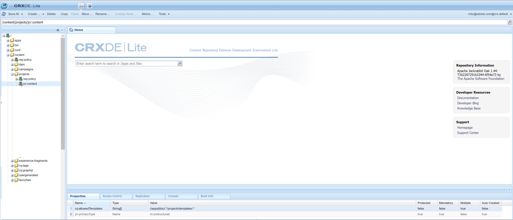

# 使用可能なプロジェクトテンプレートがありません

## 説明

お客様のユーザーは、から新しいプロジェクトを作成しようとするときに、管理者権限を含め、Admin Consoleで必要なすべての権限を割り当てられます。 *AEM Start - Projects - Create - Project* 使用できるプロジェクトテンプレートがないので、プロジェクトを作成できません。   
1 によると、AEMには、次の 3 つの異なるテンプレートが標準で付属しています。

- シンプルなプロジェクト - 他のカテゴリに適合しない、あらゆるプロジェクト用のリファレンスサンプルです（キャッチオール）。3 つの基本的な役割（所有者、エディター、監視者）と 4 つのワークフロー（プロジェクト承認、ローンチをリクエスト、ランディングページをリクエスト、電子メールをリクエスト）が含まれます。
- メディアプロジェクト - メディア関連アクティビティ用のリファレンスサンプルプロジェクトです。これには、メディア関連の複数のプロジェクトの役割（フォトグラファー、エディター、コピーライター、デザイナー、所有者、監視者）が含まれます。
- A [翻訳プロジェクト](https://experienceleague.adobe.com/docs/experience-manager-cloud-service/content/sites/administering/reusing-content/translation/overview.html?lang=en)  — 翻訳関連のアクティビティを管理するためのリファレンスサンプル。 3 つの基本的な役割（所有者、エディター、監視者）が含まれます。ワークフローユーザーインターフェイスでアクセスする 2 つのワークフローが含まれます。

      ただし、顧客には、これらのテンプレートは表示されません。     1 [https://experienceleague.adobe.com/docs/experience-manager-cloud-service/content/sites/authoring/projects/overview.html?lang=en#project-templates](https://experienceleague.adobe.com/docs/experience-manager-cloud-service/content/sites/authoring/projects/overview.html?lang=en#project-templates)

## 解決策

プロジェクトテンプレートをAEMに表示するには、プロパティ — <b>cq:allowedTemplates</b> タイプ <b>文字列</b> 値 <b>/(apps|libs)/.\*/projects/templates/.\&lt;/b>*は以下の下に存在する必要があります <b>/content/projects/jcr:content</b>.

この問題は、顧客に/content/projects の下に jcr:content ノードがないことが原因で発生していることがわかりました。 jcr:content ノードを作成し、 cq:allowedTemplates 属性を追加すると、顧客は 3 つのプロジェクトテンプレートをすべて表示できます。

