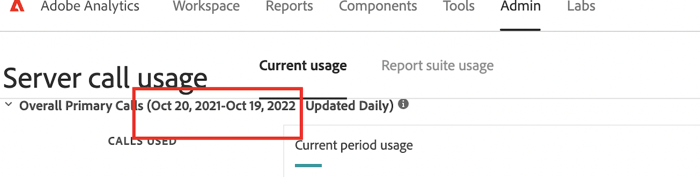

# サーバーコール使用状況 UI の日付範囲と契約が一致していません

## 説明 {#description}

### <b>環境</b>

Analytics

### <b>問題／症状</b>

サーバーコール使用状況 UI の日付範囲と契約の日付が一致しないのはなぜです。

例えば、Adobe Analytics契約では、期間は 2021 年 20 月 10 日～2023 年 19 月 1 日です。

ただし、サーバーコール使用状況 UI では、期間は 2021 年 20 月 10 日～2022 年 19 月 10 日です。

<b></b>

## 解決策 {#resolution}

設計どおりの動作です。 サーバーコール使用状況 UI の期間は、契約のサービス開始日/終了日ではなく、コミットサイクルの月に依存します。

上記のお客様のコミットサイクルの月数は、12 か月単位で請求されます。 このコミットサイクルが 2022 年 19 月 10 日（PT）に終了する場合、次のコミットサイクルは 3 か月で 2023 年 19 月 1 日（PT）に終了します。
