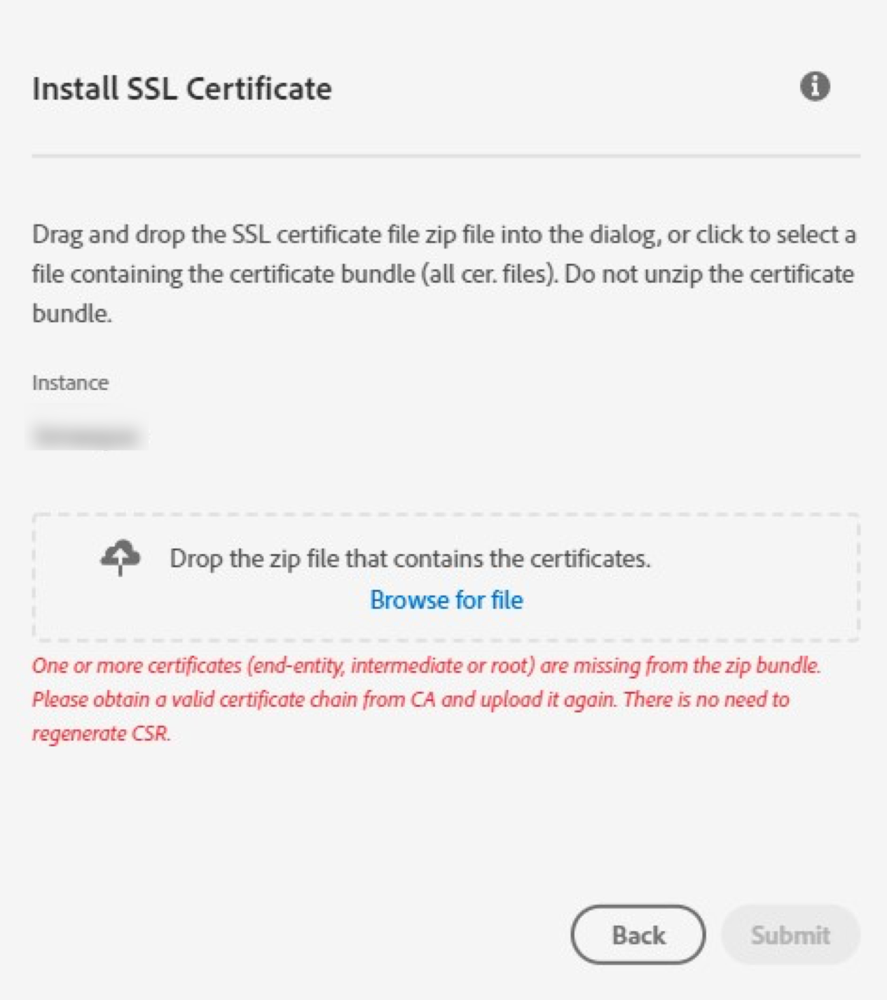

# Adobe Campaign証明書が zip バンドルにありません

## 説明 {#description}

<b>環境</b>
Adobe Campaign
<b>問題/症状</b>
SSL 証明書が期限切れになったか、一部のドメインで有効期限が近づいています。 ただし、組織のCampaign コントロールパネルを通じて生成された証明書署名要求 (CSR) 用の SSL 証明書をアップロードしようとすると、次のエラーが発生します。 *1 つ以上の証明書（エンドエンティティ、中間、またはルート）が zip バンドルにありません。 有効な証明書チェーンを CA から取得し、再度アップロードしてください。 CSR を再生成する必要はありません*.

## 解決策 {#resolution}

完全な信頼済み証明書チェーンがないと、SSL 証明書を更新できません。 認証局 (CA) に、すべての証明書を含む zip バンドルを提供するように依頼します。また、Campaign コントロールパネルを使用して証明書をアップロードできます。  ただし、緊急の場合（時間、配信、キャンペーンの送信に影響が出ている場合）は、次の手順を実行して、欠落している中間証明&#x200B;書をメ&#x200B;インの証明書から取得する必要がありま&#x200B;す&#x200B;。

1. 証明書のプロパティに移動し、証明書のパスに移動して、署名証明書を選択します。
2. その後、 <b>ファイルにコピー</b> オプション。
3. 見つからない証明書がダウンロードされたら、既存のバンドルに証明書を保存し、Campaign コントロールパネルを使用して SSL 証明書をアップロードしてみます。

その後、ドメインに SSL 証明書がインストールされているはずです。 上記の手順がまだ機能していない場合は、CA に接続します。
