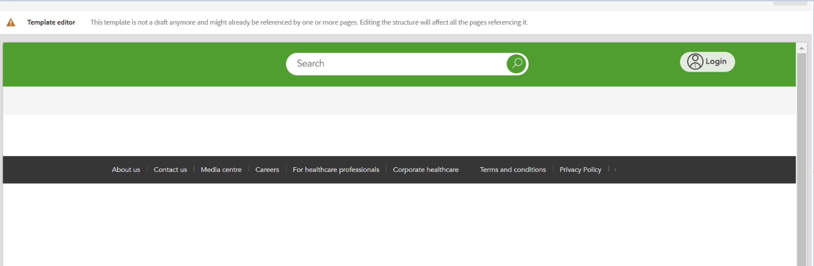

# 新しいデプロイメントはすべてのスタイル設定を削除しました

## 説明 {#description}

ある環境にパイプラインをデプロイした後、顧客はテンプレートからカスタムスタイルが見つかり、そのテンプレートで作成されたページのスタイルが削除されたことに気がつきました。

図 1. スタイルが存在するテンプレート

図 2. スタイルのないテンプレート

## 解決策 {#resolution}

顧客が環境にデプロイしたプロジェクトを確認すると、デプロイされたブランチの下の filter.xml ファイルにコンテンツ 1 が含まれていることに気がつきました。
変更されたテンプレートが含まれるパス「/conf/path/settings/wcm/templates/modified_template」には、デフォルトのフィルターモード (「replace」) が含まれていました。
つまり、顧客がパイプラインをデプロイする際には常に、そのパスがデプロイされたプロジェクトのパスに置き換えられます。
この問題を修正するには、他のパスと同様に、フィルターモードを「merge」に設定する必要があります。

1 workspaceFilter version=&quot;1.0&quot; filter root=&quot;/conf/path/settings/wcm/templates/modified_template&quot;/ filter root=&quot;/conf/path&quot; mode=&quot;merge&quot;/ filter root=&quot;/merge&quot;/ filter root=&quot;/filter root=&quot;/content/dam/path2/asset.jpg&quot; mode=&quot;merge&quot;/filter=&quot;/cont/content-fragments/path2&quot; mode=&quot;merge&quot;/ /workspaceFilter
