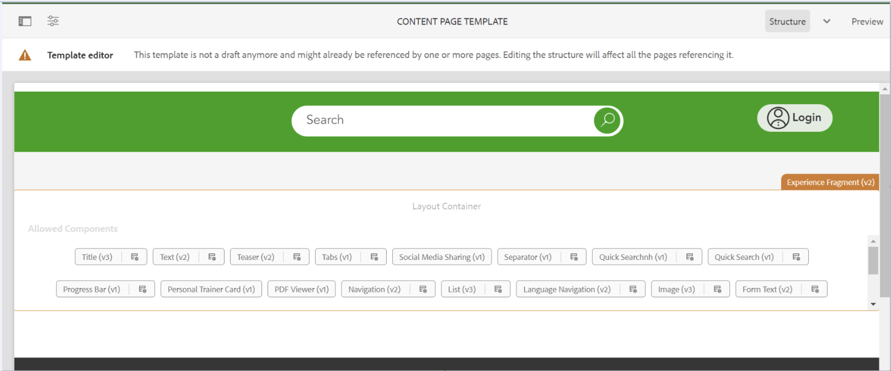

# 新しいデプロイメントですべてのスタイル設定が削除されています

## 説明 {#description}

ある環境にパイプラインをデプロイした後、顧客はテンプレートからカスタムスタイルが見つかり、そのテンプレートで作成されたページのスタイルが削除されたことに気がつきました。

図 1. スタイルが存在するテンプレート

図 2. スタイルのないテンプレート

## 解決策 {#resolution}

顧客が環境にデプロイしたプロジェクトを確認すると、コンテンツの変更を担当していたブランチ（この例では 1）の下の filter.xml ファイルにフィルター 2 が含まれていることがわかりました。
デプロイメント後に変更されたテンプレートは、「/conf/path/settings/wcm/templates/modified template」にありますが、フィルターモードはありませんでした。デフォルトでは、「replace」を示します。
これは、パイプラインがデプロイされるたびに、代わりにコード内のパスが使用されることを意味します。
他のパスの場合と同様に、フィルタモードを「merge」に設定して、この問題を修正する必要があります。 3.

1 /aem-cust-project.all-0.0.1-SNAPSHOT/jcr_root/apps/cust-packages/content/install/aem-cust-project.ui.content-0.0.1-SNAPSHOT/META-INF/vault/filter.xml

2 workspaceFilter version=&quot;1.0&quot; filter root=&quot;/conf/path/settings/wcm/templates/modified_template&quot;/ filter root=&quot;/conf/path&quot; mode=&quot;merge&quot;/ filter root=&quot;/merge&quot;/ filter root=&quot;/filter root=&quot;/content/dam/path2/asset.jpg&quot; mode=&quot;merge&quot;/ filter=&quot;/content/-fragments/path2&quot; mode=&quot;merge&quot;/ /workspaceFilter

3 workspaceFilter version=&quot;1.0&quot; filter root=&quot;/conf/path/settings/wcm/templates/modified_template&quot; <b>mode=&quot;merge&quot;</b>/ filter root=&quot;/conf/path&quot; mode=&quot;/merge&quot;/ filter root=&quot;/conf/path2&quot; mode=&quot;merge&quot;/ filter root=&quot;/content/path2&quot; mode=&quot;merge&quot;/ filter root=&quot;/content/dam/path2/asset.jpg&quot; mode=&quot;merge&quot;/ filter root=&quot;/ filter root=&quot;/filter root=&quot;/content/experience-fragments/path2&quot; mode=&quot;merge&quot;/ / / /workspaceFilter
