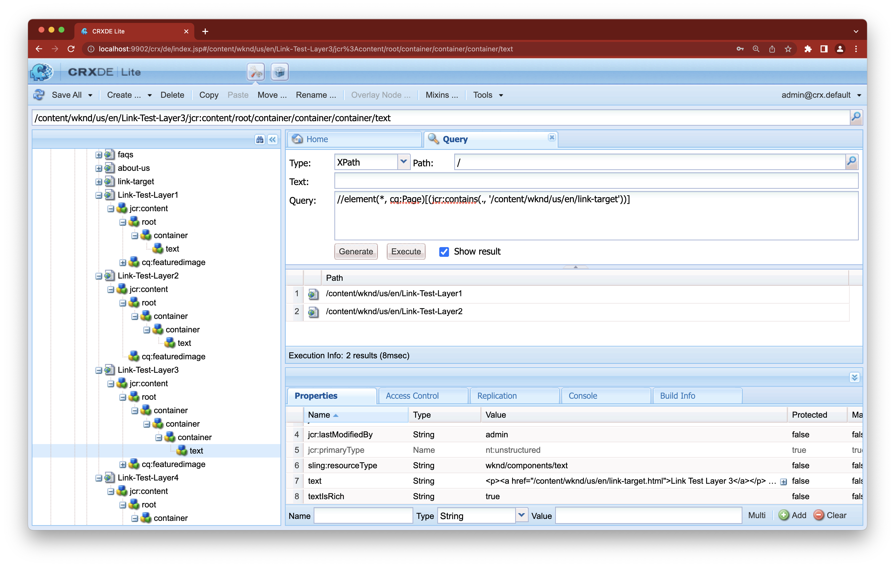

# Adobe Experience Manager：着信リンクに表示されないリンクページがある

## 説明 {#description}

<b>環境</b>
- AEM as a Cloud Service
- AEM 6.5


<b>問題/症状</b>
リンクを持つノードが、そのページの jcr:content から 4 レベルを超える場所に配置されている場合、そのページは、リンクターゲットの受信リンクには表示されません。

・リンクページが読み込まれるリンクに表示される場合：  /content/wknd/us/en/link-page/jcr:content 1) /root 2) /container 3) /container 4) /text(link

・リンクページが読み込まれるリンクに表示されない場合：  /content/wknd/us/en/link-page/jcr:content 1) /root 2) /container 3) /container 4) /container 5) /text(link


## 解決策 {#resolution}


CRXDE Lite を使用して、リンクを含むノードの階層を確認します。



ページの構造を確認して、リンクノードが浅いレベルになるように調整します。
リンクノードのレベルが深いレベルのままである場合は、インデックスを調整して、着信リンク検索用にインデックスを作成するレベルを上げます。

CRX/DE Lite を使用して、を選択します。


```
/oak:index/cqPageLucene/aggregates/cq:PageContent.
```

新しいノードを作成し、必要な階層レベルを表す「path」プロパティを追加します。
- 次の例では、「include4」と「include5」を追加して、検索する受信リンクのレベルを 6 まで上げています。


再インデックスを実行するには、の reindex プロパティの値を変更します。 `/oak:index/cqPageLucene` を true に設定して保存します。


  
    - 再インデックスが完了すると、次のメッセージが error.log に表示されます。

`    13.01.2023 12:00:45.264 *INFO* async-index-update-async org.apache.jackrabbit.oak.plugins.index.AsyncIndexUpdate async Reindexing completed for indexes: /oak:index/cqPageLucene*(788) in 733.7 ms (733 ms)`

再インデックスにより、パフォーマンスの問題を引き起こす場合があります。
再インデックスタスクは比較的静かな時間にスケジュールすることをお勧めします。
