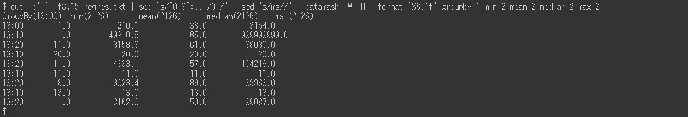
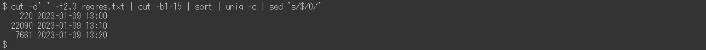
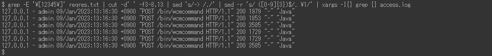

# request.log 分析の例 | AEM

## 説明 {#description}

### <b>環境</b>

Experience Manager 6.5

### <b>問題／症状</b>

Adobe Experience Manager（AEM） `request.log` パフォーマンスの問題を分析する際に役立つ様々な情報（応答時間など）が含まれます。 以下は、Linux コマンドを使用した分析例のリストです（ruby のような外部コマンドを含む） `[` 1`]`  と datamash `[` 2`]` ）に設定します。

<u>インストールガイド</u>

`[` 1`]`  [https://www.ruby-lang.org/en/documentation/installation/](https://www.ruby-lang.org/en/documentation/installation/)

`[` 2`]`  [https://www.gnu.org/software/datamash/download/](https://www.gnu.org/software/datamash/download/)

## 解決策 {#resolution}

### 目次

<b>イ。はじめに</b>

- 形式 `request.log`

<b>B.準備手順</b>

1. データクレンジング
2. 再開時間
3. 1 時間あたりのアクセス数
4. 最大同時処理
5. ログファイルの分割
6. 要求レコードと応答レコードの結合

<b>ハ。分析例</b>

1. 最も重いアクセス
2. 欠落している応答にアクセスします
3. 低速アクセス
4. 応答時間の時系列データ
5. 最小、平均（平均）、中央値、最大応答時間
6. 1 期間あたりのアクセス数
7. 1 期間あたりの応答ステータスの数
8. 頻度の高い URL
9. `access.log` のレコード `request.log` レコード

<b>ニ。終わりに</b>

#### <b>回答： <u>はじめに</u></b>

の形式 `request.log`

AEM 6.5 では、 `request.log` デフォルトでは、次の形式になります。 システムの制限により、この記事のコマンドラインはプレーンテキストではなく画像として表示されます。

例 `request.log`:

この記事の「– `>` 」は、「リクエストレコード」と呼ばれます。 「」が付いた行`<`  –」は「応答レコード」です。

<u>リクエストレコード</u>:

AEMがリクエストを受信すると、リクエストレコードがログに記録されます。 受信日時、リクエスト ID、リクエスト方法および URL が含まれます。

<u>応答レコード</u>:

AEMがリクエストに応答すると、応答レコードがログに記録されます。 これには、応答の日時、要求 ID、ステータスコード、Content-Type および応答時間（ミリ秒単位）が含まれます。

対応するマニュアルを見つける [request.log の解釈](https://experienceleague.adobe.com/docs/experience-manager-65/deploying/configuring/monitoring-and-maintaining.html#interpreting-the-request-log).

#### <b>B. <u>準備手順</u></b>

<u>手順 1. データクレンジング</u>

分析に踏み込む前に `request.log`ログレコードを標準化することが重要です。

第 1 `sed` コマンドは、応答レコードの Content-Type の余分なスペースを削除して、空白による誤ったフィールド分離を防ぎます。 Ruby コマンド（を参照） <b>`[` 1`]` </b> 上記（Ruby をインストールする場合）は、日付形式を ISO 8601 に変換します。 また、ruby コマンドは、日付と時刻をコロンの代わりに空白で区切ります。

<u>手順 2. 再開時間</u>

AEMとサービスパックのインストールを再起動すると、のリクエスト ID がリセットされる `request.log`. リクエストレコードとリクエスト `ID = 0` は、このような操作が行われる可能性があることを示します。

上記の例では、リクエスト ID は 13 で 0 にリセットされました:08:49 および 13:26:13.

<u>手順 3. 1 時間あたりのアクセス数</u>

1 時間あたりのアクセス数と、の時間範囲をカウントします `request.log`.

<u>手順 4. 最大同時処理</u>

同時処理数は、AEMのサーバー負荷を推測するのに役立ちます。

デフォルトでは、AEMでの Jetty の最大同時接続数は 200 に設定されています。 応答が完了した後、ソケットを解放する際に遅延が生じる。 同時処理の数が約 170 を超えると、新しいリクエストを受け入れることができなくなります。

<u>手順 5. ログファイルの分割</u>

のリクエスト ID `request.log` AEMの再起動時、またはサービスパックのインストール時にリセットされます。 この動作により、次の場合に分析が正しくない可能性があります `request.log` そのような操作を含みます。 正確な分析を行い、同時に処理するファイルサイズを縮小するには、を分割します `request.log` リクエストでのリクエストレコードの使用 `ID = 0`.

<u>手順 6. 要求レコードと応答レコードの結合</u>

リクエスト ID によってリクエストレコードと応答レコードを結合すると、パフォーマンスの問題が発生したタイミングを簡単に特定できます。 この結合ログファイルは、後の例で使用します。

最後 `sed` コマンドは、対応する応答レコードがない要求レコードにダミーの応答を追加します。 リクエストレコードのない応答レコードも存在する場合があります。 しかし、これらは通常、調査の対象とはならないので、無知です。

結合されたログファイルは次のようになります。

#### <b>C. <u>分析例</u></b>

<u>例 1. 最も重いアクセス</u>

レスポンスなしのアクセスを含め、レスポンス時間の降順でマージ・ログ・ファイルをソートします。

<u>例 2. 欠落している応答にアクセスします</u>

ダミーの応答時間を使用して、対応する応答レコードがないアクセスを抽出します。

応答のないアクセスを受け取るタイミングがサーバー負荷の増加と相関している場合、これらのアクセスはパフォーマンスの問題をトリガーする可能性があります。

<u>例 3. 低速アクセス</u>

10 秒以上かかった抽出アクセス。

ヒット数が多すぎる場合は、を置換します `[ 0-9] {5}` （を使用） `[ 0-9] {6}` が含まれる `grep` 100 秒以上かかったアクセスに絞り込むコマンド。

<u>例 4. 応答時間の時系列データ</u>

データからタイムスタンプと応答時間のみを抽出すると、グラフを作成するのに役立ちます。

即座に応答したアクセスを省略すると、データの効率が向上します。 次の例では、2 秒を超えたアクセスを抽出しています。

<u>例 5. 最小、平均（平均）、中央値、最大応答時間</u>

上記の例では、統計処理に datamash コマンド （https://www.gnu.org/software/datamash/）を使用しています。 応答のないアクセスがログに含まれている場合、ダミーの値は結果に影響を与えます。

<u>例 6. 1 期間あたりのアクセス数</u>

10 分あたりのアクセス数をカウントします。 結果は、大きなトラフィックがパフォーマンスの問題の原因であるかどうかを判断するのに役立ちます。

次の例では、データをPOSTリクエストのみに絞り込みます。 一般的なユースケースは、コンテンツのオーサリングやパブリッシュ層へのレプリケーションが集中しているかどうかを判断することです。

<u>例 7. 1 期間あたりの応答ステータスの数</u>

datamash コマンドを使用して、10 分あたりの各応答ステータスの数のテーブルを作成します。

<u>例 8. 頻度の高い URL</u>

10 分ごとに最も頻繁にアクセスされた上位 3 つの URL を印刷します。

例 9. `access.log` のレコード `request.log` レコード

検索 `access.log` 特定のリクエスト ID に対応するレコードの場合。

同じ URL に対して同時に複数のアクセスが発生した場合は、結果に複数のが表示されます `access.log` 単一のリクエスト ID のレコード。

#### <b>ニ。終わりに</b>

この記事の例は、パフォーマンスの問題を分析する際に役立ちます。

上記の例は CentOS 7.5 および Ubuntu 22.04LTS でテスト済みですが、バージョンの違いやコマンドのバリエーションなど、環境によっては期待どおりに動作しない場合があります。 環境にインストールされているコマンドに応じて調整してください。
