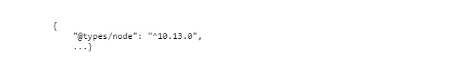

# ビルドステップでパイプラインのデプロイメントが失敗する


ビルドステップ中にパイプラインのデプロイメントに失敗した場合は、ノードのバージョンを探して ui.frontend/package.jsonファイルに追加します。

## 説明 {#description}


### <b>環境</b>

Adobe Experience Manager as a Cloud Service


### <b>問題／症状</b>

ビルドステップ中に、パイプラインの実行が失敗しました。原因は `ui.frontend` コード。

次のような ERROR メッセージが、 `build.log` ファイル：


```
12:52:44,558 [ Exec Stream Pumper]  [ INFO]  ERROR in /build_root/build/<program>/ui.frontend/node_modules/@types/node/ts4.8/util.d.ts
12:52:44,559 [ Exec Stream Pumper]  [ INFO]  [ tsl]  ERROR in /build_root/build/<program>/ui.frontend/node_modules/@types/node/ts4.8/util.d.ts(1485,42)
12:52:44,561 [ Exec Stream Pumper]  [ INFO]  TS1005: ',' expected.
12:52:44,561 [ Exec Stream Pumper]  [ INFO] 
12:52:44,561 [ Exec Stream Pumper]  [ INFO]  ERROR in /build_root/build/<program>/ui.frontend/node_modules/@types/node/ts4.8/util.d.ts
12:52:44,562 [ Exec Stream Pumper]  [ INFO]  [ tsl]  ERROR in /build_root/build/<program>/ui.frontend/node_modules/@types/node/ts4.8/util.d.ts(1485,44)
12:52:44,563 [ Exec Stream Pumper]  [ INFO]  TS1068: Unexpected token. A constructor, method, accessor, or property was expected.
12:52:44,563 [ Exec Stream Pumper]  [ INFO] 
12:52:44,563 [ Exec Stream Pumper]  [ INFO]  ERROR in /build_root/build/<program>/ui.frontend/node_modules/@types/node/ts4.8/util.d.ts
12:52:44,564 [ Exec Stream Pumper]  [ INFO]  [ tsl]  ERROR in /build_root/build/<program>/ui.frontend/node_modules/@types/node/ts4.8/util.d.ts(1485,57)
12:52:44,564 [ Exec Stream Pumper]  [ INFO]  TS1005: ';' expected.
12:52:44,564 [ Exec Stream Pumper]  [ INFO]
```


## 解決策 {#resolution}

<b>次の手順に従います。</b>
1. Git リポジトリのルート、ファイル内でを探します。 `pom.xml,` ノードのバージョンを見つけます。例： `<nodeVersion>v10.13.0</nodeVersion>`


2. 場所 `ui.frontend/package.json,` 既存のにを追加します。 `devDependencies` オブジェクト：例えば、「devDependencies」の場合は次のようになります。

   


<br>メモ：<br>


1. からの v `<` nodeVersion`>` <b>v10.13.0</b> をコピーしないでください。


2. ノードのバージョンは、お客様のケースでは異なる可能性があります。 例： <b>12.22.7</b>

