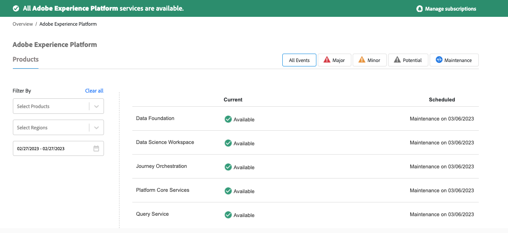

# Adobe Experience Platform はダウンしていますか？

## 説明 {#description}

<b>環境</b>

Adobe Experience Platform(AEP)

Customer Journey Analytics

<b>問題</b>

Adobe Experience Platformは機能していませんか？

## 解決策 {#resolution}

何かが期待どおりに動作しない場合は、次のページで「Adobeステータス」ページを確認してください： [Adobeステータス `>`  Experience Platform](https://status.adobe.com/cloud/experience_platform#/).

Adobeステータスは、すべてのAdobe製品およびサービスのサービスの可用性とパフォーマンスに影響を与える情報を提供します。 Adobe製品に影響を及ぼす、進行中または過去のインシデントとメンテナンスが含まれます。

<b>注意</b>：計画的/計画外のダウンタイムでアラート/通知を購読することもできます。

次の例を参照してください。

