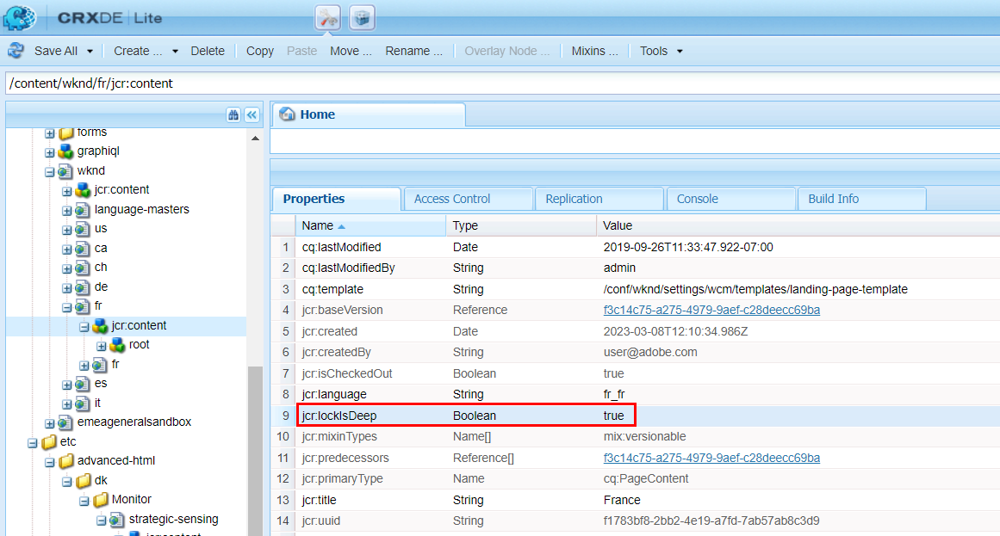

# AccessDeniedException でブロックされた配布キュー

「クイック公開」、「公開を管理」、または「レプリケート」を使用してページコンテンツ、XF、またはその他のリソースをレプリケートしようとすると、オーサーの配布キューがブロックされます。 これを確認するには、 *publish* 配布 UI からの配布キュー（<b>AEM `>`  ツール `>`  デプロイメント `>`  配分</b>）に設定します。 このドキュメントに記載されている手順に従って、問題を解決します。

## 説明 {#description}

### <b>環境</b>

- Adobe Experience Manager
- Experience Manager as a cloud service

### <b>問題/症状</b>

「クイック公開」、「公開を管理」、「レプリケート」を使用して一部のページコンテンツ（または XF およびその他の種類のリソース）をレプリケートしようとすると、作成者の配布キューが表示される <b>ブロック</b>.

この問題は、 *publish*配布 UI からの配布キュー（AEM - ツール – デプロイメント – 配布）:
       ゴールデンパブリッシャーキュー（リストから太字で入力）を選択すると、詳細が表示され、特に関連する <b>パス</b> （複数の要素を指定できます）。       を調べる <b>ログ</b> タブには、次の対応するエラーが表示されます。  2023/03/08 12:11:26:238 – 情報 – 配布パッケージ PackageMessage （pubSlingId=a1133c97-6809-411e-a435-4eea0ecbe889, reqType=ADD, pkgId=dstrpck-1678277486031-63159f4b-c577-4079-8741-d41660597d20, kgType=journal_filevault, pkgLength=6330, pubAgentName=publish, userId=replication-service, paths=`[` /content/wknd/fr`]` , deepPaths=`[` `]` ） （オフセット = 158705）
 2023/03/08 12:11:27:459 - WARN - メッセージ：配布パッケージ PackageMessage （pubSlingId=a1133c97-6809-411e-a435-4eea0ecbe889, reqType=ADD, pkgId=dstrpck-1678277486031-63159f4b-c577-4079-8741 – でインポートに失敗しました 41660597d20, pkgType=journal_filevault, pkgLength=6330, pubAgentName=publish, userId=replication-service, paths=`[` /content/wknd/fr`]` , deepPaths=`[` `]` ）が offset=158705 です（「javax.jcr.AccessDeniedException: OakAccess0000: Access denied」が原因）。インポーターは後で再試行します。
 Stacktrace: org.apache.sling.distribution.common.DistributionException: javax.jcr.AccessDeniedException: OakAccess0000: Access denied
 `[` ..`]`       次の操作が必要です *キューのクリア* （またはその項目を削除）して、キューのブロックを解除します。 

## 解決策 {#resolution}

～という誤りにもかかわらず <b>`javax.jcr.AccessDeniedException`</b>には、配布サービスユーザーの ACL /権限とは関係ない可能性がありますが、次のシナリオがお客様のケースに当てはまらない場合は、これを考慮する必要があります。

診断

レプリケートされたコンテンツに、スペシャルに関連する特定の設定が含まれている場合は、上記のエラーが発生することがあります <b>jcr:lockIsDeep</b> プロパティ。

診断を確認するには、検査する必要があります <b>前述の各パス</b> アクセスできる次のツールのいずれかが必要です。

1. 開発インスタンス用の CRX/DE
2. この [リポジトリブラウザー](https://experienceleague.adobe.com/docs/experience-manager-cloud-service/content/implementing/developer-tools/repository-browser.html?lang=ja)
3. パッケージマネージャーでのコンテンツパッケージの作成（このオプションも解決の一部です）

次に、 <b>`jcr:content`</b> 配布キュー UI で見つかった各パスのノード。次の条件を満たしているかどうかを確認します。

- 0.43188884 <b>実行 </b>持っている <b>`jcr:lockIsDeep`=&quot;（Boolean） true&quot;</b> プロパティ
- 0.43188884 <b>次を含まない </b>持っている <b>`jcr:lockOwner="xxx"`</b> プロパティ
- <b>（</b>0.45511884 <b>次を含まない</b> 持っている <b>`mix:lockable`</b> の値 <b>`jcr:mixinTypes`</b>）

この場合、問題は以下の理由から確認されます。 <b>`jcr:lockIsDeep`</b> プロパティは単独では存在できません。 このプロパティは、常に <b>`jcr:lockOwner`</b> 条件 <b>ロック</b> ページ。

以下のみを設定することはできません <b>`jcr:lockIsDeep`</b> プロパティを設定すると、JCR API を使用した場合でも、このような状況を説明する根本原因は、主にをインストールしたことにあります。 *破損した* その 1 つのプロパティを持つコンテンツパッケージ。

<u><b>解決策</b></u>

コンテンツを修正する唯一の解決策は、対応するノードに正しいプロパティが設定されているパッケージをオーサーにインストールすることです。

そのパッケージは、対応するコンテンツを持つ別のインスタンスから作成するか、影響を受けるインスタンスにこのコンテンツしかない場合は、次の手順に従います。

1. 問題のあるページの壊れたインスタンスに対してパッケージを生成します
2. パッケージをダウンロードします
3. を抽出 <b>`.content.xml`</b> page/jcr:content の場合
4. を使用して、手動で行を削除します <b>jcr:lockIsDeep</b>
5. 新しい/固定の.content.xml でパッケージを更新します
6. 変更したパッケージの再アップロードとインストール

ページのプロパティを再度確認し、レプリケーション/配布を正常にテストします。
